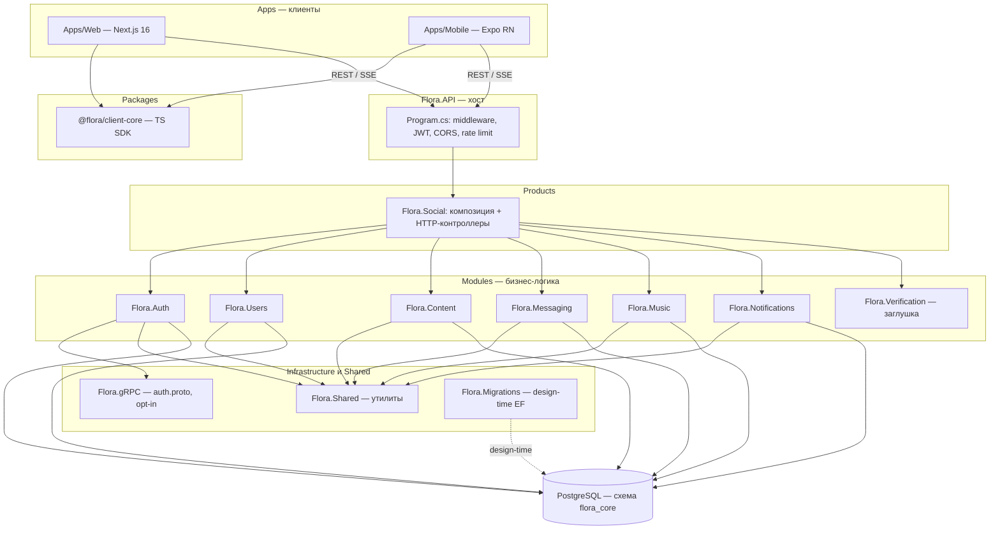
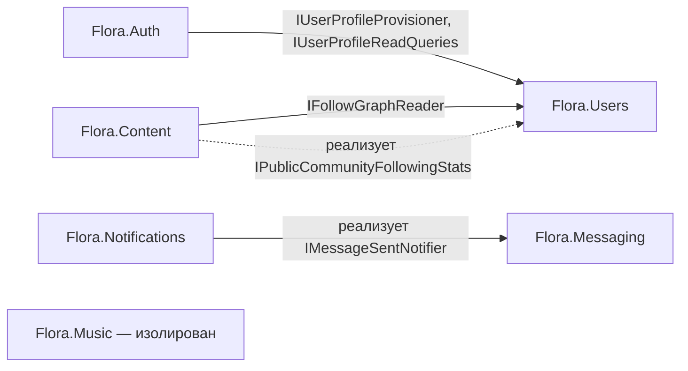
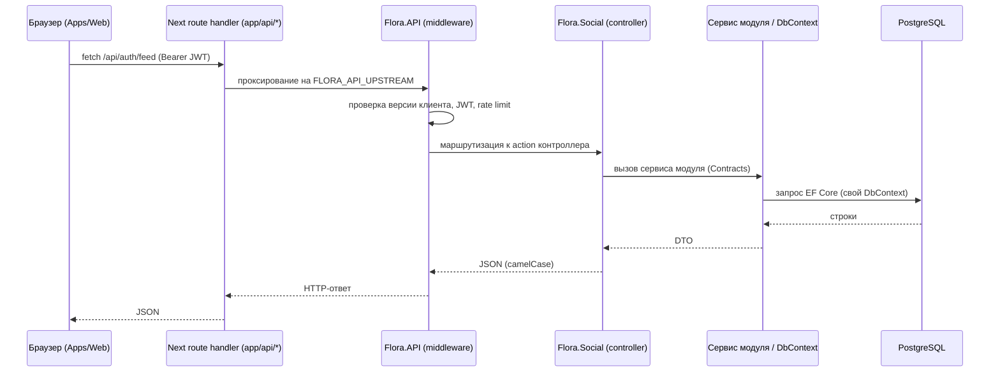
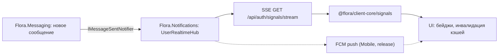

# Архитектурная карта Flora.Ecosystem

> Высокоуровневая карта системы «с высоты птичьего полёта»: глобальное назначение, границы модулей, сквозные потоки данных и технический долг. Документ описывает **взаимосвязи**, а не внутренности методов. Нормативные спецификации лежат в [`docs/`](docs/), правила границ — в [`.cursor/rules/`](.cursor/rules/) и [`docs/agent-rules.txt`](docs/agent-rules.txt).

---

## 1. Обзор системы (High-Level Overview)

Flora.Ecosystem — модульная некоммерческая цифровая экосистема. Архитектурно это **модульный монолит**: единый процесс-хост ([`Flora.API`](Flora.API)) разворачивает набор слабосвязанных бизнес-модулей, каждый из которых построен по Clean Architecture (`Domain → Application → Infrastructure`, плюс `Contracts` как DTO/порты на границе). Модули общаются только через контракты и не имеют права читать чужую БД или ссылаться на внутренние реализации друг друга. Это позволяет в будущем вынести любой модуль в отдельный сервис без переписывания доменной логики.

Конкретные пользовательские приложения собираются в слое **Products** как композиция модулей. Сегодня существует один продукт — [`Flora.Social`](Products/Flora.Social) (социальная сеть: лента, сообщения, музыка, сообщества, люди, уведомления). Направление зависимостей строго однонаправлено: `Apps → API → Products → Modules → Infrastructure`. Бизнес-логика разрешена **только** в `Modules`; `API`, `Products`, `Infrastructure`, `Flora.Shared` её не содержат (API — маршрутизация и middleware, Products — композиция и HTTP-адаптеры).

Стек: **C# / .NET 10** на бэкенде (PostgreSQL, EF Core, опционально gRPC), **Next.js 16 / TypeScript** в вебе и **Expo / React Native** на мобильных. Клиенты разделяют общий TypeScript-SDK [`@flora/client-core`](Packages/flora-client-core). Две сквозные доменные концепции определяют облик системы: **FSCP** (Flora Secure Chat Protocol — собственный E2E-протокол, при котором сервер хранит только шифртекст) и **FIRA** (Flora Individual Recommendation Algorithm — рекомендации для ленты, музыки, людей и сообществ). Данные хранятся в одной БД PostgreSQL (схема `flora_core`), логически разделённой по одному `DbContext` на модуль с отдельными таблицами истории миграций.

---

## 2. Карта модулей (Component & Module Map)

### 2.1. Компонентная схема



### 2.2. Хост и слой композиции

| Компонент | Зона ответственности | Точки входа | Связанность |
| --- | --- | --- | --- |
| **Flora.API** | Хостинг, конвейер middleware (CORS, проверка версии клиента, JWT-аутентификация, авторизация, rate limit), служебные эндпоинты `GET /`, `/health`, `/version`. **Не содержит** бизнес-логики и ссылок на модули. | [`Flora.API/Program.cs`](Flora.API/Program.cs), [`FloraClientVersionMiddleware.cs`](Flora.API/FloraClientVersionMiddleware.cs), [`FloraVersions.cs`](Flora.API/FloraVersions.cs) | Единственная зависимость — `Flora.Social`. Всю реальную регистрацию DI делегирует продукту. |
| **Products/Flora.Social** | Фактический composition root: регистрирует все 7 модулей, настраивает JWT/rate-limit, монтирует HTTP-контроллеры и (опционально) gRPC. Содержит HTTP-адаптеры и продуктовые «мосты». | [`Products/Flora.Social/Class1.cs`](Products/Flora.Social/Class1.cs) (`FloraSocialComposition`), контроллеры [`MessagingController.cs`](Products/Flora.Social/MessagingController.cs), [`MusicController.cs`](Products/Flora.Social/MusicController.cs), [`NotificationsController.cs`](Products/Flora.Social/NotificationsController.cs), [`SignalsController.cs`](Products/Flora.Social/SignalsController.cs) | Ссылается на все модули. Порядок регистрации значим: `Users → Auth` (Auth требует `IUserProfileProvisioner`), `Notifications → Messaging` (Messaging требует `IMessageSentNotifier`). |

Порядок middleware: `CORS → FloraClientVersionMiddleware → Authentication (JWT) → Authorization → RateLimiter`.

### 2.3. Бизнес-модули

| Модуль | Отвечает за | НЕ отвечает за | DbContext / владение данными | Точка входа | Межмодульная связанность (через Contracts) |
| --- | --- | --- | --- | --- | --- |
| **Flora.Auth** | Аккаунты, пароли (Argon2), JWT/refresh-сессии, 2FA/TOTP, регистрация по email, смена email, журнал безопасности | Профили, аватары, граф подписок, контент, сообщения | `AuthDbContext` — `UserAccount`, `UserSession`, `PendingRegistration`, `PendingEmailChange`, `UserSecurityLogs` | [`AuthModuleComposition.cs`](Modules/Flora.Auth/AuthModuleComposition.cs) (`AddAuthModule`, `MapAuthModuleGrpc`) | → `Flora.Users.Contracts` (`IUserProfileProvisioner`, `IUserProfileReadQueries`); использует `Flora.gRPC` |
| **Flora.Users** | Профили, аватары, граф подписок, приватность, блокировки, presence, рекомендации людей (**FIRA-P**) | Учётные данные, контент, сообщения | `UsersDbContext` — `UserProfile`, `UserAvatar`, `UserFollower`, `UserPrivacySettings`, `UserBlock`, `UserPresence` | [`UsersModuleComposition.cs`](Modules/Flora.Users/UsersModuleComposition.cs) (`AddUsersModule`) | **Нет исходящих** зависимостей (эталонный модуль). Публикует широкий набор портов в `Flora.Users.Contracts` |
| **Flora.Content** | Посты, черновики, комментарии/лайки/репосты/просмотры, сообщества и членство, ранжирование ленты (**FIRA-F**), рекомендации сообществ (**FIRA-C**), транскод видео (ffmpeg) | Учётные данные, граф подписок (читает через порт), сообщения, музыка | `ContentDbContext` — `UserPost`, `PostDraft`, `PostComment/Like/Repost/View`, `PostImage/Video`, `Community`, `UserCommunity` | [`ContentModuleComposition.cs`](Modules/Flora.Content/ContentModuleComposition.cs) (`AddContentModule`) | → `Flora.Users.Contracts` (`IFollowGraphReader`); **реализует** `IPublicCommunityFollowingStats` (порт, объявленный в Users) |
| **Flora.Messaging** | DM (хранение **шифртекста** FSCP), список/пагинация диалогов, voice/image/video-ассеты, E2E-инфраструктура (epochs, key/recovery backup, устройства, unlock-challenge), идемпотентность | Доставка push (делегирует), отображаемые имена (мост в продукте), аутентификация | `MessagingDbContext` — `UserMessage`, `UserE2EKey`, ассеты, `KeyEpochPublicIdentity`, `UserDeviceKey`, `UserE2EUnlockChallenge` и др. | [`MessagingModuleComposition.cs`](Modules/Flora.Messaging/MessagingModuleComposition.cs) (`AddMessagingModule`) | **Объявляет порт** `IMessageSentNotifier` (реализуется Notifications) |
| **Flora.Notifications** | In-app inbox, реестр FCM push-токенов, realtime-хаб (SSE, in-memory), диспетчер push для сообщений | Хранение сообщений, аутентификация, контент | `NotificationsDbContext` — `UserNotification`, `UserPushToken` | [`Class1.cs`](Modules/Flora.Notifications/Class1.cs) (`NotificationsModuleComposition.AddNotificationsModule`) | → `Flora.Messaging.Contracts` (**реализует** `IMessageSentNotifier`); зависит от продуктового `IUserDisplayNameResolver` |
| **Flora.Music** | Треки, плейлисты, избранное, артисты, транскод аудио (ffmpeg), рекомендации (**FIRA-M**), таксономия жанров, фоновые hosted-сервисы | Профили, лента, сообщения, аутентификация | `MusicDbContext` — `MusicTrack`, `MusicFavorite`, `MusicPlaylist(+Track)`, `MusicArtist`, `MusicTrackArtist` | [`MusicModuleComposition.cs`](Modules/Flora.Music/MusicModuleComposition.cs) (`AddMusicModule`) | **Нет** межмодульных зависимостей |
| **Flora.Verification** | По замыслу — KYC/верификация. Фактически **заглушка**: реальная email-верификация живёт в `Flora.Auth` | — | Нет DbContext | [`Class1.cs`](Modules/Flora.Verification/Class1.cs) (пустой `AddVerificationModule`) | Нет (см. раздел 4) |

### 2.4. Инфраструктура и общий код

| Компонент | Назначение | Заметки |
| --- | --- | --- |
| **Infrastructure/Flora.gRPC** | Транспорт gRPC между модулями. Содержит единственный контракт [`Protos/auth.proto`](Infrastructure/Flora.gRPC/Protos/auth.proto) (генерация **только server-side**). | Включается флагом `Grpc:AuthService:Enabled`; клиентов в репозитории нет, межмодульно фактически не используется (см. раздел 4). |
| **Flora.Shared** | Низкоуровневые утилиты: [`FloraUuid.cs`](Flora.Shared/FloraUuid.cs) (UUID v7), [`UuidV5.cs`](Flora.Shared/UuidV5.cs) (детерминированные ID, синхронизированы с TS-клиентом), `LatinIdentifiers`, `TimestampAuditInterceptor`. | Бизнес-логики нет — соответствует правилам. |
| **Flora.Migrations** | Design-time проект для `dotnet ef`. Мигрирует 6 DbContext (кроме Verification) в **одну** БД PostgreSQL с отдельными таблицами истории на модуль. | Порядок применения (по FK): `Auth → Users → Content → Messaging → Notifications → Music`. |
| **tests/Flora.ContractFixtures** | Контрактные тесты HTTP-поверхности и биндинга DTO; генерирует JSON-фикстуры в `artifacts/contract-fixtures/`. | Используется TS-парсерами client-core для проверки паритета контрактов. |

### 2.5. Клиентский слой

| Компонент | Роль | Ключевые точки входа | Связанность |
| --- | --- | --- | --- |
| **Packages/flora-client-core** | Общий «мозг» клиента: REST-транспорт, сессии/JWT, парсеры контрактов, криптография FSCP, realtime-сигналы, телеметрия, UI-хелперы. | Экспорты `./api`, `./auth`, `./fscp`, `./contracts`, `./signals`, `./storage`, `./telemetry`, `./crypto`, `./display`; [`src/fscp/envelope.ts`](Packages/flora-client-core/src/fscp/envelope.ts), [`src/api/client.ts`](Packages/flora-client-core/src/api/client.ts) | Платформенно-независим; конкретные хранилища/sodium внедряются приложениями. |
| **Apps/Web** | Толстый клиент (Next.js App Router). Маршруты `login` и группа `(dashboard)`: `feed`, `messages`, `people`, `communities`, `music`, `notifications`, `profile`, `settings`. | Прокси [`app/api/*/route.ts`](Apps/Web/app), API-слой [`lib/socialApi.ts`](Apps/Web/lib/socialApi.ts), [`lib/auth.ts`](Apps/Web/lib/auth.ts), [`lib/messagingApi.ts`](Apps/Web/lib/messagingApi.ts); FSCP в [`lib/fscp/`](Apps/Web/lib/fscp) | Использует client-core **выборочно** (fscp-bootstrap, signals, display, telemetry); держит **параллельный** REST/FSCP-слой (см. раздел 4). Состояние: React Context + TTL-кэши (без zustand/react-query). |
| **Apps/Mobile** | Expo SDK 56 / React Native. expo-router: `(auth)` и `(tabs)` (feed, music, messages, notifications, profile; people/communities скрыты). | [`lib/api.ts`](Apps/Mobile/lib/api.ts), [`lib/session.ts`](Apps/Mobile/lib/session.ts), [`providers/FloraProviders.tsx`](Apps/Mobile/providers/FloraProviders.tsx), zustand-стора `stores/*` | **Консолидирован** на `@flora/client-core` (api/auth/fscp/contracts/signals). Нативные адаптеры: expo-secure-store, react-native-mmkv, react-native-libsodium, react-native-quick-crypto. State: zustand + react-query. |

### 2.6. Граф связанности модулей (только Contracts)



Связанность **низкая** и однонаправленная. Внутри `Modules/` нет ни одной ссылки на чужой `Domain`/`Infrastructure` — все связи идут через `Contracts`. Используются две корректные инверсии портов (порт объявлен в одном модуле, реализован в другом): `IMessageSentNotifier` (Messaging → Notifications) и `IPublicCommunityFollowingStats` (Users → Content). `Flora.Music` и `Flora.Users` не имеют исходящих межмодульных зависимостей. Нарушения границ присутствуют только в продуктовом слое (см. раздел 4).

---

## 3. Потоки данных (Data Flow)

### 3.1. Аутентифицированный HTTP-запрос (UI → БД)



Веб по умолчанию ходит на собственный origin (`/api/*`), а Next проксирует на `Flora.API` (`FLORA_API_UPSTREAM`); мобильный обращается к API напрямую. При истечении access-токена клиент выполняет single-flight `refresh`. Идеальный путь — `контроллер → сервис модуля → DbContext модуля`; легаси-путь (прямой доступ к нескольким DbContext из контроллера) описан в разделе 4.

### 3.2. FSCP — отправка и чтение E2E-сообщения

```mermaid
sequenceDiagram
    participant S as Отправитель (client-core/fscp)
    participant API as Flora.API / Flora.Messaging
    participant R as Получатель (client-core/fscp)

    Note over S,R: Bootstrap — один раз на устройство
    S->>API: PUT /api/auth/me/e2e-public-key (X25519 pub)
    API-->>S: deviceUuid (+ опц. парольный backup, Argon2id)

    Note over S: Отправка
    S->>API: GET e2e-public-key получателя
    API-->>S: X25519 pub получателя
    S->>S: messageKey 32B; тело XChaCha20-Poly1305 (AAD)
    S->>S: RKE на отправителя и получателя: эфемерный X25519 ECDH + HKDF-SHA256
    S->>S: подпись конверта Ed25519, сериализация fscp1:base64url(JSON)
    S->>API: POST messages { encryptedForReceiver, encryptedForSender }
    API->>API: валидация ТОЛЬКО формы конверта (без расшифровки)

    Note over R: Чтение
    R->>API: GET messages
    API-->>R: fscp1:... (шифртекст)
    R->>R: проверка Ed25519 → unwrap RKE → расшифровка тела
```

Ключевой инвариант: **сервер никогда не видит plaintext** — он хранит и маршрутизирует строку `fscp1:...` и проверяет только структуру конверта. Криптопримитивы: X25519 (согласование ключей, ECDH в RKE), Ed25519 (подпись конверта и привязка устройств), XChaCha20-Poly1305 (тело сообщения, обёртка ключа в RKE, бэкапы), HKDF-SHA256 (вывод wrap-ключа), Argon2id (парольный бэкап), AES-GCM (медиа-блобы). Нормативные источники: [`docs/fscp/FSCP.md`](docs/fscp/FSCP.md), [`docs/fscp/e2e-security.md`](docs/fscp/e2e-security.md); реализация — [`Packages/flora-client-core/src/fscp/`](Packages/flora-client-core/src/fscp) и (на вебе) [`Apps/Web/lib/fscp/`](Apps/Web/lib/fscp).

### 3.3. Realtime-сигналы (новое сообщение/уведомление → UI)



Realtime реализован через **SSE** (in-memory хаб в `Flora.Notifications`), без WebSocket и без брокера сообщений. Клиент получает лёгкие сигналы `message`/`notification` и инвалидирует кэши/счётчики; параллельно работает polling счётчиков (`has-new`, `unread-count`). На мобильном в release добавляется доставка через FCM. Межмодульное событие «сообщение отправлено» проходит синхронным вызовом порта `IMessageSentNotifier` (Messaging → Notifications), а не через шину событий.

---

## 4. Технический долг и «мёртвый код»

Список приоритизирован: сверху — нарушения архитектурных границ, снизу — косметика. Каждый пункт — кандидат на рефакторинг.

### 4.1. Нарушения границ (высокий приоритет)

- **God-контроллер.** [`Products/Flora.Social/ImportedSocialController.cs`](Products/Flora.Social/ImportedSocialController.cs) — **3563 строки**. Внедряет `AuthDbContext`, `UsersDbContext`, `ContentDbContext`, `MessagingDbContext` и выполняет прямые EF-запросы, `Add`/`Remove`, `SaveChangesAsync` над доменными сущностями. Это бизнес-логика и персистентность в продуктовом слое — прямое нарушение правила «бизнес-логика только в Modules». Самый крупный долг; декомпозировать на use-cases в `Application`-слоях модулей, оставив в продукте тонкие HTTP-адаптеры.
- **Межмодульный доступ к БД в продукте.** [`Products/Flora.Social/SocialUserDisplayNameResolver.cs`](Products/Flora.Social/SocialUserDisplayNameResolver.cs) читает `AuthDbContext` и `UsersDbContext` напрямую. Кроме того, `Flora.Social.csproj` ссылается на `Flora.Auth.Infrastructure` и `Flora.Users.Infrastructure` (в обход `Contracts`). Заменить на вызовы портов модулей.
- **Интерфейсы в Application, а не в Contracts.** `IConversationService`, `INotificationInboxService`, `IContentFeedQueries` объявлены в `Application`-проектах, из-за чего продукт зависит от `Application` модулей, а не только от `Contracts`. Поднять публичные интерфейсы в `Contracts`.

### 4.2. Дублирование

- **Параллельный клиентский слой на вебе.** [`Apps/Web/lib/fscp/`](Apps/Web/lib/fscp) и `Apps/Web/lib/*Api.ts` дублируют логику, уже имеющуюся в [`@flora/client-core`](Packages/flora-client-core) (`./fscp`, `./api`, `./contracts`). Мобильное приложение консолидировано на SDK, веб — нет. Риск: рассинхрон криптопротокола и контрактов между платформами. Цель — свести веб на client-core, оставив только тонкие платформенные обёртки.

### 4.3. Заглушки и неиспользуемый код

- **Модуль-заглушка.** [`Modules/Flora.Verification`](Modules/Flora.Verification) состоит из маркеров `Class1.cs`; `AddVerificationModule()` пуст; реальную верификацию выполняет `Flora.Auth`. Либо наполнить модуль ответственностью, либо удалить до момента реальной потребности.
- **No-op эндпоинты.** `MapUsersModuleEndpoints()`, `MapContentModuleEndpoints()`, `MapMessagingModuleEndpoints()`, `MapMusicModuleEndpoints()` в композиции продукта — пустые заглушки.
- **Неиспользуемая зависимость.** `tweetnacl` присутствует в [`Apps/Web/package.json`](Apps/Web/package.json), но не импортируется в исходниках.

### 4.4. Преждевременная сложность (overengineering)

- **gRPC-инфраструктура без потребителей.** [`Infrastructure/Flora.gRPC`](Infrastructure/Flora.gRPC) и `AuthGrpcService` существуют, но: контракт один (`auth.proto`), генерация только серверная, клиентов нет, по умолчанию выключено, межмодульно не используется (модули общаются in-process через `Contracts`). Дублирует HTTP-аутентификацию. Держать как «спящую» опцию осознанно либо удалить до реального перехода на межсервисное взаимодействие.

### 4.5. Косметика (naming smells)

- **Файлы `Class1.cs` как composition root.** Дефолтные имена не переименованы: [`Products/Flora.Social/Class1.cs`](Products/Flora.Social/Class1.cs) (содержит `FloraSocialComposition`), [`Modules/Flora.Notifications/Class1.cs`](Modules/Flora.Notifications/Class1.cs), маркеры в `Flora.Verification` и `Flora.gRPC`. Переименовать в осмысленные (`*ModuleComposition.cs`, `*Marker.cs`) для навигации.

### 4.6. Контроль регрессий границ

Проверку однонаправленности зависимостей и изоляции модулей автоматизирует [`tools/Validate-Architecture.ps1`](tools/Validate-Architecture.ps1). Рекомендуется прогонять его в CI, чтобы перечисленные нарушения не воспроизводились в новом коде.

---

### Сводка для навигации

| Хочу понять… | Смотреть |
| --- | --- |
| Точку входа и middleware | [`Flora.API/Program.cs`](Flora.API/Program.cs) |
| Что и как собирается в продукт | [`Products/Flora.Social/Class1.cs`](Products/Flora.Social/Class1.cs) |
| Границы и правила | [`docs/agent-rules.txt`](docs/agent-rules.txt), [`.cursor/rules/`](.cursor/rules) |
| E2E-протокол | [`docs/fscp/FSCP.md`](docs/fscp/FSCP.md), [`Packages/flora-client-core/src/fscp/`](Packages/flora-client-core/src/fscp) |
| Рекомендации | [`docs/fira/FIRA.md`](docs/fira/FIRA.md) |
| Схему БД и порядок миграций | [`Flora.Migrations`](Flora.Migrations) |
