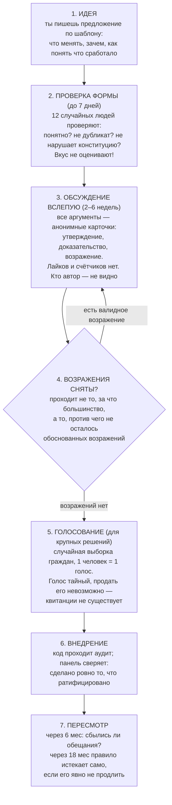
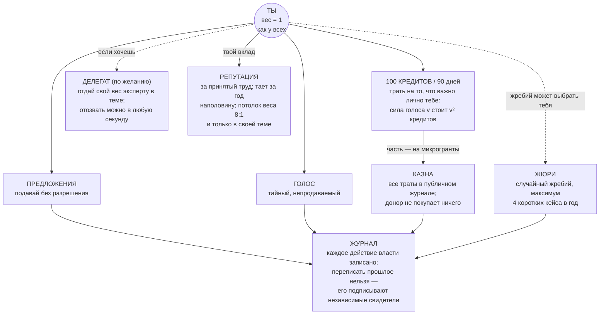
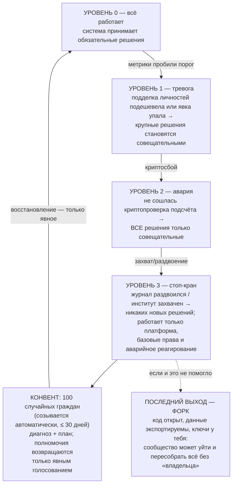

# FGP-GUIDE — как работает управление Flora, на пальцах

**Status:** ненормативное введение (простыми словами)
**Date:** 2026-07-13

Этот документ ничего не устанавливает — он объясняет. Точные правила: [`FGP.md`](./FGP.md) (протокол), [`FPP.md`](../fpp/FPP.md) (кто считается человеком), [`FGP-THREATS.md`](./FGP-THREATS.md) (как систему атакуют и как она отбивается). При любом расхождении верить им, не этому файлу.

---

## 1. Вся система в четырёх предложениях

1. **Никто не главный.** Нет директора, совета директоров и «админов». Есть правила, журнал, в котором видно всё, и процедуры, в которых решают случайно выбранные люди.
2. **Деньги не покупают власть.** Вес в решениях нельзя купить, подарить или унаследовать — только заработать трудом, и он тает со временем.
3. **Харизма не работает.** Идеи обсуждаются анонимно и письменно: никто не знает, кто автор, поэтому побеждает аргумент, а не популярность.
4. **Если система ломается — она сама себе отключает полномочия,** а не продолжает решать в сломанном виде. Крайний случай: забрать код и данные и уйти (форк) — это право встроено в конституцию.

---

## 2. Путь любой идеи

Любой участник (уровень V1+, см. §3) может предложить что угодно — разрешения не нужно. Дальше идея едет по конвейеру:

Ключевая странность, к которой надо привыкнуть: **решение продвигает не количество сторонников, а отсутствие обоснованных «против»**. «Мне не нравится» — не возражение. «Вот проверяемое доказательство вреда» — возражение, и оно останавливает даже очень популярную идею, пока его не разберут.

---

## 3. Кто ты в системе: уровни человека

Чтобы боты и фермы аккаунтов не голосовали, у каждого аккаунта есть уровень «подтверждённой человечности» (это не паспорт — имя никто не спрашивает и не хранит):

| Уровень | Как получить | Что открывает |
| --- | --- | --- |
| **V0** | подтвердить email | пользоваться соцсетью, читать governance |
| **V1** | дважды в год — короткая живая видео-встреча со случайным человеком (20–30 мин, взаимная проверка «ты живой?») | **голосовать**, подавать предложения, поддерживать гранты |
| **V2** | 3 участника уровня V2+ лично поручились «это отдельный живой человек» (поручитель рискует своей репутацией) | попадать в жюри и панели |
| **V3** | документ у независимого проверяющего (без сохранения данных) **или** год подтверждённого вклада | быть делегатом, входить в чрезвычайный круг |

Пропустил церемонии — права засыпают (вернёшься — проснутся). Умершие аккаунты вымываются из электората сами, без «реестра смерти».

---

## 4. Карта власти: у кого какие рычаги

Запомнить стоит одно: **важные решения требуют двух ключей сразу**. Ключ 1 — эксперты темы подтверждают «это корректно и безопасно». Ключ 2 — случайная выборка обычных людей подтверждает «мы этого хотим» (один человек = один голос, без всяких весов). Элита не решит за всех, толпа не продавит опасное.

---

## 5. Как управлять: твои 7 действий

| Хочешь | Делай | Что важно знать |
| --- | --- | --- |
| **Изменить что-то** | подай предложение по шаблону | нужен небольшой залог кредитов; вернётся, если предложение осмысленное (даже если его отклонят) |
| **Поддержать чужую идею** | ставь на неё кредиты (сила v — цена v²) | поддержка должна продержаться недели — вспышка хайпа затухает сама |
| **Остановить плохое решение** | подай возражение с доказательством | ставка 5 кредитов; «просто не нравится» сгорит, обоснованное — остановит процесс |
| **Голосовать** | если выборка выпала на тебя — придёт приглашение | голос тайный; до закрытия окна можно молча переголосовать (поэтому скупка голосов бессмысленна) |
| **Не разбираться самому** | делегируй вес знакомому эксперту по теме | делегация живёт 90 дней, отзыв мгновенный; «суперделегаты» невозможны математически |
| **Послужить системе** | принимай жребий в жюри | это как гражданская повинность: редко, коротко, засчитывается как вклад |
| **Получить ресурсы на своё дело** | заявка на микрогрант в календарное окно | решает общий сигнал кредитами; получил — через полгода отчитаешься «обещано/сделано» |

И три вещи, которые **никто** не может сделать с тобой: прочитать твою переписку (ключей у сервера физически нет), подкрутить твою ленту против твоих настроек, наказать тебя тайно (любая санкция видима и обжалуема перед случайным жюри).

---

## 6. Почему это не захватить: шесть замков

| Замок | Как работает |
| --- | --- |
| **Деньгам нечего купить** | вес не продаётся; голос не подтверждаем (нет квитанции — нет сделки); кто будет голосовать — неизвестно заранее |
| **Популярности не за что зацепиться** | обсуждение анонимно; счётчиков поддержки не видно; «это мой RFC, голосуйте!» — недоказуемое сотрясание воздуха |
| **Решающих не подкупить заранее** | жюри и комитеты собирает жребий на один кейс; состав выборки голосования вообще не публикуется |
| **Ботам не пробиться** | голос — только у подтверждённых живых людей; цена подделки личности публично замеряется каждый квартал |
| **Прошлое не переписать** | журнал — цепочка хешей, подписанная независимыми свидетелями в разных юрисдикциях |
| **Основатели — с таймером** | особые права учредителей автоматически истекают по мере роста сообщества; продлить их нельзя по конструкции |

---

## 7. Если всё-таки сломалось

Система при сбоях **сама сужает свои полномочия** — автоматически, без чьего-либо решения:

Направление отказа всегда одно: **к статус-кво и меньшей власти**. Сломать систему — значит всего лишь остановить новые решения, а не захватить старые. Поэтому ломать её невыгодно.

---

## 8. Мини-словарь

| Слово | По-человечески |
| --- | --- |
| RFC / предложение | документ «что меняем и почему», единица любого изменения |
| Consent gate | «нет обоснованных против» — фильтр вместо голосования большинством |
| Сортиция | выбор решающих жребием, как присяжных |
| QV-кредиты | твой личный бюджет «мне это важно»; сила v стоит v² |
| Делегация | «голосуй за меня в этой теме» — отзываемо в любой момент |
| Receipt-freeness | голос нельзя доказать третьему лицу → его бессмысленно покупать |
| Nullifier / маска | криптографический псевдоним: один человек = одна маска на вопрос |
| Tripwire | метрика-сигнализация: пробила порог — процедура запускается сама |
| Лестница деградации | автоматическое сужение полномочий системы при сбоях |
| Форк | право забрать код и данные и продолжить без старой команды |
