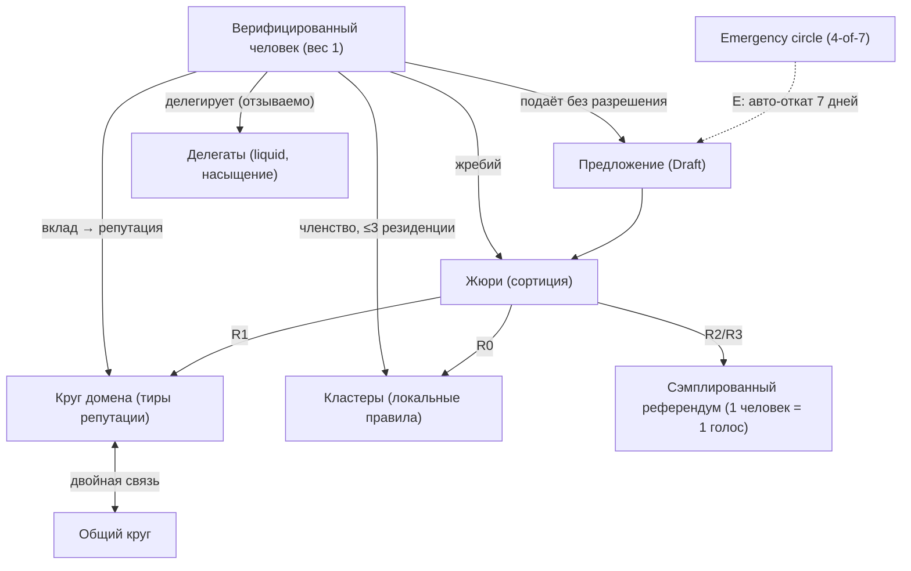
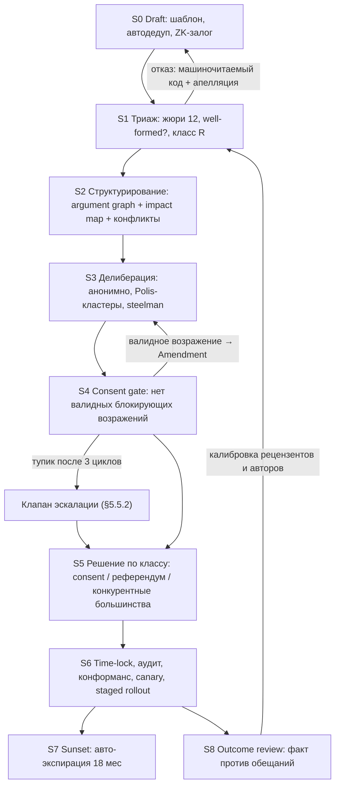

# FGP — Flora Governance Protocol

**Status:** Draft (RFC)
**Version:** 0.6
**Date:** 2026-07-13

Компаньоны: [`FGP-THREATS.md`](./FGP-THREATS.md) (v0.5) — модель противников, операционные программы защиты (V-01…V-14), красная команда, симуляции, лестница деградации, кризисные процедуры, исследовательские треки; [`FPP.md`](../fpp/FPP.md) (v0.2) — нормативная спецификация personhood (уровни V0–V3, церемонии, поручительства, якоря, `C_identity`); [`FGP-CRYPTO.md`](./FGP-CRYPTO.md) (v0.1) — криптографический слой (примитивы, nullifier'ы, тэлли, жеребьёвки, журнал, детерминированная арифметика). Все четыре документа нормативны; при конфликте приоритет у `FGP.md`. Ненормативное введение простым языком — [`FGP-GUIDE.md`](./FGP-GUIDE.md). Экономический слой (Pollen: PoP-UBI, демерредж, взаимный кредит, Commons-казна) — [`FEP.md`](../fep/FEP.md): FGP управляет его параметрами (R2) и бюджетом казны (§10), обратная конвертация «деньги → власть» запрещена инвариантом. История ревью — Приложение B (B.1: 0.1 → 0.2, 25 находок; B.2: 0.2 → 0.3, ещё 25; B.3: 0.3 → 0.4 — согласование с Rust-стеком и юридическим слоем; B.4: 0.4 → 0.5 — первый адверсариальный проход по FPP и стыки; B.5: 0.5 → 0.6 — достройка казны и ИИ-контура с адверсариальным разбором новых механизмов).

---

## Overview

FGP (Flora Governance Protocol) — протокол распределения власти и принятия решений в Flora.Ecosystem. Он управляет **только общим** (commons): дефолты продукта, правила модерации, приоритеты roadmap, изменения самого протокола. Частное пространство пользователя (переписка, персональная лента, данные, идентичность) выведено из-под юрисдикции governance техническими инвариантами (§1).

Дизайн-цель: сделать захват — корпоративный, плутократический, популистский, бюрократический — **экономически бессмысленным и процедурно недостижимым**, а не «запрещённым правилами». Правила нарушаются; инварианты и стоимость атак — нет.

Власть разделена на четыре независимых канала легитимности, взаимно гасящих отказы друг друга:

| Канал | Механизм | Что гасит |
| --- | --- | --- |
| **Вклад** | непокупаемая, затухающая, доменная репутация | охлократию, некомпетентность |
| **Согласие** | социократический consent: отсутствие валидных блокирующих возражений | тиранию большинства |
| **Жребий** | сортиционные жюри со стратификацией | лоббизм, окапывание элит |
| **Выход** | AGPLv3 + E2E-ключи у пользователей + экспорт данных = право на форк | всё, что прорвало первые три |

Поверх каналов действует **двухключевая модель** (§4.0): домен компетенции подтверждает *валидность* решения (первый ключ), популяция на равных весах подтверждает его *желательность* (второй ключ). Ни компетентная элита не решает за всех, ни большинство не продавливает невалидное.

Соответствие требований и разделов:

| Требование | Раздел |
| --- | --- |
| Индивидуальный суверенитет | §1 (Слой 0) |
| Иммунитет к лоббизму и плутократии | §4, §4.9 (стоимость атак), THREATS V-01…V-03 |
| Анти-харизма | §3 |
| Открытая инициатива без охлократии | §2.3, §5 |
| Модерация без цензуры и радикализации | §6 |
| Честный анализ уязвимостей и планы борьбы | §7 + [`FGP-THREATS.md`](./FGP-THREATS.md) |

---

## Goals & Non-Goals

**Goals:**

- Механика (алгоритмы, формулы, протоколы), реализуемая кодом, а не регламентом доброй воли.
- Пять аппаратных гарантий: суверенитет, иммунитет к плутократии, анти-харизма, свобода инициатив без охлократии, сдерживание деструкции без цензуры.
- Отказобезопасность: при провале любого механизма итог — статус-кво или автоматическое сужение полномочий (§7.3), но не захват.
- Проверяемость: тэлли и журнал воспроизводимы из публичных данных; инварианты покрыты тестами и test vectors (§8.4).

**Non-Goals:**

- Юридическая структура фонда/оператора (отдельный документ; THREATS V-08 фиксирует границу и требования к ней). Модель лицензирования уже задана [`LEGAL.md`](../../LEGAL.md); её честное сопряжение с гарантиями FGP — §1.1 и §9.5.
- Юридическая механика сбора средств (счета, налоги, договоры) — отдельный юридический RFC (V-08). Распределение собранного — в юрисдикции FGP: §10 (Commons-казна).
- «Решение» человеческой природы. FGP снижает стоимость честности и повышает стоимость захвата; политику как явление он не отменяет.

---

## Architecture Position

FGP — бизнес-логика будущего модуля **Governance**. Целевой стек бэкенда — Rust-workspace `Backend/` ([`next-architecture.md`](../../next-architecture.md)); модуль реализуется парой крейтов `flora-governance` + `flora-governance-contracts` в `Backend/crates/modules/`, композиция — `flora-social`, хост — `flora-api`. Внутри крейта сохраняется слоистость Clean Architecture (`src/domain | application | infrastructure | http` + `compose()`); схема данных — свои таблицы в `flora_core` со своей историей миграций (`flora-migrate`).

**Governance не участвует в strangler-миграции:** модуля не существует в .NET, он рождается сразу в Rust — без freeze-окон, двойной записи и переносного долга. Работы стартуют не раньше Фазы 0 миграции (фундамент workspace); статус фаз — таблица §6.0 `next-architecture.md`. Межмодульная граница компилируема: чужие модули могут зависеть только от `flora-governance-contracts` (правила зависимостей — §2.3 там же). Governance не читает чужие БД: personhood — контракт Verification ([`FPP.md`](../fpp/FPP.md)), применение правил видимости — модулем Content по контрактам, уведомления — через Notifications. Детали — §8.

```
Apps/Web, Apps/Mobile (+ верификация тэлли в @flora/client-core, WASM-ядро)
  └─→ flora-api (Rust-хост)
        └─→ flora-social (композиция)
              └─→ flora-governance (предложения, жюри, репутация, бюллетени, журнал)
                    ├─→ flora-verification-contracts (personhood: уровни V1–V3, FPP)
                    ├─→ flora-users-contracts (read-only, только post-hoc)
                    └─→ flora-notifications-contracts (гражданские уведомления)
```

---

## 0. Аксиомы проектирования

- **A1. Инварианты вместо обещаний.** Право реально, только если его нарушение требует сломать криптографию или форкнуть протокол, а не «нарушить политику».
- **A2. Деньги не конвертируются во власть, если во власти нет ничего покупаемого.** Вес непередаваем; голос неподтверждаем (receipt-freeness); электорат неизвестен заранее (сортиция + приватные выборки). Три свойства закрывают три канала покупки: актив, избирателя, представителя.
- **A3. Харизма — это канал связи.** Канал сужается архитектурно: асинхронный типизированный текст без личности отправителя. Что не передаётся — то не влияет.
- **A4. Закон Гудхарта неотменяем.** Каждая метрика получает контр-метрику, случайный аудит и срок годности.
- **A5. Подавленное меньшинство не исчезает — оно мутирует.** Управлять видимостью и контекстом, а не существованием.
- **A6. Цена решения пропорциональна необратимости.** Обратимое — дёшево и быстро, необратимое — дорого и медленно.
- **A7. Тишина ≠ согласие для новых полномочий.** Полномочия расширяются только явной ратификацией; истекают по умолчанию (sunset).
- **A8. Assume breach.** Каждый отдельный механизм проектируется в предположении, что остальные уже взломаны; провал целостности автоматически сужает полномочия системы (§7.3), а не «ставит вопрос».
- **A9. Незакрываемый канал влияния делается дорогим и наблюдаемым.** Что нельзя запретить технически (внепротокольная агитация, искренняя коллузия, юрисдикционное давление) — обесценивается, замеряется и выносится на дашборд.

---

## 1. Слой 0 — Конституция и не-полномочия (индивидуальный суверенитет)

### 1.1. Жёсткие права как технические инварианты

| Право | Реализация | Статус в Flora |
| --- | --- | --- |
| Тайна переписки | FSCP: сервер хранит только ciphertext, ключей нет физически ([`Documents/fscp/FSCP.md`](../fscp/FSCP.md)) | реализовано |
| Суверенитет ленты | FIRA: пользовательские настройки пайплайна; **нормативно по FGP**: каждый ранжирующий компонент обязан иметь user-override и хронологический fallback; target — исполнение ранжирования на клиенте / выбираемом узле | частично ([`Documents/fira/FIRA.md`](../fira/FIRA.md)) |
| Переносимость данных | Полный машиночитаемый экспорт; идентичность = ключи пользователя (identity key из e2e-security), переносимая между инсталляциями | частично |
| Неотзываемость кода | AGPL-3.0-only: каждая **выпущенная** версия необратимо остаётся форкаемой. Точная юридическая рамка (dual licensing, CLA, охрана обозначений) — [`LEGAL.md`](../../LEGAL.md); честная граница гарантии — §9.5 | реализовано |
| Проверяемость клиента | Reproducible builds + подписанные релизы (клиент может доказать отсутствие бэкдора) | target |
| Отсутствие теневых санкций | Любое действие модерации видимо затронутому: правило + доказательство + путь апелляции | нормативно по FGP |
| Право не обновляться | Version pinning: подписанные воспроизводимые релизы; принудительный апгрейд клиента невозможен как санкция | target |

### 1.2. Перечень не-полномочий (enumerated non-powers)

Никакое решение внутри FGP **не может**:

1. читать или выдавать содержимое E2E-переписки — ключей на сервере нет;
2. изменять ранжирование ленты конкретного пользователя против его настроек;
3. приватизировать код или данные — юридически необратимо для выпущенного (AGPL);
4. вводить теневые санкции (shadow ban, скрытое понижение без уведомления);
5. конфисковать идентичность — бан ограничивает сервис, но не отбирает ключи и экспорт;
6. вводить недобровольную монетизацию внимания (реклама в ленте, engagement-KPI как цель оптимизации);
7. обязывать клиентское сканирование контента (client-side scanning): граница модерации E2E-пространства проходит **исключительно** по добровольной жалобе участника переписки (§6.5);
8. принуждать к установке конкретной версии клиента (право version pinning, §1.1).

RFC, затрагивающий пп. 1–8, автоматически классифицируется как конституционный (R3, §2.2) и по умолчанию невалиден: триаж обязан отклонить его с кодом `constitutional_conflict`, если он не оформлен как конституционная поправка с полным циклом §5.

### 1.3. Идентичность: владение и восстановление

- Гражданская идентичность = криптографические ключи у пользователя; сервер хранит аттестации, не контроль.
- **Восстановление при утрате ключей** (потеря устройства ≠ потеря гражданства): социальное восстановление `3-of-5` поручителей уровня V2+ (§4.1), cooldown 30 дней с уведомлением поручителей (окно для оспаривания), не чаще 1 раза за 12 мес; нормативная механика — FPP §6. Старый commitment попадает в revocation list; активные делегации сбрасываются, активные мандаты (жюри, панели) отзываются.
- Восстановление не создаёт вторую личность: `civic_id` наследует репутацию через новый commitment, но история восстановлений публична в агрегатах (телеметрия V-01, THREATS).

### 1.4. Право на форк — последний контур

Математика §3–§6 сдерживает захват только пока стоимость выхода конечна и умеренна. Гарантии выхода: код (AGPL) + данные (экспорт) + идентичность (ключи у пользователя) + **воспроизводимость governance-состояния**: журнал прозрачности и леджер вкладов публичны и хеш-цепочны (§6.4), любой форк может пересчитать репутацию по собственным правилам из сырых данных. Архитектурно модульный монолит выносится в сервисы без переписывания доменов (см. [`ARCHITECTURE.md`](../../ARCHITECTURE.md)). Юридическая граница фиксируется заранее, а не «внезапно» в момент раскола: форкается код, данные и спецификации — **не** бренд и обозначения (Flora, FGP и др. охраняются, [`LEGAL.md`](../../LEGAL.md) §6); форк обязан жить под собственным именем. Процедура цивилизованного раскола — THREATS §6.3. Конституция заканчивается пунктом о праве на выход.

---

## 2. Топология власти

### 2.1. Субъекты

| Субъект | Происхождение | Полномочия | Ограничители |
| --- | --- | --- | --- |
| **Верифицированный человек** | personhood-аттестация уровня V1+ (§4.1) | базовый вес 1; подача предложений; QV; референдумы | одна личность — один nullifier |
| **Домен компетенции** `d` | список: engineering, protocol-security, moderation-policy, product-ux, infra-ops, docs-l10n, community | репутация и делегирование считаются **внутри** домена | изменение списка — R2 |
| **Круг домена** | тир T1+ домена (§4.2.1); роли — выборы без кандидатов (§3.6) | операционные решения R0/R1 своего домена | consent-процедура; двойная связь с общим кругом (два разных представителя) |
| **Общий круг** | по двойной связи от кругов доменов | межкоординация, календарь, споры о границах доменов | не может решать за домен |
| **Кластер** (сообщество Flora.Social) | самоорганизация | локальные правила (L2 §6.2), локальные R0 | манифест публичен; глобальный пол L0 неотменяем |
| **Жюри** | сортиция из пула: V2+, стаж ≥ 6 мес, liveness; стратификация §5.2 | триаж, валидность возражений, апелляции, конституционные ревью, аудиты | мандат на один кейс; вердикт мотивирован; частота службы ≤ 4 кейса/год; выбытие/деградация уровня в ходе кейса → замена из резерва той же страты |
| **Делегат** | добровольные делегации (§4.5); уровень V3 | голосует делегированным весом в доменных процедурах | кап + насыщение + отложенная публикация бюллетеней (§3.8) + мгновенный отзыв |
| **Emergency circle (EC)** | 7 человек, V3, выборы без кандидатов, ступенчатая ротация 6 мес, ≤ 2 срока подряд | закрытый перечень действий §5.9, подпись 4-of-7 | авто-откат 7 дней + ретроактивная ратификация; декларации конфликта интересов |

### 2.2. Классы решений

| Класс | Определение | Примеры | Путь принятия |
| --- | --- | --- | --- |
| **R0** | обратимое, локальное | правила кластера, локальный дефолт | consent кластера, окно 7 дней |
| **R1** | обратимое, глобальное | дефолт UI, фича без миграции данных | consent круга домена + открытая делиберация 14 дней |
| **R2** | трудно обратимое | схема данных, контракты FIRA/FSCP-смежные, параметры репутации | R1-путь **+** сэмплированный референдум (равные веса, §5.6), поддержка ≥ 60 %, time-lock 14 дней |
| **R3** | конституционное | слой 0, сам FGP, лицензия, список L0 | делиберация ≥ 45 дней + конкурентные большинства + повторное подтверждение через 30 дней (§5.6) |
| **E** | чрезвычайное | активная атака, критическая уязвимость | EC по перечню §5.9; авто-откат 7 дней |

Класс присваивает триаж-жюри по машиночитаемому чек-листу (миграция данных? меняет контракты? затрагивает слой 0? обратимо за ≤ 1 релиз?). Спор о классе — вторая панель, один раз. **При сомнении — класс выше.**

### 2.3. Инициатива: открыто, без гейткиперов

- Подать Draft может **любой** верифицированный человек в любой момент; ни круг, ни жюри не могут запретить подачу — только классифицировать и триажировать.
- Анти-спам — не гейткипер, а стоимость: залог в гражданских кредитах (§4.4), списываемый **анонимно** (ZK-spend: доказательство владения кредитами без раскрытия личности — иначе залог деанонимизировал бы автора, ломая §3.1). Залог возвращается, если предложение прошло триаж как well-formed, **даже если отклонено по существу**; сгорает только при вердиктах `duplicate`/`spam`. Рецидив — экспоненциальный рост залога; при перегрузке очереди триажа залог растёт динамически для всех (THREATS V-06).
- SLA триажа: медиана ≤ 7 дней. Обеспечивается ротацией жюри как гражданской повинностью с кредитами участия — очередь не может тихо умереть.
- Отказ всегда машиночитаем: `{duplicate_of | incoherent | out_of_scope | constitutional_conflict}` + мотивировка. Переподача после исправления не ограничена.
- «Кладбище с достоинством»: отклонённые по существу предложения хранятся с вердиктами и **автоматически реанимируются** при изменении признанных фактов (новые evidence-узлы могут ссылаться на закрытые RFC и триггерить повторный триаж).
- LLM-ассистированные добросовестные предложения **разрешены**: критерий — не «написано ИИ», а нагрузка на очередь, дубликаты и качество (V-06).

### 2.4. Схема топологии



---

## 3. Механика «Анти-харизма»

Принцип: на стадиях, где формируется решение, личность автора **физически недоступна** оценивающим. Харизме не оставляют канала: нет голоса и видео, нет имени и аватара, нет подписчиков, нет счётчиков поддержки.

### 3.1. Identity firewall и отрицаемое авторство

- Все артефакты делиберации подписываются эфемерным псевдонимом, привязанным к предложению: ZK-доказательство «я верифицированный человек, тир репутации в домене ≥ T, и я не участвую в этом предложении под другим псевдонимом». Nullifier строится на паре `(personhood, proposal)` — один человек = одна маска на предложение, мультимаскинг криптографически исключён.
- Видимый атрибут участника — **минимальный порог, требуемый контекстом** (ZK range proof «тир ≥ требуемого», §4.2.1), а не фактический тир: показ точного тира сужает множество анонимности (T3-узел в домене с двадцатью T3 — это 1 из 20; в связке со стилометрией — деанонимизация). Не имя, не стаж, не число подписчиков.
- **Отрицаемое авторство (designated-verifier):** все ZK-креденшалы делиберации строятся так, что убедительны только для протокола; любой внепротокольный «пруф авторства» (скриншот, экспортированное доказательство) **симулируем третьей стороной**. Следствие: публичное заявление «это мой RFC, голосуйте» — недоказуемое cheap talk, которое может сделать кто угодно; сигнал обесценен конструктивно, а не запрещён. Подтверждаемое раскрытие — только через протокол и только после закрытия решения (§3.7).
- Личность раскрывается системе начисления репутации (через nullifier), но не участникам и не алгоритмам ранжирования аргументов.

### 3.2. Граф аргументации вместо потока

- Делиберация — не чат. Единица — типизированный узел: `Claim | Evidence | Objection | Mitigation | Amendment | Question`.
- Узел ≤ 150 слов. `Evidence` обязан содержать проверяемый источник или воспроизводимый расчёт; голое мнение в `Evidence` невалидно.
- «+1» не существует. Дубликаты аргументов кластеризуются (эмбеддинги + подтверждение человеком) — сто повторов одного довода схлопываются в один узел. Счёт повторов **не** влияет на вес: аргумент либо нов, либо нет. Спорное слияние (включая adversarial-примеры против эмбеддингов: маскировку дубликата или ложное склеивание чужого аргумента) — дешёвая апелляция unmerge; повторный спор — панельный пересмотр.
- Потоковые чаты и реакции остаются в социальном слое Flora.Social, но не имеют входа в решение: подсчёт берёт только граф.
- **Steelman-обязательство:** перед стадией решения каждое неразрешённое возражение должно иметь пересказ со стороны сторонников, подтверждённый автором возражения («да, вы поняли меня верно»). Непересказанное возражение блокирует переход дальше.
- Проходимость предложения определяется состоянием графа (§5.5), а не суммой одобрений.

### 3.3. Нормализация стиля (AI-клерк) — с защитой от захвата самого клерка

- Перед публикацией узел проходит style-flattening: нейтральный регистр, снятие эмоциональных маркеров, стандартная структура. Автор подтверждает сохранение смысла.
- Двойная функция: гасит риторику **и** мешает стилометрической деанонимизации (защита §3.1).
- **Требования к клерку** (иначе клерк — точка захвата, THREATS V-11): открытые веса, версия модели закреплена хешем в `PolicyArtifact`, детерминированный инференс, диффы «до/после» доступны автору и аудиту; случайный семантический аудит 5 % узлов панелями; право автора отказаться (публикация без флэттенинга с пометкой `raw`); target — исполнение на клиенте.
- Конституционное ограничение AI: клерк структурирует, кластеризует, суммаризирует — **никогда не оценивает и не решает**. Все операции логируются, любая оспорима человеком, финальная форма подписывается человеком. Нарушение — R3-инцидент.

### 3.4. Скрытые агрегаты, commit-reveal, батчинг

- Во время делиберации скрыты: число сторонников, промежуточные подсчёты, любые социальные сигналы. Это ломает информационные каскады («все уже за — и я за»).
- Голосование — commit-reveal: сначала криптографическое обязательство, вскрытие после закрытия окна. Ранние голоса не двигают поздние.
- Порядок узлов графа рандомизируется на клиенте — «верхнего комментария» не существует.
- **Батч-публикация:** узлы графа публикуются пакетами в 2 случайных окна в сутки — тайминг-корреляция (сопоставление времени публикации с онлайн-активностью аккаунтов) гасится. Target для V2+: подача узлов через анонимизирующий транспорт.

### 3.5. Качество RFC: двойное слепое рецензирование с калибровкой

- K = 7 рецензентов, случайно из пула T2+ домена, стратификация по кластерам мнений (§5.4), автор и рецензенты взаимно анонимны.
- Рубрика (каждая шкала 0–10): фальсифицируемость (проверяемые критерии успеха), качество evidence, полнота impact map, обратимость и план отката, реализм стоимости.
- Итог: `Q = trimmed_mean_20%(оценки)` — усечённое среднее выдерживает 1–2 захваченных рецензентов из 7.
- **Калибровка рецензентов:** вместе с оценкой рецензент даёт вероятностный прогноз «решение будет признано успешным на outcome review через 6 мес» (§5.8). Прогноз скорится по Брайеру; вероятность попадания в будущие панели ∝ softmax(калибровка). Рецензенты, чьи оценки предсказывают реальность, рецензируют чаще; чувствительные к хайпу — вымываются статистически, без чьего-либо решения.
- Рубрики ревью имеют sunset 24 мес: пере-ратификация как R2 (анти-Гудхарт, A4).

### 3.6. Именованные роли: выборы без кандидатов

Для немногих персональных ролей (фасилитатор круга, emergency circle) — социократическая процедура: номинации с обязательной письменной аргументацией «почему этот человек для этой роли», открытое обсуждение возражений, consent-раунд. Нет предвыборной кампании — харизме негде развернуться. Срок ≤ 6 мес, продление только повторным consent, ≤ 2 сроков подряд. Роли дают процессные обязанности, **не** вес в решениях.

### 3.7. Раскрытие постфактум и внепротокольные заявления

- После ратификации или отклонения автор может раскрыть авторство **через протокол** (единственный канал подтверждаемого раскрытия, см. §3.1). Репутация начисляется через nullifier и без публичного раскрытия: признание отделено от влияния на исход.
- Публичное заявление авторства **во время** делиберации: недоказуемо (§3.1), но предложение получает флаг `authorship_claimed` → включается аномалия-скрининг поддержки (всплеск conviction без прироста графа аргументов — маркер внепротокольной мобилизации), панель может продлить делиберацию. Подробнее — THREATS V-13.

### 3.8. Делегаты: подотчётность без стадности

Бюллетени делегатов публикуются **после закрытия окна голосования** (≤ 24 ч): делегировавшие видят, как их вес был использован (подотчётность, основание для мгновенного отзыва), но публичная позиция делегата не может запустить информационный каскад среди голосующих. Анонсы намерений до закрытия окна — нарушение мандата делегата (флаг + отзыв делегаций по инициативе делегировавших).

---

## 4. Математика веса голоса и делегирования

### 4.0. Три арены — три режима веса (двухключевая модель)

| Арена | Вопросы | Режим веса | Обоснование |
| --- | --- | --- | --- |
| **Приоритизация** («что раньше») | roadmap, очередь ресурсов | QV-кредиты (§4.4) + conviction на доменных весах (§4.8) | интенсивность легитимна: «насколько это важно лично мне» |
| **Доменная** («валидно ли») | consent R1, панели валидности, рецензии | допуск по тирам (§4.2.1), внутри — сортиция; выбор вариантов в круге — вес `w` (§4.3) | компетентность фильтрует качество, но не решает за всех |
| **Гражданская** («хотим ли») | референдумы R2/R3 | **строго 1 человек = 1 голос** (сэмплированная выборка, §5.6) | общесистемные последствия ⇒ равенство; репутационная элита не может решить за популяцию |

Решение классов R2/R3 требует **обоих ключей**: доменного (возражения сняты, качество подтверждено) и гражданского (равный референдум). Плутократия должна была бы купить оба — валидированный труд и анонимную выборку населения одновременно.

Равенство гражданской арены — одновременно анти-плутократия «по доверенности»: свободное время конвертируется только в репутацию, репутация — только в доменный вес; последнее слово по общесистемным вопросам остаётся за равной выборкой, а не за теми, кто может позволить себе много неоплачиваемого труда.

### 4.1. Базис: proof-of-personhood

Базовый вес каждого верифицированного человека — ровно 1. Бюджеты, репутации и делегации привязаны к стабильному тегу личности `civic_id`; эфемерные контекстные nullifier'ы (маски делиберации, бюллетени) доказуемо принадлежат валидному `civic_id`, не раскрывая какому (иерархия идентификаторов — FPP §10.0).

#### 4.1.1. Условие Sybil-безопасности

```
C_identity(L) · k  >  Δp(k) · V_decision
```

стоимость создания `k` поддельных личностей уровня `L` должна превышать ожидаемый выигрыш от сдвига вероятности решения `Δp(k)` ценности `V_decision`. `C_identity` — **публичный параметр безопасности** (аналог cost-of-attack в PoW): оценивается эмпирически (красная команда замеряет цену личности на сером рынке — методология THREATS V-01) и публикуется ежеквартально.

#### 4.1.2. Уровни верификации

| Уровень | Требования | Права | Оценка C_identity |
| --- | --- | --- | --- |
| **V0** | email-код (текущий `Flora.Verification`) | социальная сеть; governance — только чтение и advisory-сигналы | ~0 (не personhood) |
| **V1** | V0 + liveness-церемония (синхронное окно 2 раза/год, парные human-challenge; пропуск двух подряд → приостановка до V0 с grace-консервацией надстроек, FPP §2.1) | гражданский голос: QV, референдумы, подача предложений | низкая |
| **V2** | V1 + web-of-trust: ≥ 3 поручителя V2+, разнесённых по графу поручительств (критерии — FPP §4.1), каждый ставит репутацию (слэшинг за выявленного сибила) | жюри и панели (стаж ≥ 6 мес) | средняя |
| **V3** | V2 + внешний якорь на выбор: документная blind-верификация у независимого аттестора **или** подтверждённый непрерывный вклад ≥ 12 мес | делегат, emergency circle, комитеты расшифровки | высокая |

Мультипутёвость V3 сознательна: документы — не единственный путь (приватность), длительный вклад — эквивалентный якорь (подделка требует год реального труда на личность — дороже документов).

**Нормативная механика уровней** — церемонии, поручительства и слэшинг, внешние якоря, восстановление, nullifier-модель, методика замера `C_identity` — вынесена в [`FPP.md`](../fpp/FPP.md) (владелец — модуль Verification). Здесь фиксируются только права, которые уровни открывают.

**Доступность:** для тех, кому синхронные церемонии недоступны (часовые пояса, инвалидность, уход за близкими), существуют альтернативные пути аттестации **эквивалентной стоимости** (растянутые асинхронные челленджи + усиленное поручительство — FPP §3.3). Гражданские права не могут зависеть от способности к конкретному ритуалу; эквивалентность `C_identity` альтернативных путей — предмет регулярного аудита (THREATS V-01).

#### 4.1.3. Восстановление и ревокация

См. §1.3 и FPP §6. Ревокация commitment'а (компрометация, смерть, добровольный выход) — в revocation list; голоса из активных окон отзываются, исторические агрегаты не переписываются (журнал append-only, поверх пишется корректирующая запись).

#### 4.1.4. Протокол сибил-инцидента (политика пересчёта)

При выявлении сибил-кластера:

1. **Карантин:** governance-права кластера личностей приостанавливаются (социальные функции — нет: презумпция для смежных аккаунтов).
2. **Пересчёт:** все тэлли за последние 90 дней пересчитываются без карантинных nullifier'ов (возможно по построению: бюллетени привязаны к nullifier'ам, публичные данные + ZK-пруфы позволяют детерминированный re-tally).
3. **Флип:** если исход какого-либо решения меняется — решение приостанавливается, автоматическое переголосование ≤ 30 дней.
4. **Слэшинг:** поручители каждого подтверждённого сибила теряют застейканную репутацию; репутация, заработанная сибилами, обнуляется.
5. **Постмортем:** публичный отчёт ≤ 30 дней (без PII).

### 4.2. Репутация: непокупаемый, затухающий, доменный вес

```
R(u, d, t) = Σ_i  q_i · 2^(−(t − t_i) / T_half),        T_half = 12 мес
q_i        = clamp( trimmed_mean_20%(панель K=5 по рубрике вклада), 0, q_max )
Σ q_i за календарный месяц ≤ Q_month                     (доходный кап)
```

- Источники `q_i` — только валидированные артефакты труда: смердженный код (после ревью), принятые RFC, точность рецензий (калибровка §3.5), устоявшие в апелляции решения модерации, bridging-ноты (§6.2 L3), документация, переводы, инфраструктурные дежурства, находки красной команды (THREATS §3, вне месячного капа, с отдельным годовым капом).
- Свойства: **непередаваема** (не актив), **непокупаема** (источник — труд, валидированный случайной панелью, а не счётчиком), **затухает** (полураспад 12 мес: власть не наследуется из заслуг пятилетней давности), **доменна** (рецензент кода не имеет веса в policy модерации), **ограничена в темпе** (кап `Q_month` отсекает гринд-фермы и «покупку» рабочей силой).
- Автоматизированные источники `q` имеют sunset 24 мес (пере-ратификация R2) — анти-Гудхарт.

#### 4.2.1. Тиры (пороговые роли)

| Тир | Критерий (внутри домена d) | Открывает |
| --- | --- | --- |
| **T0** | верифицирован (V1+) | делиберация, QV, референдумы, подача RFC |
| **T1** | R > 0 и ≥ 1 валидированный вклад | панели валидности возражений, круг домена |
| **T2** | R ≥ p75 домена | пул рецензентов RFC, панели конформанса (§5.7) |
| **T3** | R ≥ p95 домена | без дополнительных прав (статусный атрибут в делиберации не виден выше T3) |

Конституционные жюри — **гражданская арена**: T0 + V2 + стаж, стратификация; компетентностный ценз не применяется (конституция принадлежит всем).

- **Малые домены:** перцентили вырождаются при малой популяции — домен с < 15 активных участников работает в **инкубационном режиме**: тиры замещаются абсолютными минимумами вклада, R1-решения контрассигнуются общим кругом, делегирование отключено.
- **Мультидоменная концентрация:** кап службы ≤ 4 кейса/год — **суммарный** по всем доменам и ролям; доля людей, состоящих в ≥ 3 кругах доменов, — tripwire (§7.2). Один человек в семи кругах — это не семь компетенций, а одна точка отказа.

### 4.3. Вес голоса (доменная арена)

```
w(u, d) = 1 + β · ln(1 + R(u, d)),        w ≤ w_max = 8
```

Логарифм: десятикратный рост вклада даёт прибавку веса на константу, а не в десять раз. Жёсткий потолок: максимальное влияние самого заслуженного контрибьютора против новичка — **8 : 1**, и только внутри доменных процедур (§4.0); дальше — только аргументами (§3.2). `β` калибруется так, чтобы `w_max` достигался на 99-м перцентиле репутации домена. Кит без валидированного вклада имеет `w = 1` — столько же, сколько любой человек.

### 4.4. Интенсивность предпочтений: QV-кредиты

- Каждому человеку (V1+) — равный бюджет `B = 100` гражданских кредитов на эпоху (90 дней). Кредиты **непередаваемы** и **сгорают** в конце эпохи: их нельзя купить, продать или накопить. Списание — в момент commit, из бюджета эпохи, в которой открыто окно.
- Голос силой `v` по одному вопросу стоит `v²` кредитов: можно выразить, что вопрос важен лично тебе, нельзя задавить все вопросы сразу (максимум по одному вопросу — `√B = 10`).
- Кредиты — также валюта процессных ставок (залог подачи §2.3, ставка возражения §5.5.1), всегда через ZK-spend (анонимно).
- Почему QV мёртв без §4.1: разбив бюджет между `k` подставными личностями, атакующий получает `k·√B` голосов против `√B` у честного — выигрыш **линеен** по числу сибилов. QV включается только поверх personhood.

### 4.5. Делегирование: liquid democracy с предохранителями

```
I(v, d) = Σ_{u → v}  w(u, d) · α^(h−1),        α = 0.8,  глубина h ≤ 2
E(v, d) = w(v, d) + C_d · (1 − e^(−I(v, d) / C_d)),        C_d = max(20, 2·√N_d)
```

- `I` — входящий делегированный поток (с затуханием по глубине цепочки), `E` — эффективный вес, `N_d` — активные участники домена.
- **Насыщение:** `E ≤ w_max + C_d` при любом входящем потоке. Асимптотика документируется честно: максимальный делегат несёт до `8 + C_d` веса (28 при малом домене), но его **доля** от суммарного веса домена падает как `2√N_d / N_d = 2/√N_d` — при `N_d = 10 000` максимум делегата ≈ 2 % домена. Предельная ценность делегирования суперзвезде → 0, что само по себе стимулирует распределять доверие между несколькими экспертами.
- Делегация: доменная, TTL 90 дней (переподтверждение), **мгновенный отзыв**, цепочки ≤ 2 звеньев (непрозрачные пирамиды доверия исключены конструктивно). Делегирование **по умолчанию запрещено** (opt-in только): пассивная концентрация власти опаснее неявки.
- Делегация действует **только в доменной арене**. В сэмплированных референдумах делегатов нет: неответивший член выборки заменяется резервом той же страты (§5.6), а не представителем — иначе выборка теряет репрезентативность и приобретает покупаемые точки.
- **Асимметрия прозрачности:** делегат голосует публично с отложенной публикацией (§3.8), индивидуальный избиратель — приватно (§4.6). Формула: *приватность — слабым, прозрачность — сильным.*
- Урок LiquidFeedback (Пиратская партия ФРГ): неограниченная транзитивность порождает суперделегатов с тысячами голосов. Здесь это исключено насыщением, а не этикой.

### 4.6. Receipt-freeness и проверяемость тэлли

- Бюллетени шифруются к комитету пороговой расшифровки **5-of-9**: члены — V3, сортиция с разбросом (ни один Polis-кластер > 1/3 комитета, ≥ 4 юрисдикции), **свежая DKG-церемония на каждое голосование** (ключи не переживают одно окно). Публикуется только агрегат.
- **ZK-пруф корректности тэлли** публикуется вместе с результатом: любой (включая `@flora/client-core` на устройстве пользователя) проверяет, что агрегат соответствует множеству валидных бюллетеней уникальных nullifier'ов, без вскрытия индивидуальных голосов. Несходящийся пруф = событие лестницы деградации (§7.3).
- Избиратель может **молча перезаписать** голос до закрытия окна (coercion override): доказать покупателю финальное содержание голоса невозможно — квитанции не существует (семейство MACI).
- Следствие: взятка неверифицируема → контракт «деньги за голос» неисполним → рынок голосов не возникает. Покупать пришлось бы не подтверждаемые голоса, а население оптом — см. §4.9.
- **Минимизация данных (пост-квантовая гигиена):** шифртексты бюллетеней уничтожаются после публикации агрегата, ZK-пруфа и окна оспаривания (30 дней); хранятся только агрегаты и пруфы. Стратегия «собери сейчас — расшифруй потом» упирается в отсутствие предмета расшифровки; PQ-миграция примитивов — исследовательский трек (THREATS §7).
- **Отказ комитета:** если порог 5-of-9 недостижим (недоступность, DoS), окно объявляется сорванным и повторяется с новой DKG. Сорванное голосование — задержка, а не потеря и не «результат по умолчанию».
- Остаточный риск сговора комитета (вскрытие индивидуальных бюллетеней ≥ 5 членами) и его детекция — THREATS V-11.
- Конкретные конструкции (DKG, exp-ElGamal + Chaum-Pedersen, Bulletproofs well-formedness, правило перезаписи, k-анонимность страт) — [`FGP-CRYPTO.md`](./FGP-CRYPTO.md) §5.

### 4.7. Коллузия: корреляционный дисконт

- В QV-агрегации пары избирателей с аномально высокой исторической ко-направленностью получают дисконт совместного веса (по мотивам pairwise-bounded quadratic funding). Дисконт ограничен снизу (`δ ≥ 0.5`): органические сообщества единомышленников почти не задеваются, механически скоординированные блоки — сжимаются. Методология дисконта публична; параметры — R2.
- Честно: изощрённая коллузия статистически неотличима от искреннего единомыслия. Это смягчение, не гарантия — программа V-03 (THREATS).

### 4.8. Conviction voting: устойчивость к хайпу

```
y(t+1) = γ · y(t) + Σ_u E(u, d) · s_u(t),        γ = 2^(−Δt / τ_half),  τ_half = 7 дней

θ_eff(p) = θ_base(R-класс) / (1 + η · q̂(p)),     η = 1,  q̂(p) ∈ [0, 1]

приоритет присваивается ⇔ y(p) ≥ θ_eff(p) непрерывно ≥ W(класс) дней
```

- Поддержка `s_u` должна быть **выдержана во времени**: conviction накапливается асимптотически и распадается при уходе поддержки. Вспышка внимания без удержания затухает сама; флешмоб не проталкивает R2 за выходные.
- `q̂(p)` — нормированный гражданский QV-скор эпохи (доля от максимального). Связка арен: общественный запрос **снижает порог** доменной выдержки (ускоряет очередь), но не заменяет её — популярность ускоряет, компетентная выдержка решает.
- **Receipt-freeness распространяется и на conviction:** сигнал `s_u` — криптографическое обязательство; публикуется только агрегат `y(t)` с задержкой ≤ 24 ч, индивидуальная поддержка неподтверждаема третьим лицам (то же семейство MACI, что §4.6). Иначе «выдержанная поддержка» стала бы единственным покупаемым голосом системы: оплата по проверяемому графику поддержки обходила бы receipt-freeness бюллетеней.

### 4.9. Сводная стоимость атак

| Атака | Что её ломает | Во что превращается |
| --- | --- | --- |
| Скупка голосов | receipt-freeness + override (§4.6); состав выборки приватен (§5.6) | взятка неисполнима, целей для взятки не видно |
| Захват китом (капитал) | вес непокупаем (§4.2–4.3); делегации насыщаются (§4.5); двухключевая модель (§4.0) | капиталу нечего купить: нужен валидированный труд **и** анонимная выборка населения одновременно |
| Лоббирование решающих | сортиция: состав жюри/комитетов неизвестен заранее, мандат на один кейс | вместо подкупа пяти «китов» — подкуп населения оптом: retail-лоббизм становится wholesale-невозможным |
| Ботоферма (Sybil) | `C_identity(L) · k` + слэшинг поручителей + liveness (§4.1) + протокол пересчёта (§4.1.4) | линейно дорожающая атака с публично отслеживаемой ценой и откатываемым эффектом |
| Медийный хайп / популизм | слепая делиберация (§3), скрытые счётчики (§3.4), conviction-окно (§4.8), двухтактный R3 (§5.6) | эмоциональная волна обязана прожить дольше собственного периода полураспада — дважды |
| Флуд предложений (в т.ч. LLM) | залог + SLA-жеребьёвка + динамический залог под нагрузкой (§2.3) | спам платит по нарастающей; пропускная способность защищена жребием, а не гейткипером |
| Марионеточные кластеры (джерримендеринг R3) | резидентство ≤ 3 кластеров, пороги M_min и возраста (§5.6) | создание «кластеров» не создаёт голосов: каждый человек учитывается ≤ 3 раза и только в живых сообществах |

---

## 5. Алгоритм консенсуса: от идеи до кода

### 5.0. Конвейер



### 5.1. S0 — Draft

Шаблон: проблема, предлагаемое изменение, проверяемые критерии успеха, план отката. Автодедуп по эмбеддингам с подтверждением человеком. Залог кредитами через ZK-spend (§2.3): факт залога проверяем, личность автора — нет.

### 5.2. S1 — Триаж (≤ 7 дней медиана)

Жюри 12 (сортиция; стратификация по Polis-кластерам × стажу × географии — пул описан в §2.1). Проверяет **форму, не вкус**: связность, полнота шаблона, дубликат, конституционность, класс R. Отказ — машиночитаемый код + мотивировка; одна апелляция ко второй панели. Прошёл триаж — залог возвращён (независимо от дальнейшей судьбы).

### 5.3. S2 — Структурирование, конфликты, зависимости

- Конверсия в argument graph (§3.2). AI-клерк собирает черновик impact map: затронутые модули, миграции, контракты, класс обратимости; подписывает человек-автор. Окончательный R-класс фиксируется.
- **Конфликты:** impact map декларирует затрагиваемые `PolicyArtifact`-пути. Пересечение с активным RFC → сериализация: первым решается раньше вошедший в S3; поздний обязан выполнить rebase (авто-уведомление, поправки) после исхода первого. Гонка ратификаций исключена детерминированным правилом.
- **Зависимости:** RFC может декларировать зависимость от другого; блокируется до его ратификации.
- **Контроль текста (анти-hijack):** до S5 текст контролирует автор (или чемпион, §5.10): поправка входит в текст только с его согласия. Отклонённая поправка с сустейненным валидным возражением идёт через клапан §5.5.2 либо оформляется конкурирующим вариантом (`variant-of`, та же сериализация). Враждебный перехват — подмена содержания при сохранении накопленной поддержки — невозможен: смена смысла = новый RFC с нулевой историей conviction.

### 5.4. S3 — Делиберация (14–45 дней по классу)

Анонимные типизированные узлы (§3.1–3.4). Параллельно — Polis-опрос по ключевым осям (вход — только V1+): выявляются кластеры мнений и **bridging-поправки** — формулировки, поддерживаемые поперёк кластеров. Цель стадии — не победа, а исчерпание пространства возражений.

**Минимальная делиберационная явка:** S4 не открывается, пока в графе не отметились ≥ N_delib различных участников (R1 — 20, R2 — 50, R3 — 200; отметка = узел либо структурированная оценка прочтения). Недобор → однократное авто-продление окна; повторный недобор → усиленное ревью (панель валидности +2 члена, пороги +10 п.п.). Решение не может пройти «тихо в праздники».

### 5.5. S4 — Consent gate (социократия, формализованная в графе)

```
Pass(P) ⇔ Q(P) ≥ Q_min  ∧  ¬∃ o ∈ Objections(P): valid(o) ∧ ¬resolved(o)

valid(o): панель 5 (сортиция T1+ домена), большинство ≥ 2/3, рубрика:
  (a) доказуемый вред миссии или конституции, ИЛИ
  (b) регресс для идентифицируемой группы пользователей,
  И (c) возражение опирается на проверяемые Evidence-узлы.
  Отдельная категория (d): доказанное внешнее условное вознаграждение за исход
  («каждому по X, если пройдёт») — валидное блокирующее возражение само по себе:
  подкуп исходом не оставляет квитанций и невидим для receipt-freeness —
  он ловится публичностью обещания, без которой не работает
```

«Мне не нравится» — невалидно. Валидное возражение либо конвертируется в Amendment (возврат в S3), либо блокирует. Продвигает не большинство «за», а **отсутствие обоснованных «против»** — это отрезает и охлократию (некомпетентное большинство не может продавить), и вето-тролля (пустое возражение отсеивает панель).

#### 5.5.1. Ставка возражения

Возражение сопровождается ставкой 5 кредитов (ZK-spend). Возврат при вердиктах «валидно» **или** «добросовестно, но не блокирует»; сгорает только при «фривольно/спам»; рецидив фривольности — ×2 за каждый случай в 12 мес. Ставка в кредитах, а не в репутации: новичок с `R = 0` имеет полный бюджет кредитов — право возражать не зависит от стажа.

#### 5.5.2. Клапан эскалации (защита от вечного вето)

Консент-принцип без клапана позволяет меньшинству бесконечно блокировать назревшее решение — это зеркальная уязвимость охлократии. Правило:

- После **3 циклов поправок** с сохраняющимся валидным возражением жюри фиксирует «исчерпание делиберации» (формально: прирост графа за последний цикл < ε — новых аргументов нет, позиции воспроизводятся).
- Автор вправе **один раз** запросить эскалацию класса: R0→R1, R1→R2, R2→R3. Эскалированное решение идёт по процедуре целевого класса с порогом +5 п.п. и с **досье возражения** в бюллетене: steelman обеих сторон (подтверждённый сторонами, §3.2) печатается рядом с вопросом.
- Возражение, преодолённое эскалацией, помечается `overridden` и получает **обязательный ревизит на S8**: если предсказанный вред материализовался — автоматически открывается rollback-RFC с ускоренным триажем.
- R3 не эскалируется: сустейненное конституционное возражение окончательно (выше конституции ничего нет).

Свойства: меньшинство не может блокировать вечно, но его несогласие (а) поднимает цену решения на класс, (б) документируется в бюллетене, (в) гарантированно перепроверяется фактами. Большинство не может продавить дёшево и молча.

### 5.6. S5 — Решение по классу

| Класс | Процедура |
| --- | --- |
| R0 | consent кластера (S4 локально) |
| R1 | consent круга домена; возражение любого верифицированного — через S4-панель |
| R2 | S4 **+** сэмплированный референдум: равные веса, `n(N) = ⌈n₀ / (1 + (n₀−1)/N)⌉`, `n₀ = 385` (95 % ДИ, ±5 %); поддержка ≥ 60 % действительных бюллетеней; отклик ≥ 60 % выборки, иначе повтор с расширенной выборкой |
| R3 | S4 **+** конкурентные большинства: `S_global ≥ 2/3` (равные веса, `n₀ = 1068`, ±3 %) ∧ `поддержка > 1/2 в ≥ 60 % квалифицированных кластеров` ∧ конституционная панель не сустейнила возражение; **повторное подтверждение через 30 дней** (двухтактность гасит эмоциональные волны) |

Механика выборки и защита от манипуляций:

- **Приватность состава:** выборка вычисляется VRF из публичного сида по приватному реестру personhood; выбранные получают приватные ZK-креденшалы голосования. Состав **не публикуется** — взяточнику/давителю некого искать (late binding доведён до конца; публичный состав ломал бы §4.6). Публикуются: размер выборки, страты, агрегат, ZK-пруф «все бюллетени — от уникальных членов выборки».
- **Стратификация:** кластеры мнений (Polis) × стаж × активность × география. Неответившие заменяются резервом той же страты; хронический неотклик — tripwire (§7.2).
- **Квалифицированные кластеры (анти-джерримендеринг):** для конкурентных большинств R3 учитываются только кластеры с ≥ 50 **резидентов** и возрастом ≥ 6 мес; каждый участник декларирует ≤ 3 резидентных кластера. Насоздавать марионеточных кластеров нельзя: людей, которых можно посчитать, от этого не прибавляется.
- **Предмет голосования — всегда артефакт:** бюллетень ратифицирует хеш конкретного текста RFC, а не пересказ. Пояснение (explainer) — единственное поле борьбы формулировок; при дедлоке wording-панели пояснение заменяется механическим дайджестом из графа (пара подтверждённых steelman-узлов + выдержка impact map). **Вето через мета-слой формулировок невозможно** — голосование состоится в любом случае.
- **Формулировка пояснения:** adversarial wording panel — представители противоположных Polis-кластеров утверждают текст консентом; меньшинство панели имеет право на **особое мнение в бюллетене** (одна страница). Власть формулировки расщеплена и документирована.
- **Языки:** канонический текст один (ратифицируется его хеш); переводы делает AI-клерк по правилам §3.3 с выборочным аудитом семантической эквивалентности; расхождение перевода — инцидент конформанса (§5.7).

### 5.7. S6 — Имплементация и конформанс

- Merge в AGPL-репозиторий → для R2+ обязательное security-ревью → reproducible build → публичное аудит-окно ≥ 72 ч → canary-кластеры (opt-in) → staged rollout. Kill-switch у EC (§5.9).
- **Конформанс-гейт (защита от дрейфа имплементации):** ратифицированный текст фиксируется хешем в `PolicyArtifact`; PR обязан ссылаться на артефакт; CI проверяет ссылку; панель конформанса (T2 домена, сортиция) подписывает соответствие кода ратифицированной семантике. Расхождение = инцидент: откат или новый RFC, молчаливая «поправка при переносе в код» невозможна.
- Финальная ратификация де-факто — принятие релиза клиентами: подписанные и воспроизводимые сборки дают пользователям право не обновляться на спорную версию (§1.1, §1.2 п. 8).
- **Security-релизы и право пиннинга:** экстренные патчи безопасности идут отдельным каналом — минимальный дифф, публичная ссылка на уязвимость, ускоренное аудит-окно 24 ч, reproducible. Право не обновляться сохраняется; требовать минимальную версию сервер может **только** при protocol-breaking компрометации криптографии (E-действие с ретроактивной ратификацией). «Принудительный апгрейд ради удобства» остаётся запрещён (§1.2 п. 8) — иначе security-канал превращается в предлог.

### 5.8. S7/S8 — Sunset и outcome review

- Всё, кроме R3, **истекает через 18 мес**. Продление лёгким пере-consent, только если за период не появилось новых валидных возражений; иначе полный цикл. Свод правил не может расти неограниченно — бюрократия саморассасывается.
- Через 6 мес после внедрения панель сверяет фактические метрики с критериями успеха из RFC (плюс обязательный ревизит `overridden`-возражений, §5.5.2). **Конфликт-правило:** в outcome-панель не входят автор RFC, его S1-рецензенты и члены его wording-панели — контур калибровки (§3.5) остаётся разомкнутым: валидировать собственные прогнозы нельзя. Результат обновляет калибровку рецензентов (§3.5) и репутацию автора. **Асимметрия штрафов:** невыполненные обещания наказываются сильнее, чем честное «не сработало, откатываем» — врать о будущем дороже, чем ошибаться. Панель вправе зафиксировать «критерии были нефальсифицируемы» — это тоже штраф автору (обход рубрики S1 наказуем ретроактивно).

### 5.9. Чрезвычайный путь (E)

Закрытый перечень действий EC (расширение — R3):

1. rate-limit / заморозка конкретных эндпоинтов;
2. откат релиза на предыдущую версию;
3. заморозка деплой-пайплайна;
4. карантин скомпрометированных личностей/ключей;
5. freeze binding-режимов governance (перевод в advisory).

Явно **вне** полномочий EC: правила контента, баны кластеров, изменение параметров протокола.

Процедура: подпись 4-of-7 → немедленное действие → публичная запись в журнале ≤ 24 ч → **автоматический откат через 7 дней**, если действие не ратифицировано ретроактивно по R1/R2. Чрезвычайные полномочия физически не могут стать постоянными: продление требует нормального цикла. Злоупотребление — программа V-12 (THREATS).

### 5.10. Отзыв предложений и решения о людях

- Автор может отозвать RFC до начала S5; после — предложение принадлежит commons (любой T1 может подхватить чемпионство). Ратифицированное решение отзыву автором не подлежит.
- **Решения о конкретных людях** (роли, отзыв ролей, эскалации L4): субъект уведомляется, имеет право ответа отдельным узлом графа, апелляция — сортиционное жюри. Публичного шейминга нет: в журнале — агрегированная запись, детали доступны субъекту и панели.

### 5.11. Толкование конституции

Неоднозначность слоя 0 разрешают конституционные панели (гражданская арена, §4.2.1) по запросу любого круга или панели. Толкования образуют публичный реестр прецедентов, обязательный, пока R3 не уточнит текст. Единоличного толкователя не существует; толкование **не может расширять полномочия** — при сомнении читается узко (аксиома A7).

---

## 6. Архитектура модерации

### 6.1. Принципы

1. **Поведение, не убеждения.** Санкционируются наблюдаемые действия (спам, харассмент, координированная неаутентичность), а не идеологии. Поведенческие критерии нейтральны к содержанию → нет мучеников за взгляды.
2. **Видимость и контекст, не существование.** Удаление — исключительная мера одного слоя (L0).
3. **Субсидиарность.** Правила локальны настолько, насколько возможно; глобальный пол минимален.
4. **Ноль теневых действий.** Каждая санкция видима затронутому: правило + доказательство + путь апелляции. Shadow ban запрещён конституционно (§1.2 п. 4): скрытые санкции — топливо конспирологии и радикализации.
5. **Ступенчатость** (graduated sanctions, Ostrom): трение → видимость → ограничения аккаунта; никогда не сразу максимум.
6. Санкции против контента и против аккаунтов — раздельные треки с раздельными процедурами.

### 6.2. Пять слоёв

**L0 — глобальный пол (единственный слой с удалением).** Закрытый перечень: CSAM, прямая координация насилия, вредоносное ПО, промышленный спам. Каждый акт — запись в публичный append-only журнал (хеш-цепочка, без PII). Специализированные жюри + профессиональная эскалация. Расширение перечня — только R3: «министерство правды» не может отрасти тихо.

**L1 — поведенческий слой (контент-нейтральный).** Rate limits, детект ботов и координированной неаутентичности, **virality circuit breaker**: контент, чья скорость распространения превышает перцентиль p99.9, получает трение (interstitial «прочитать перед репостом», задержка фанаута) — независимо от содержания, по одинаковым публичным порогам, без белых списков (белый список = вектор захвата). Слой не читает смысл — только динамику. Дезинформация теряет главный носитель (вирусный разгон) без единого вердикта об истинности.

**L2 — кластерный слой (субсидиарность).** Машиночитаемый манифест правил кластера, видимый до вступления. Нарушение локального правила → невидимость **внутри кластера**, не глобально. Локальные модераторы — по правилам кластера; их действия — в том же публичном журнале. Клиент пользователя может фильтровать строже манифеста (FIRA-настройки): модерация как настройка клиента, а не приговор сервера. Анти-оссификация локальной власти: изменения манифеста — с notice period 14 дней; несогласные могут **форкнуть кластер** (first-class операция: клон манифеста + преемственная ссылка «форк кластера X», видимая 30 дней). Дешёвый выход дисциплинирует и локальных правителей.

**L3 — контекстный слой (community notes).** Заметки сообщества с bridging-скорингом (матричная факторизация, алгоритм класса Community Notes):

```
r̂(u, n) = μ + b_u + b_n + f_u · f_n
show(n) ⇔ b_n ≥ τ  (τ ≈ 0.4)  ∧  оценщиков ≥ 30  ∧  представлено ≥ 2 кластеров мнений
```

`f_u, f_n` — латентные оси поляризации; `b_n` — «полезность за вычетом полярности». Заметка показывается, только если её признали полезной люди, которые обычно **не согласны друг с другом**. Оценщики — V1+ (сокпаппет-рейтинг упирается в personhood). При недоборе оценщиков нота не показывается (fail-safe: отсутствие ноты, а не слабая нота). Дополнительно: провенанс медиа (C2PA-подписи источника), маркировка без блокировки. Утверждение не удаляется за ложность — оно обрастает контекстом и теряет разгон (L1).

**L4 — аккаунт-санкции и апелляции.** Ступенчато: трение → лимиты видимости → приостановка; только за поведение; всегда с уведомлением. Апелляция — сортиционное жюри; вердикты образуют публичную прецедентную базу; повторное преследование за то же деяние запрещено. Overturn rate апелляций — публичная метрика качества модерации (§7.2).

### 6.3. Анти-радикализация

- **Карантин ≠ изгнание.** Кластер с систематическими поведенческими нарушениями теряет рекомендации и превью (**search-not-suggest**: находим по явному запросу, не подсовываем), но остаётся адресуемым. Члены сохраняют полные индивидуальные права вне кластера — вины по ассоциации нет.
- Обоснование: опыт деплатформинга показывает — изгнание сообщества уплотняет и озлобляет остаток, перенося его в среды без какого-либо модерирующего трения. Держать в поле зрения с трением дешевле, чем выдавить в темноту и получить мутацию.
- **Exit ramps:** выход из карантинного кластера бесплатен и не стигматизирован системой; bridging-контент (Polis, L3) систематически подсвечивает точки пересечения кластеров — мосты наружу существуют всегда.
- Радикализация — метрика, не только риск: доля пользователей, потребляющих контент единственного кластера, — на публичном дашборде; рост — сигнал для ревью рекомендательных квот FIRA (разнообразие уже нормировано в FIRA).

### 6.4. Прозрачность и защита самого журнала

- Все действия L0–L4 и все governance-события — в append-only журнале (хеш-цепочка). Агрегаты открыты: объёмы, категории, апелляции, overturn rate, по кластерам. Выборочный аудит журнала — регулярная задача сортиционных жюри.
- **Витнесс-косайнинг (защита от split-view):** head журнала периодически подписывают ≥ 5 независимых наблюдателей (зеркала-организации, ≥ 3 юрисдикции); клиенты принимают журнал только с ≥ 3 совпадающими косайнами. Обнаруженный split-view (разным наблюдателям показаны разные версии) — немедленный freeze binding-режимов и кризисная процедура (THREATS §6.2). Прецедент дизайна — Certificate Transparency.
- **Внешнее якорение (против переписывания глубокой истории):** head-хеш журнала периодически публикуется во внешние независимые носители (общественные архивы, сторонние transparency-логи). Сговор витнессов может подделать будущее, но не прошлое глубже последнего якоря.
- **Состав витнессов (после genesis):** утверждается R2 по публичным критериям независимости — ≥ 3 юрисдикции, публичная идентичность организации, отсутствие финансовой зависимости от оператора; ежегодная ре-аттестация с публикацией результатов. Выбытие ниже 5 активных — tripwire (§7.2); ниже 3 клиентский минимум косайнов недостижим → автоматический freeze binding. Витнессы не могут тихо «закончиться».

### 6.5. Граница E2E: модерация без ключей

- Приватная переписка **вне** досягаемости L0–L4 by design: сервер хранит шифртекст (FSCP), сканировать нечего, обязательное клиентское сканирование запрещено конституционно (§1.2 п. 7).
- Единственный канал: **добровольная жалоба участника** с криптографическим доказательством — message franking (target-расширение FSCP, отдельный RFC): отправка коммитит franking-тег над plaintext, сервер слепо подписывает квитанцию хранения; жалующийся получатель раскрывает конкретное сообщение + тег, и жюри получает доказательство «это сообщение действительно было отправлено этим отправителем через этот сервер» — без доступа к остальной переписке. Подделка жалобы криптографически исключена, приватность остальной истории не затронута.

### 6.6. Межкластерные рейды

Детектор скоординированного притока (velocity вступлений/комментариев из коррелированного источника — контент-нейтрально, по динамике). Кластер-цель может поднять **drawbridge**: slow-mode для аккаунтов моложе X дней в кластере, ≤ 72 ч, активация консентом локальных модераторов, запись в журнал. Продление сверх 72 ч — R0-решение кластера. Санкционируется поведение «рейд», а не мнения рейдеров: их аккаунты и права вне рейда не затронуты.

### 6.7. Юрисдикционный оверлей

Требование локального закона исполняется как **гео-ограничение видимости**, не глобальное удаление (кроме пересечения с L0). Каждое требование — запись в журнале (факт и категория, без PII) + годовой transparency report. Глобальный пол не расширяется решением одной юрисдикции.

### 6.8. Устойчивость модераторов

Модерация — валидируемый вклад (репутация в `moderation-policy`), с ротацией, капом очереди на человека и лимитом непрерывной службы: выгоревший модератор — не только гуманитарная проблема, но и вектор захвата (усталые решения → рост overturn rate → эскалации). Overturn rate по модератору — приватная обратная связь ему и панели, не публичный позорный столб (§5.10). Отдельно L0: специализированный подготовленный пул с психологической поддержкой, обязательными паузами ротации и юридическим щитом оператора — L0-контент травматичен, а выгоревшее L0-жюри опасно и для людей, и для решений.

---

## 7. Уязвимости: сводка и автоматика

Полные операционные программы защиты — [`FGP-THREATS.md`](./FGP-THREATS.md) (нормативен): по каждой уязвимости — превенция, детекция с порогами, playbook реагирования, восстановление, red-team верификация, владелец, остаточный риск.

### 7.1. Карта уязвимостей → программы

| Программа | Уязвимость | Ключевой предохранитель | Остаточный риск (честно) |
| --- | --- | --- | --- |
| V-01 | Подрыв personhood (Sybil, AI-подделка личности) | уровни V1–V3, слэшинг поручителей, публичный `C_identity`, протокол пересчёта §4.1.4 | гонка с генеративной подделкой перманентна — главный фронт |
| V-02 | Репутационная олигархия | полураспад, капы, слепое ревью, квоты новичков в пулах | культурный гейткипинг математикой не ловится |
| V-03 | Картели и мягкая коллузия | насыщение делегаций, отложенная публичность, корреляционный дисконт | искренний идеологический блок легитимен и неотличим |
| V-04 | Захват/скос жюри-пулов | стратификация, лимиты службы, KL-мониторинг репрезентативности | популяционный скос не лечится протоколом |
| V-05 | Agenda setting, власть формулировки | adversarial wording, особое мнение в бюллетене, открытая инициатива | рамки формируются и вне платформы |
| V-06 | AI-флуд предложений | ZK-залоги, динамическая цена, жеребьёвка очереди | цена генерации → 0; человеческое ревью — вечный bottleneck |
| V-07 | Time-rich capture, бюрократизация | сортиция, микро-повинности ≤ 2 ч, sunset | полностью не устраним |
| V-08 | Легально-физический захват | E2E-минимум данных, витнессы, reproducible builds, форк | бренд и домен не форкаются |
| V-09 | Goodhart на репутации | панельная валидация, sunset метрик, shadow-аудиты | вечная гонка, бюджетируется |
| V-10 | Апатия, кризис легитимности | выборки, кредиты участия, авто-сужение полномочий | протокол не создаёт желания участвовать |
| V-11 | Крипто/имплементация (комитет, ZK-баги, журнал, AI-клерк) | DKG per-vote, клиентская верификация, витнессы, канареечные бюллетени | молодость ZK-инструментария — систематический риск |
| V-12 | Инсайдеры и злоупотребление EC | закрытый перечень, 4-of-7, авто-откат, учения | сговор 4 из 7 полностью не исключён |
| V-13 | Деанонимизация и внепротокольная харизма | DV-пруфы (cheap talk), батчинг, флэттенинг, аномалия-скрининг | решившего публично раскрыться не остановить — сигнал лишь обесценивается |
| V-14 | Захват казны, зависимость от доноров | изоляция доноров, двухключевой бюджет, несовместимости §10.3, резерв ≥ 12 мес | внепротокольное финансирование людей и рост класса получателей полностью не устраняются |

### 7.2. Tripwires — предохранители с автоматическим взводом

Метрики публикуются на дашборде в реальном времени; пересечение порога **автоматически** открывает процедуру — не требуется, чтобы кто-то «поднял вопрос»:

| Метрика | Порог | Автоматическое действие |
| --- | --- | --- |
| Gini эффективного веса `E` по домену | > 0.6 | авто-RFC о ребалансе капов (R2) |
| Доля top-1 % участников в суммарном `E` | > 15 % | то же |
| Суммарная доля top-10 делегатов домена | > 25 % | то же + расследование V-03 |
| Индекс коллузии (доля веса, срезанная дисконтом §4.7) | > 10 % эпохи | расследование V-03 |
| Медиана триажа | > 14 дней | авторасширение жюри-пула |
| Overturn rate апелляций модерации | > 30 % | конституционное ревью модерации |
| Отклик сэмплированных референдумов | < 60 % выборки | ревью процедуры и UX голосования |
| Отклик < 40 % два референдума подряд | — | R2+ → advisory до ревью (лестница §7.3) |
| Оценка `C_identity` | < порога класса решений | блокировка binding-режима этого класса (§8.3) |
| Частота E-действий | > 2 за квартал | конституционное ревью EC (V-12) |
| KL-дивергенция жюри-пула от популяции по стратам | > порога (THREATS V-04) | кампания рекрутинга + консервативные пороги панелей |
| Доля людей в ≥ 3 кругах доменов | > порога (калибруется в v0) | ребаланс капов службы (§4.2.1) |
| Аномалия отклика по страте выборки | локальный порог | продление окна + мультиканальная доставка + расследование V-11 |
| Активные витнессы журнала | < 5 | внеочередное R2-пополнение состава; < 3 → freeze binding (минимум косайнов недостижим) |
| Спрос на панельные места за квартал | > 60 % ёмкости пула | рекрутинг-кампания + панели минимальных размеров; > 90 % → R2+ в advisory (качество жребия не разменивается на пропускную способность) |
| Доля одного источника в поступлениях казны (скользящий год) | > 25 % | публичная запись + план диверсификации ≤ 90 дней (§10.1) |
| Резерв казны | < 12 мес обязательств | заморозка новых грантов до восстановления резерва (§10.4) |
| Доля активных избирателей с выплатами казны | > порога (калибруется в v0) | ревью V-14: контур самообслуживания (§10.3) |
| Соотношение поданного объёма к человеко-часам ревью | > порога (V-06) | динамический залог подачи + приоритет очереди людям (§11) |
| Расхождение ZK-пруфа тэлли или split-view журнала | событие (не порог) | немедленный freeze binding + кризисная процедура |

### 7.3. Лестница деградации (graceful degradation)

Принцип (A8): при провале целостности система **автоматически теряет полномочия** — вместо того чтобы продолжать решать в скомпрометированном состоянии. Деградация немедленна и не требует голосования; восстановление режима — явное R2-решение с публичным отчётом об устранении. Полная таблица событий и процедур — THREATS §5.

```
Уровень 0: полный binding (v2)
Уровень 1: binding только R0/R1            ← C_identity ниже порога R2/R3; хроническая неявка
Уровень 2: полный advisory                 ← провал ZK-пруфа тэлли; компрометация комитета; сибил-инцидент с флипом
Уровень 3: freeze governance               ← split-view журнала; доказанный захват института
                                             (действует только слой 0 + прямое E-реагирование)
```

Направление всегда к статус-кво и меньшим полномочиям; «вверх» лестница не срабатывает автоматически никогда. Накопление триггеров (≥ 3 tripwires два квартала подряд) — конституционный конвент (THREATS §6.1).

Три правила закрывают вторичные дыры самой лестницы:

- **Caretaker mode:** на уровнях ≥ 2 sunset-часы (§5.8) замораживаются — кризис не роняет действующие правила по таймеру; статус-кво консервируется целиком, пока механизм пере-consent недоступен.
- **Выход с уровня 3** (разрыв циркулярности «для восстановления нужен замороженный механизм»): предавторизованная конституционная норма — конвент (THREATS §6.1) восстанавливает уровень ≤ 1 голосованием 2/3 состава с ручным витнесс-верифицируемым подсчётом; это его единственное прямое полномочие.
- **Анти-веапонизация:** событийные триггеры принимают только криптографически верифицируемые доказательства (подписанные конфликтующие heads, несходящийся пруф); поведенческие — только sustained (два периода). Спровоцировавший freeze атакующий получает задержку статус-кво, а не исход — направление отказа делает governance-DoS малоценным (THREATS §5.1).

### 7.4. Проверка на здравость: принципы Острома

| Принцип Ostrom | Реализация в FGP |
| --- | --- |
| 1. Чёткие границы | personhood (§4.1), манифесты кластеров (§6.2 L2) |
| 2. Соответствие правил местным условиям | R0 и L2: локальные правила кластеров |
| 3. Участие затронутых в изменении правил | открытая инициатива (§2.3) + consent gate (§5.5) |
| 4. Мониторинг подотчётен сообществу | transparency log + витнессы + аудиты жюри (§6.4) |
| 5. Ступенчатые санкции | L1→L4 (§6.2), graduated deposits (§2.3, §5.5.1) |
| 6. Дешёвое разрешение конфликтов | сортиционные жюри, апелляции, прецеденты, клапан эскалации (§5.5.2) |
| 7. Признание права на самоорганизацию | кластеры, право форка (§1.4) |
| 8. Вложенные уровни | кластер → домен → экосистема → конституция (§2.2) |

---

## 8. Реализация в Flora.Ecosystem

### 8.1. Модуль (Rust)

Целевой стек — Rust-workspace `Backend/` ([`next-architecture.md`](../../next-architecture.md)). Governance рождается в нём сразу (см. Architecture Position): в strangler-миграции не участвует, freeze-окон и двойной записи не имеет.

```
Backend/crates/modules/
  flora-governance/                 реализация; слоистость внутри крейта:
    src/domain/                     Proposal, ArgumentNode, Objection, JuryCase,
                                    ReputationEvent, DelegationEdge, EncryptedBallot,
                                    TransparencyLogEntry, PolicyArtifact, TripwireState
    src/application/                конвейер S0–S8, жеребьёвка/стратификация панелей,
                                    расчёт R/w/E/тиров, tally (commit-reveal, ZK-пруф),
                                    conviction, корреляционный дисконт, tripwires,
                                    лестница деградации
    src/infrastructure/             sqlx-репозитории (таблицы governance_* в flora_core,
                                    своя таблица истории миграций через flora-migrate),
                                    DKG и криптография бюллетеней, хеш-цепочка журнала,
                                    витнесс-протокол
    src/http/ + compose()           axum-роутер, фоновые воркеры (tokio) — часы sunset,
                                    tripwire-мониторы, батч-публикация узлов
  flora-governance-crypto/          криптоядро: nullifier-верификация, VRF-выборки,
                                    проверка тэлли-пруфов; компилируется в native (сервер)
                                    и wasm32 (@flora/client-core); зависимостей на модули нет
  flora-governance-contracts/       DTO + trait-порты + события, без бизнес-логики
```

Данные personhood (аттестации, nullifier-реестр, поручительства) модулю **не принадлежат** — их владелец Verification ([`FPP.md`](../fpp/FPP.md) §10.2); Governance хранит только nullifier-теги в своих артефактах. (В v0.3 `PersonhoodAttestation`/`NullifierRegistry` ошибочно числились в домене Governance — нарушение владения данными, исправлено.)

Нормативные требования к реализации:

- **Числовой детерминизм.** Consensus-critical вычисления (тэлли, веса `w`/`E`, conviction, корреляционный дисконт, bridging-скоринг) — целочисленная/фикс-пойнт арифметика с форматами, зафиксированными в test vectors. Float в этих путях запрещён: расхождение реализаций из-за порядка операций над `f64` = ложный «несходящийся пруф» = ложный freeze по лестнице §7.3. (Формулы §4 с `ln`/`exp` реализуются табличной/фикс-пойнт аппроксимацией, одинаковой на всех платформах.)
- **Единое криптоядро.** `flora-governance-crypto` — один аудированный код для серверного тэлли и клиентской верификации: дрейф паритета server↔client исключён по построению. Монокультурная оговорка: один баг валиден с обеих сторон — поэтому golden-вектора обязательны, а независимая реализация верификатора — явный community-target (THREATS V-11).
- **Границы компилируемы.** Чужие модули зависят только от `flora-governance-contracts` (cargo-граф + `validate-architecture-rust`); внутренняя слоистость — ревью. Workspace-инварианты: `unsafe_code = "forbid"`, RustCrypto-примитивы без C-зависимостей, `cargo deny`; для governance-критичных крейтов дополнительно `cargo audit`/`cargo vet` и пиновка `Cargo.lock` (THREATS V-11).

### 8.2. Границы и контракты

- **Входящие порты Governance:** trait `PersonhoodAttestor` (`flora-verification-contracts`; нормативная спецификация — [`FPP.md`](../fpp/FPP.md), **блокирующее предусловие v1 — FPP P1**); `flora-users-contracts` (read-only, только post-hoc §3.7 — делиберация живёт на псевдонимах); контракты Notifications для гражданских уведомлений (включая приватную доставку креденшалов выборки §5.6).
- **Обратная инверсия для labor anchor:** trait `LaborAnchorSource` объявлен в `flora-verification-contracts`, реализует его Governance (данные вкладов — его домен), внедряет композиция `flora-social` — тот же паттерн, что `IMessageSentNotifier` (FPP §5.2). Циклов зависимостей не возникает.
- **Исходящие артефакты:** Governance **не исполняет** модерацию и не трогает чужие данные. Он владеет правилами и журналом решений и публикует версионированные `PolicyArtifact` (манифесты L0–L4, ратифицированные параметры, хеши ратифицированных текстов), которые Content/Users/FIRA-компоненты потребляют через свои contracts-крейты. События: `GovernanceDecisionRatified`, `GovernanceModeChanged` (лестница деградации — потребители обязаны уважать advisory-режим).
- **Клиентская верификация:** `@flora/client-core` получает модуль `governance` на WASM-сборке `flora-governance-crypto` (проверка ZK-пруфов тэлли, косайнов журнала, подписей релизов) — гарантии §4.6/§6.4 проверяемы на устройстве пользователя, не на слово серверу.
- Правила границ соблюдены: бизнес-логика только в модуле, зависимости однонаправленные, чужие БД не читаются, модуль выносится в отдельный сервис сменой композиции без рефакторинга доменов.

### 8.3. Фазы ввода полномочий

| Фаза | Полномочия | Предусловия перехода |
| --- | --- | --- |
| **v0 — advisory** | все решения совещательные; калибровка параметров (β, капы, пороги) на реальных данных; песочница и симуляции (§8.4) | Фаза 0 Rust-миграции завершена (workspace-фундамент, `next-architecture.md` §6) — модуль не рождается в уходящем стеке |
| **v1 — binding для R0/R1** | правила модерации, продуктовые дефолты | **FPP P1** (церемонии V1, web-of-trust V2, 2 квартальных замера `C_hat` — [`FPP.md`](../fpp/FPP.md) §11); `C_identity` ≥ порога R1; ≥ 2 полных цикла S0–S8 в v0 без критических инцидентов; витнессов журнала ≥ 3; ≥ 1 red-team учение пройдено (THREATS §3) |
| **v2 — binding для R2/R3** | roadmap, релизный поезд (CI-гейт: деплой R2+ требует governance-аттестации ратификации + конформанс-подписи §5.7) | **FPP P2** (ZK-креденшалы, внешние якоря V3); `C_identity` ≥ порога R3; DKG-комитеты обкатаны в v1; клиентская верификация тэлли в проде; reproducible builds в проде; внешний криптоаудит; franking-RFC в FSCP принят хотя бы как draft |

Каждый переход фазы — сам по себе решение класса R3. Все численные параметры документа — стартовые значения, изменяемые как R2 (Приложение A); перечень не-полномочий §1.2, таблица классов §2.2 и лестница деградации §7.3 — R3.

### 8.4. Песочница, симуляции, test vectors

- **`flora-governance-sandbox`** (dev-крейт вне продакшн-графа) — стенд с полной механикой и синтетической популяцией: обязательная среда red-team учений и обкатки параметров. Любой R2-параметр-чейндж прикладывает сим-отчёт (агентное моделирование с атакующими стратегиями из THREATS §1) как Evidence-узел.
- **Инварианты в CI** (примеры, полный список THREATS §4): уникальность nullifier'ов; детерминизм тэлли из публичных данных; недостижимость изменения артефактов слоя 0 любой последовательностью R0–R2; отсутствие пути S3→S5 мимо S4; монотонность лестницы деградации. Property-тесты — на фикс-пойнт реализациях (§8.1), не на float-прототипах.
- **Test vectors:** `Documents/test-vectors/governance/` (по образцу FSCP): фикстуры тэлли и ZK-пруфов, nullifier-деривации, VRF-выборок, bridging-скоринга, корреляционного дисконта. Вектора фиксируют и числовые форматы (§8.1) — они и есть спецификация арифметики; паритет server ↔ WASM-клиент проверяется на одном наборе. Состав наборов и форматы — [`FGP-CRYPTO.md`](./FGP-CRYPTO.md) §12, фикс-пойнт — §10 там же.

---

## 9. Genesis — учредительный период и мета-эволюция

### 9.1. Проблема начальной легитимности

Конституция не может ратифицировать сама себя: в момент запуска нет ни верифицированной популяции, ни жюри, ни репутации — есть основатели с полным контролем. FGP не делает вид, что этого этапа не существует; он делает его **явным, журналируемым и самоистекающим**.

### 9.2. Учредительные полномочия (genesis powers)

- Перечислены закрыто: деплой и параметры v0, назначение первых витнессов журнала, календарь учредительных событий, **лицензионная и юридическая политика** ([`LEGAL.md`](../../LEGAL.md) — см. §9.5). Всё исполняется с меткой `genesis` в журнале; первая запись журнала — хеш этого документа.
- До учредительной ратификации FGP работает **только** в advisory (v0) — это не политика, а конструкция: binding-механизмам нечем легитимироваться.
- **Запрет самопродления:** genesis-полномочия не могут продлить или расширить genesis-полномочия. Единственный путь — ратифицированный R3.

### 9.3. Самоистечение по порогам населения

| Порог (активные V1+) | Событие |
| --- | --- |
| ≥ 500 | обязательный **учредительный конвент** (сортиция из всех V1+): ревизия конституции и первый R3 — ратификация FGP по правилам §5.6 с n(N) |
| ≥ 2000 | genesis-полномочия истекают полностью: деплой-ключи → DKG, первые витнессы переизбираются, основатели — обычные участники (репутация — только через панели, ретроактивного гранда нет) |

До ратификации система честно называется тем, чем является: благожелательной диктатурой с таймером и публичным журналом. После — у основателей нет ни одного механизма, недоступного любому V3-участнику.

### 9.4. Мета-эволюция протокола

- Версии FGP мигрируют через **shadow-run**: новая механика работает параллельно старой ≥ 1 эпоху (90 дней) на тех же входах; расхождения исходов публикуются как evidence перед R3-голосованием о переключении.
- Федерация FGP-инстансов (взаимное признание personhood и журналов между инсталляциями) — исследовательский трек (THREATS §7), не обещание.

### 9.5. Юридический слой genesis (сопряжение с LEGAL.md, честно)

Сегодняшняя юридическая реальность ([`LEGAL.md`](../../LEGAL.md)): единый правообладатель, CLA с делегированием прав, двойное лицензирование кода (AGPL-3.0-only | коммерческая, бренд Luna), CC BY-SA 4.0 для спецификаций, охраняемые обозначения (включая «FGP»). Из этого следует:

- **На что реально опирается инвариант «неотзываемости» (§1.1):** только на свойство AGPL-3.0-only применительно к **выпущенным** версиям — каждый релиз необратимо форкаем. Будущие версии не гарантированы ничем, кроме права форка, — и не могут быть: обещание «навсегда AGPL» не имеет исполняемого механизма, право форка имеет. FGP формулирует гарантию ровно такой ширины и не шире.
- **Коммерческое лицензирование — канал финансирования, не власти.** Коммерческая лицензия не покупает ни одного governance-права: вес, роли, приоритет триажа непродаваемы (§4, аксиома A2). RFC, предлагающий governance-привилегии за деньги или лицензионный статус, — конституционный конфликт (`constitutional_conflict`, §1.2).
- **Концентрация периода genesis признана:** copyright + товарные знаки + коммерческие права сегодня в одних руках — это юридический single point of failure с таймером (§9.3), а не замалчиваемая деталь. Требование к юридическому RFC (THREATS V-08): к порогу ≥ 2000 активных V1+ — план распределения (оператор ≠ держатель ТМ ≠ витнессы; целевое состояние — права у структуры, чей устав содержит **license-lock**: невозможность закрытия будущих версий без роспуска структуры). До исполнения плана единственный работающий предохранитель — форкаемость каждого релиза.
- **CLA-симметрия:** вклад контрибьютора делегирует права правообладателю (dual licensing), — в обмен FGP-репутация за смердженный вклад начисляется без каких-либо лицензионных условий, а сам вклад немедленно попадает в AGPL-релиз (необратимо общественная копия существует всегда).

---

## 10. Commons-казна: ресурсы без конвертации в власть

Пост-капиталистичность не означает отсутствие денег: серверы, TURN-релеи церемоний, внешние криптоаудиты, юридическая защита и программы доступности стоят реальных денег. Казна — механизм, которым система ест, не продавая власть. Юридическая механика сбора (счета, налоги, договоры) — вне FGP (юридический RFC, THREATS V-08); здесь — правила распределения и защита от захвата (программа V-14).

### 10.1. Источники и изоляция доноров

- Источники: добровольные пожертвования, гранты, доходы коммерческого лицензирования ([`LEGAL.md`](../../LEGAL.md)). В период genesis коммерческие потоки поступают правообладателю — это часть признанной асимметрии §9.5; план распределения прав (V-08) обязан включать перевод этих потоков в казну целевой структуры.
- **Донат не покупает ничего:** ни веса, ни приоритета триажа, ни доступа, ни упоминаний. Поступления смешиваются в общий пул; целевое назначение (earmarking) допускается только в широкие R2-категории (§10.2) — не в конкретные RFC, команды или фичи. «Оплачу разработку нужной мне фичи» — не донат, а покупка roadmap: отклоняется конституционно (A2).
- **Фунгибельность закрыта:** целевой взнос не увеличивает статью сверх ратифицированного бюджет-RFC — избыток уходит в резерв. Деньги фунгибельны: без этого правила earmarking в категорию высвобождал бы общие средства и управлял аллокацией в обход двух ключей.
- **Кап зависимости:** один источник (или аффилированная группа) > 25 % скользящих годовых поступлений — tripwire (§7.2): публичная запись + план диверсификации ≤ 90 дней. Шантаж уходом крупного донора парируется резервом (§10.4): уход покупает системе неудобство, а донору — ничего.
- **Атрибуция крупного:** поступления выше порога атрибуции (Приложение A) принимаются только от идентифицированного источника — иначе кап 25 % обходится дроблением через прокладки, а влияние приходит без подотчётности. Неатрибутируемые крупные поступления зачисляются **только в резерв**: анонимная щедрость приемлема ровно там, где она не расширяет ничьих дискреционных статей.
- **In-kind — тоже поступление:** безвозмездные серверы, «бесплатный» аудит, донорские юр-услуги декларируются в леджере по рыночной оценке и входят в кап 25 % и категории. Иначе самый удобный канал зависимости — не деньги, а подаренная инфраструктура, снять которую с баланса можно в любой момент.
- Все поступления — в публичном леджере (сумма, категория, источник); суммы ниже порога агрегации — агрегированно (приватность мелких доноров — та же логика, что «приватность слабым»).
- **Genesis-казна (честно):** до фазы v2 binding бюджет-RFC невозможен (§8.3) — расходы несёт оператор. Норма периода: оператор публикует расходы **в том же формате леджера** с первого дня, бюджет обсуждается advisory-циклом; прозрачность приходит раньше власти. Передача казначейских потоков целевой структуре — часть плана V-08 (§9.5).

### 10.2. Распределение: две арены, как у решений

Бюджет — тоже решение, поэтому наследует двухключевую модель §4.0:

- **Бюджет-RFC** (годовой, класс R2): распределение по **закрытому перечню категорий** — инфраструктура, безопасность и аудиты, доступность, документация и переводы, микрогранты, юридическая защита (только роли протокола — модераторы, витнессы, red team — по публичным критериям, не персональные фавориты), резерв. Доменные круги подтверждают реализм смет (первый ключ), сэмплированный референдум — желательность приоритетов (второй ключ). **Квартальные корректировки — R1 внутри ратифицированного конверта**: перераспределение ≤ 10 % между действующими категориями, без новых категорий и без роста итога; сверх конверта — полный R2. (Годовой референдум и лёгкие корректировки вместо четырёх R2-референдумов в год: бюджет не должен съедать ёмкость сортиции §7.2 и внимание выборок.) Изменение перечня категорий — R2; расход вне категории **технически не исполняется**: запись леджера требует ссылки на категорию действующего `PolicyArtifact`.
- **Микрогранты (≤ 20 % бюджета):** единственная статья, распределяемая напрямую гражданским сигналом — QV кредитами (§4.4, не деньгами) с корреляционным дисконтом §4.7. **Грант-сигналы receipt-free** (то же MACI-семейство и скрытые агрегаты, что §4.6/§4.8): поддержка гранта неподтверждаема третьим лицам — иначе казна открыла бы единственный канал, где «поддержи мой грант — поделюсь деньгами» стал бы исполнимым контрактом с верифицируемым вкладом. Грант-раунды идут в **фиксированные, заранее объявленные календарные окна** эпохи — тайминг раунда не подгадывается под моменты, когда кредитные бюджеты популяции осушены большим спорным голосованием. Кап на грант; получатель — не чаще 2 циклов подряд; суммы выше порога идентификации (Приложение A) — только идентифицированным получателям (clawback против псевдонима юридически неисполним; реальный механизм для остальных — удержание последнего транша, запрет будущих выплат, слэшинг). Каждый грант проходит outcome review (аналог S8): «обещано/сделано» определяет право следующих заявок.
- **Исполнение:** распорядители категорий — панели с ротацией ≤ 12 мес, не индивиды. Выплаты milestone-based; последний транш — после приёмки независимой сортиционной панелью, для сумм выше порога (Приложение A) — **двумя** независимыми панелями (приёмка — самое подкупаемое место milestone-схемы: у получателя есть и мотив, и деньги); clawback-условия в каждом контракте.

### 10.3. Несовместимости (анти-самообслуживание)

- Распорядитель категории не может быть получателем в ней (и наоборот) в течение мандата + 6 мес после.
- Получатели текущих выплат не входят в бюджетные панели и wording-панель бюджет-RFC. В референдуме они — обычные граждане: второй ключ принадлежит популяционной выборке, в которой получатели растворяются статистически. Доля активных избирателей, получающих выплаты казны, — публичная телеметрия V-14: класс зависимых от казны не должен вырасти незаметно (это контур самообслуживания public choice, главный внутренний риск любой казны).
- Заявка декларирует аффилиации с распорядителями и действующими получателями. **Подставной получатель** (выплата фактически идёт лицу под несовместимостью) — фрод: аннулирование, clawback, запрет на казну 24 мес обоим, слэшинг репутации; ловится аудитом несовместимостей V-14, а честное декларирование аффилиации само по себе не дисквалифицирует — решает панель без аффилированных.
- **Наблюдатели не на содержании:** витнессы журнала (§6.4) вознаграждения из казны не получают — только компенсацию прямых издержек по фиксированным публичным ставкам; внешний аудитор казны оплачивается фиксированной предоплатой (сумма не зависит от содержания заключения) с обязательной ротацией ≤ 3 лет. Наблюдатель, живущий на деньги наблюдаемого, — не наблюдатель.
- Оплачиваемая работа **не генерирует репутацию автоматически**: `q` начисляют те же слепые панели по тем же рубрикам (§4.2). Деньги и вес ортогональны: можно получать оплату при `R = 0`, можно иметь высокий `R` без единой выплаты — зарплата не стала каналом конверсии капитала в вес.
- Казна не платит за: голосование и явку (turnout buying), поручительства (FPP §4), вердикты панелей (сверх стандартных кредитов участия), «продвижение» RFC.

### 10.4. Устойчивость

- **Резерв ≥ 12 мес** инфраструктурных обязательств — обязательная строка бюджета (не может быть срезана ниже минимума иначе как R3): funding cliff любого донора превращается в окно спокойного замещения.
- Вендоры (хостинг, аудит, TURN): повторный контракт > 36 мес подряд → обязательный ре-тендер; зависимость от единственного вендора — телеметрия V-14.
- **Продление при недоступности R2:** если новый бюджет-RFC не может быть ратифицирован (деградация лестницы §7.3, срыв референдума), действующий бюджет **продлевается по номиналу** — без новых категорий, без роста статей, микрогранты приостановлены — до восстановления механизма. Иначе деградация governance убивала бы и серверы: инфраструктура не должна зависеть от здоровья процедур ратификации.
- **Caretaker-режим:** на уровнях лестницы ≥ 2 (§7.3) казна исполняет только действующие обязательства и безопасность; новые гранты и новые категории заморожены — скомпрометированный механизм не раздаёт деньги.
- Леджер казны — часть transparency-журнала (§6.4, §8.1): хеш-цепочка, витнесс-косайны, внешний ежегодный аудит с публичным отчётом.

### 10.5. Не-полномочия казны

Казна не может: покупать или продавать governance-права (в любом направлении); финансировать нарушение слоя 0; иметь секретные статьи (агрегация мелких сумм допустима, сокрытие категорий — нет); брать долг, дающий кредитору права влияния. Перечень — R3, как §1.2.

---

## 11. ИИ в контуре управления

Точечные нормы уже заданы (§2.3 — LLM-предложения; §3.3 — AI-клерк; §6.2 — bridging-алгоритмы; V-06 — флуд). Здесь — общие правила, чтобы каждое новое применение ИИ не изобретало этику заново.

- **ИИ — инструмент, не актор.** Гражданские акты (голос, узел графа, вердикт, поручительство, подпись) исходят только от `civic_id` живого человека (§4.1, FPP). Автономный агент не имеет civic-статуса ни при какой степени автономии; агентские аккаунты — максимум V0 (чтение, advisory-сигналы). Действия агента с креденшалами человека — действия этого человека: ответственность неделегируема, «это сделал мой агент» не смягчает, а отягчает (небрежность с креденшалами); передача civic-ключей стороннему агент-сервису = аренда личности со всеми последствиями (FPP §8.2).
- **ИИ структурирует и измеряет — не решает и не оценивает истинность.** Конституционное ограничение §3.3 распространяется на **все** ИИ-компоненты протокола (клерк, дедуп, кластеризация, bridging, переводы, аномалия-скрининг): выход ИИ — всегда вход для человека или прозрачной формулы, не финальный вердикт; у каждого компонента human-override; открытые веса, пин версии хешем, логи, семантический аудит — как у клерка; sunset 24 мес с пере-ратификацией (A4). Нарушение — R3-инцидент.
- **Симметрия доступа.** Официальный governance-ассистент (суммаризация длинных RFC, объяснение процедур простым языком, черновики возражений, навигация по прецедентам) — общедоступная инфраструктура на открытых весах, финансируемая казной (§10). Без этого качество делиберации становится функцией доступа к frontier-моделям — новое классовое неравенство поверх старых. Панели и жюри вправе пользоваться ассистентом; мотивировка вердикта обязана ссылаться на evidence-узлы: «так сказал ИИ» — невалидная мотивировка (§5.5).
- **Ассистент — не рамка.** Если большинство читает RFC глазами одного суммаризатора, владелец суммаризатора владеет повесткой (V-05 в новой упаковке). Поэтому: выходы ассистента никогда не входят в бюллетень (там только человеческий explainer adversarial-панели и механический дайджест графа, §5.6) и не подменяют steelman-узлы; каждая суммаризация несёт ссылку на полный текст и разметку «сгенерировано»; сравнение суммаризации с графом аргументов — часть семантического аудита (§3.3); альтернативные клиенты вправе подключать свои модели (протокол не привилегирует официальную).
- **Дисклоужер без дискриминации.** Материалы, сгенерированные преимущественно ИИ, декларируются флагом `ai_assisted`. Флаг не влияет на вес и оценку по существу (критерий — качество, дубликаты, нагрузка; §2.3) — его назначение телеметрия V-06 и честность процесса. Признано открыто: недекларирование технически недоказуемо; защита построена не на детекции происхождения, а на залогах, дедупе и панельном качестве — они работают одинаково против человеческого и машинного шума.
- **Асимметрия генерация/ревью — главный открытый фронт.** Цена генерации текста падает быстрее цены человеческого ревью. Пороги явки `N_delib` (§5.4) считают людей, не тексты; соотношение «поданный объём / человеко-часы ревью» — публичная метрика V-06; proof-of-human-time на подачу — исследовательский трек (THREATS §7).

---

## 12. Prior art: что взято и что отвергнуто

| Источник | Взято | Отвергнуто |
| --- | --- | --- |
| Социократия | consent-принцип, круги, двойная связь, выборы без кандидатов | consent без клапана эскалации (вечное вето, §5.5.2) |
| LiquidFeedback / Пиратская партия | делегирование по доменам, мгновенный отзыв | неограниченная транзитивность (эмпирически → суперделегаты) |
| Quadratic Voting (Posner/Weyl) | квадратичная цена интенсивности | покупка кредитов за деньги (реинтродукция капитала) |
| Futarchy (Hanson) | прогнозы с proper scoring (Brier) как advisory-сигнал | денежные рынки предсказаний как механизм решения |
| MACI (Ethereum research) | receipt-freeness, coercion override | on-chain-специфика |
| Community Notes (Wojcik et al., 2022) | bridging-скоринг — крупнейший работающий в проде анти-поляризационный алгоритм | — |
| Polis / vTaiwan | кластеризация мнений, bridging statements, стратификация по кластерам | — |
| Сортиция / гражданские ассамблеи (Ирландия 2016–2018); deliberative polling (Fishkin) | случайные стратифицированные жюри и выборки, мандат на кейс | постоянные назначенные комитеты |
| Conviction voting (Commons Stack) | накопление поддержки во времени против флешмобов | токен-стейкинг |
| Ostrom, «Governing the Commons» | восемь принципов как чек-лист (§7.4) | — |
| Proof-of-personhood (WorldID / BrightID / Idena) | мультисигнальность, web-of-trust со слэшингом, liveness-церемонии | централизованная биометрия (единая точка доверия и приватностный риск) |
| Certificate Transparency | append-only журнал + независимые витнессы против split-view | — |
| Message franking (Grubbs et al.; Messenger) | доказуемые жалобы в E2E без доступа к переписке | серверное/клиентское сканирование |
| Designated-verifier proofs (Jakobsson et al.) | отрицаемое авторство: внепротокольные «пруфы» симулируемы | — |
| Беанстолк-атака (Beanstalk, 2022); The DAO (2016) | уроки: мгновенно приобретаемая власть = мгновенный захват → вес принципиально не покупается и накапливается только во времени; форк — рабочий последний предохранитель | — |
| Participatory budgeting (Porto Alegre; Decidim) | бюджет как гражданская процедура: категории, публичный леджер, outcome-отчётность (§10) | бюджетные комитеты без сортиции и ротации |
| Quadratic funding (Gitcoin) | QV-сигнал для микрогрантов + коллузионный дисконт (§10.2) | денежный matching и покупаемые вклады (реинтродукция капитала) |

---

## Приложение A. Сводка параметров (стартовые значения; класс изменения R2, если не указано иное)

| Параметр | Значение | Раздел |
| --- | --- | --- |
| Полураспад репутации `T_half` | 12 мес | §4.2 |
| Доходный кап `Q_month` | калибруется в v0 | §4.2 |
| Кап веса `w_max` | 8 | §4.3 |
| Тиры T1/T2/T3 | R>0 / p75 / p95 домена | §4.2.1 |
| QV-бюджет `B` / эпоха | 100 кредитов / 90 дней | §4.4 |
| Залог подачи RFC | динамический, ZK-spend; рецидив ×2 | §2.3 |
| Ставка возражения | 5 кредитов; фривольный рецидив ×2 (12 мес) | §5.5.1 |
| Затухание делегации `α`, глубина | 0.8, ≤ 2 | §4.5 |
| Кап делегата `C_d` | max(20, 2√N_d); доля ≤ ~2/√N_d | §4.5 |
| TTL делегации | 90 дней | §4.5 |
| Комитет расшифровки | 5-of-9, V3, DKG на каждое окно, ≥ 4 юрисдикции | §4.6 |
| Корреляционный дисконт, пол | δ ≥ 0.5 | §4.7 |
| Полураспад conviction `τ_half`; связка QV | 7 дней; η = 1 | §4.8 |
| Триаж: жюри / SLA | 12 / медиана ≤ 7 дней | §5.2 |
| Рецензенты RFC / усечение / sunset рубрик | 7 / 20 % / 24 мес | §3.5 |
| Панель валидности возражения | 5 (T1+), порог 2/3 | §5.5 |
| Циклы поправок до клапана; надбавка эскалации | 3; +5 п.п. | §5.5.2 |
| Выборка R2 / R3 | n₀ = 385 (±5 %) / 1068 (±3 %), FPC; отклик ≥ 60 % | §5.6 |
| R3 конкурентные большинства | 2/3 ∧ >1/2 в ≥ 60 % квалифицированных кластеров ∧ повтор через 30 дней | §5.6 |
| Квалифицированный кластер | ≥ 50 резидентов, возраст ≥ 6 мес; резиденций ≤ 3/чел | §5.6 |
| Аудит-окно релиза | ≥ 72 ч | §5.7 |
| Sunset решений (кроме R3) | 18 мес | §5.8 |
| EC: подпись / откат / срок | 4-of-7 / 7 дней / 6 мес, ≤ 2 срока | §5.9 |
| Virality breaker | перцентиль p99.9 | §6.2 L1 |
| Нота: порог `τ` / мин. оценщиков / кластеров | 0.4 / 30 / 2 | §6.2 L3 |
| Drawbridge | ≤ 72 ч, продление — R0 | §6.6 |
| Витнессы журнала | ≥ 5 наблюдателей, ≥ 3 юрисдикции, клиент требует ≥ 3 косайнов | §6.4 |
| Батч-публикация узлов | 2 случайных окна/сутки | §3.4 |
| Публикация бюллетеней делегатов | ≤ 24 ч после закрытия окна | §3.8 |
| Liveness-церемонии | 2/год; 2 пропуска подряд → уровень −1 | §4.1.2 |
| Восстановление личности | 3-of-5 поручителей V2+, cooldown 30 дней, ≤ 1/год | §1.3 |
| Семантический аудит AI-клерка | 5 % узлов | §3.3 |
| Служба в жюри | ≤ 4 кейса/год/чел, суммарно по всем доменам и ролям | §2.1, §4.2.1 |
| Минимальная делиберационная явка N_delib | R1: 20, R2: 50, R3: 200 | §5.4 |
| Окно оспаривания тэлли / уничтожение шифртекстов | 30 дней | §4.6 |
| Инкубационный режим домена | < 15 активных участников | §4.2.1 |
| Манифест кластера: notice / ссылка форка | 14 дней / 30 дней | §6.2 L2 |
| Security-аудит-окно | 24 ч | §5.7 |
| Genesis-пороги | конвент ≥ 500, полное истечение ≥ 2000 активных V1+ | §9.3 |
| Shadow-run новой версии FGP | ≥ 1 эпоха (90 дней) | §9.4 |
| Казна: кап одного источника | 25 % скользящих годовых поступлений | §10.1 |
| Казна: порог атрибуции источника / порог агрегации мелких | калибруется в v0; неатрибутируемое сверх порога — только в резерв | §10.1 |
| Казна: микрогранты / кап получателя | ≤ 20 % бюджета; ≤ 2 цикла подряд | §10.2 |
| Казна: квартальная корректировка (R1) | ≤ 10 % между категориями, без роста итога | §10.2 |
| Казна: порог двойной приёмки milestone / порог идентификации получателя | калибруется в v0 | §10.2 |
| Казна: ротация распорядителей / несовместимость | ≤ 12 мес; мандат + 6 мес; фрод-запрет 24 мес | §10.2, §10.3 |
| Казна: резерв / ре-тендер вендора | ≥ 12 мес обязательств (снижение — R3) / > 36 мес непрерывного контракта | §10.4 |
| Sunset ИИ-компонентов протокола | 24 мес, пере-ратификация R2 | §11 |
| Арифметика consensus-critical путей | целочисленная/фикс-пойнт; форматы — в test vectors (изменение — R3: меняет проверяемость тэлли) | §8.1, §8.4 |

Параметры personhood (церемонии, поручительства, слэшинг, якоря, восстановление, TTL данных) — [`FPP.md`](../fpp/FPP.md), Приложение A.

---

## Приложение B. История адверсариальных ревью

Серьёзность: **К** — критично (рабочий вектор захвата/отказа), **В** — высоко, **С** — средне.

### B.1. Ревью 0.1 → 0.2

| # | С. | Дыра в v0.1 | Закрытие в v0.2 |
| --- | --- | --- | --- |
| F1 | К | Режимы веса смешаны: R2-референдум «с QV-весами» позволял активному меньшинству/репутационной элите решать общесистемные вопросы | §4.0 двухключевая модель: три арены; референдумы строго 1 человек = 1 голос |
| F2 | К | Вечное вето: валидное возражение блокировало бессрочно — филибастер меньшинства, зеркало охлократии | §5.5.2 клапан эскалации: ≤ 3 циклов, эскалация класса +5 п.п., досье возражения в бюллетене, обязательный ревизит |
| F3 | В | Публичные бюллетени делегатов в реальном времени → информационный каскад («звезда уже проголосовала») | §3.8 отложенная публикация после закрытия окна; анонс намерений = нарушение мандата |
| F4 | К | Автор мог криптографически доказать авторство вне протокола (свой ZK-witness) и вернуть себе харизму/давление | §3.1 designated-verifier: внепротокольные «пруфы» симулируемы = cheap talk; подтверждаемое раскрытие только через протокол после закрытия |
| F5 | К | Комитет расшифровки мог сговориться и вскрыть индивидуальные бюллетени → возврат coercion/скупки | §4.6 DKG 5-of-9 на каждое окно, разброс по кластерам/юрисдикциям, ZK-пруф тэлли, клиентская верификация; V-11 |
| F6 | В | Не было политики пересчёта после вскрытия сибил-кластера: украденные решения оставались в силе | §4.1.4 протокол инцидента: карантин → re-tally 90 дней → авто-переголосование при флипе → слэшинг → постмортем |
| F7 | С | Флат «n ≥ 1000» нереализуем для малой популяции и статистически произволен | §5.6 формула Кокрана с FPC: n₀ = 385 (R2), 1068 (R3) |
| F8 | В | Возражения бесплатны (спам-вектор); ставка в репутации отсекла бы новичков (R = 0) | §5.5.1 ставка 5 гражданских кредитов (есть у каждого), сгорает только за фривольность |
| F9 | С | Конфликтующие одновременные RFC на одни артефакты → гонка ратификаций | §5.3 декларация артефактов в impact map, детерминированная сериализация, зависимости |
| F10 | В | Полномочия EC не перечислены → «чрезвычайка» могла расширяться толкованием | §5.9 закрытый перечень 5 действий + явные запреты, 4-of-7, ≤ 2 срока |
| F11 | К | Журнал прозрачности мог показывать разным наблюдателям разные версии (split-view) — фальсификация «прозрачности» | §6.4 витнесс-косайнинг ≥ 5/≥ 3 юрисдикций, клиент требует ≥ 3; split-view = freeze |
| F12 | В | Коллизия «модерация vs E2E» не разрешена: риск требований сканирования на клиенте | §1.2 п. 7 запрет client-side scanning; §6.5 franking-жалобы как единственный канал |
| F13 | В | AI-клерк — точка захвата: незаметная подмена смысла, supply chain, закрытая модель | §3.3 открытые веса + пин хеша, детерминизм, диффы, 5 % аудит, право отказа (`raw`) |
| F14 | В | Нет проверки соответствия кода ратифицированному тексту — «дрейф при имплементации» | §5.7 конформанс-гейт: хеш в PolicyArtifact, CI-ссылка, подпись панели конформанса |
| F15 | К | Нет автоматической реакции на провал целостности: скомпрометированная система продолжала бы решать | §7.3 лестница деградации: события → автоматическое сужение полномочий; THREATS §5 |
| F16 | С | Тайминг публикаций узлов коррелирует с онлайн-паттернами → деанонимизация | §3.4 батч-публикация в 2 случайных окна/сутки; mixnet-target |
| F17 | С | Асимптотика веса делегата не документирована (сколько это — «насыщение»?) | §4.5 явные границы: ≤ 8 + C_d абсолютно, доля ≤ ~2/√N_d домена |
| F18 | С | «Тиры 0–3» упоминались, но нигде не определены | §4.2.1 таблица тиров, привязка пулов и прав |
| F19 | В | Утрата ключей = утрата гражданства; recovery не существовало (или был бы сибил-лазейкой) | §1.3 социальное восстановление 3-of-5 V2+, cooldown 30 дней, revocation, ≤ 1/год |
| F20 | С | Межкластерные рейды (координированная атака на сообщество) не покрыты слоями L0–L4 | §6.6 drawbridge-протокол: контент-нейтральный slow-mode ≤ 72 ч |
| F21 | К | Джерримендеринг R3: конкурентные большинства покупались созданием марионеточных кластеров | §5.6 квалифицированные кластеры (≥ 50 резидентов, ≥ 6 мес) + резидентство ≤ 3/чел |
| F22 | В | Залог подачи из личного кошелька деанонимизировал автора (ломал §3.1 финансовым следом) | §2.3 ZK-spend: залог проверяем, личность скрыта |
| F23 | В | Состав выборки референдума был бы публичен → взяточник знает, кого покупать (ломает late binding) | §5.6 приватная выборка: VRF + приватные креденшалы, публикуется агрегат + ZK-пруф |
| F24 | С | Решения о конкретных людях шли по общей механике без прав субъекта | §5.10 уведомление, право ответа, апелляция, отсутствие публичного шейминга |
| F25 | С | Граница эпох кредитов не определена (двойное расходование на стыке) | §4.4 списание в момент commit из бюджета эпохи открытия окна |

Дополнительно введены: аксиомы A8 (assume breach) и A9 (незакрываемые каналы — дорогие и наблюдаемые); не-полномочия §1.2 пп. 7–8; программа красной команды, симуляции и test vectors (§8.4, THREATS §3–4); расширенные tripwires (§7.2); минимальные пороги bridging-нот (§6.2 L3); юрисдикционный оверлей (§6.7); устойчивость модераторов (§6.8).

### B.2. Ревью 0.2 → 0.3 (второй проход: жизненный цикл, вторичные поверхности, краевые случаи)

| # | С. | Дыра в v0.2 | Закрытие в v0.3 |
| --- | --- | --- | --- |
| F26 | К | Циркулярный дедлок восстановления: выход с уровня 3 требовал R2, а binding заморожен — freeze был бы вечным | §7.3: предавторизованное полномочие конвента — восстановление уровня ≤ 1 голосами 2/3 с ручным витнесс-верифицируемым подсчётом |
| F27 | К | Genesis не определён: до «первого R3» власть основателей неограниченна и бессрочна — конституция не может ратифицировать сама себя | §9: перечисленные genesis-полномочия, запрет самопродления, самоистечение по порогам населения (конвент ≥ 500, полное истечение ≥ 2000), учредительная ратификация |
| F28 | К | Лестница деградации как оружие: спровоцируй tripwire перед проигрышным голосованием — получи freeze (DoS через предохранитель) | §7.3 анти-веапонизация: только верифицируемые/sustained триггеры, freeze = задержка статус-кво (не исход), time-boxed recovery; THREATS §5.1 |
| F29 | К | Дедлок wording-панели = вето через мета-слой: не согласовали формулировку — референдум не состоялся | §5.6: предмет голосования — всегда хеш артефакта; спорен только explainer, при дедлоке — механический дайджест из графа |
| F30 | К | Подкуп исходом: «каждому по X, если политика пройдёт» — не требует квитанций, receipt-freeness бессилен | §5.5 категория (d): публичное условное вознаграждение за исход — валидное блокирующее возражение; THREATS V-03 мониторинг |
| F31 | В | Замкнутый контур калибровки: рецензенты могли попадать в outcome-панели и валидировать собственные прогнозы | §5.8 конфликт-правило: автор, S1-рецензенты и wording-панель исключены из outcome-панели |
| F32 | В | Показ фактического тира сужал множество анонимности (T3 в малом домене = 1 из 20) → стилометрия добивает | §3.1: показывается только минимально требуемый порог (ZK range proof), не фактический тир |
| F33 | В | Hostile amendment: контроль текста RFC не определён — поправками можно подменить смысл, сохранив накопленную поддержку | §5.3: текст контролирует автор/чемпион; отклонённая поправка → клапан §5.5.2 или `variant-of`; смена смысла = нулевая история conviction |
| F34 | В | Sunset во время кризиса: на уровнях ≥ 2 правила истекали бы по таймеру без механизма продления — кризис роняет нормативную базу | §7.3 caretaker mode: sunset-часы заморожены на уровнях ≥ 2 |
| F35 | В | Тихий consent: R1 мог пройти при нулевой делиберации (праздники, низкая явка) — «отсутствие возражений» ≠ «прочитали и согласны» | §5.4 минимальная делиберационная явка N_delib (20/50/200) + авто-продление + усиленное ревью |
| F36 | В | Право пиннинга vs security-патчи: пользователи, запиннившие уязвимую версию, и «security» как предлог принудительного апгрейда | §5.7: отдельный security-канал (минимальный дифф, CVE-ссылка, 24 ч аудит); принуждение — только при protocol-breaking крипто-компрометации через E |
| F37 | В | Стратегическое самопозиционирование в Polis: отвечай «как надо» — попади в нужную страту жюри/выборки | THREATS V-04: долговременные поведенческие фичи, ретест-консистентность, многоосевая стратификация, кап отклонения от пропорциональности |
| F38 | С | Сговор витнессов мог переписать глубокую историю журнала (все подписи — их же) | §6.4 внешнее якорение head-хеша: прошлое глубже якоря неподделываемо |
| F39 | С | Перцентильные тиры вырождаются в малых доменах (p75 от пяти человек) | §4.2.1 инкубационный режим доменов < 15 активных: абсолютные минимумы, контрассигнация, без делегирования |
| F40 | В | Синхронные liveness-церемонии исключали людей (часовые пояса, инвалидность, уход) — гражданские права зависели от ритуала | §4.1.2 альтернативные пути аттестации эквивалентной стоимости + регулярный аудит доступности |
| F41 | С | Мультидоменная концентрация: один человек в кругах всех семи доменов — капы каждого домена не видят суммы | §4.2.1 глобальный кап службы + tripwire доли людей в ≥ 3 кругах |
| F42 | В | Подавление доставки гражданских уведомлений (инсайдер/сбой) искажает выборку незаметно для receipt-freeness | §7.2 tripwire аномалии отклика по стратам + мультиканальная доставка (THREATS V-11) |
| F43 | С | Оссификация кластеров: локальная власть без сдержек — манифест меняется тихо, выход дорогой | §6.2 L2: notice period 14 дней + форк кластера как first-class операция |
| F44 | С | Harvest-now-decrypt-later: шифртексты бюллетеней хранились бы вечно — будущий квантовый компьютер вскрывает историю голосований | §4.6 уничтожение шифртекстов после пруфа и окна оспаривания; PQ-трек THREATS §7 |
| F45 | С | Adversarial-примеры против дедупа: маскировка дубликатов / ложное склеивание чужих аргументов | §3.2 апелляция unmerge + панельный пересмотр |
| F46 | С | Толкование конституции не определено — неоднозначность слоя 0 решал бы «кто-то» | §5.11 конституционные панели, реестр прецедентов, узкое чтение при сомнении |
| F47 | С | Мультиязычность: перевод — незаметный канал искажения смысла бюллетеня | §5.6: ратифицируется хеш канонического текста; переводы клерком + аудит эквивалентности |
| F48 | С | Недоступность 5-of-9 комитета срывала окно без определённого исхода | §4.6: сорванное окно = повтор с новой DKG (задержка, не результат) |
| F49 | С | Красная команда сама — привилегированная инфраструктура атаки (sealed-записи, канарейки) | THREATS §3: автораспечатывание sealed ≤ 90 дней, ротация ≤ 2 лет, капы канареек, симметричный аудит аудиторов |
| F50 | С | L0-жюри без подготовки и защиты: травматичный контент + юридические риски добровольцев | §6.8 специализированный пул: тренинг, психологическая поддержка, паузы, юридический щит |

Дополнительно введены: §9 Genesis и мета-эволюция (shadow-run версий протокола); §5.11 толкование конституции; равенство арен как анти-плутократия по доверенности (§4.0); минимизация данных бюллетеней (§4.6); исследовательские треки (THREATS §7).

### B.3. Ревью 0.3 → 0.4 (третий проход: согласование с целевым Rust-стеком и юридическим слоем)

Контекст прохода: бэкенд переводится на Rust ([`next-architecture.md`](../../next-architecture.md); workspace `Backend/` существует, миграцию ведёт отдельный трек), опубликован юридический манифест ([`LEGAL.md`](../../LEGAL.md)). Проверялось: где спецификация противоречит реальному стеку и юридической реальности.

| # | С. | Дыра в v0.3 | Закрытие в v0.4 |
| --- | --- | --- | --- |
| F51 | В | Инвариант «неотзываемость кода» сформулирован шире юридической реальности: dual licensing + CLA (LEGAL.md) позволяют правообладателю лицензировать **будущие** версии иначе — «навсегда AGPL» было обещанием без механизма | §1.1 уточнён (гарантия = AGPL выпущенных версий + право форка); §9.5 юридический слой genesis; THREATS V-08 дополнен |
| F52 | В | §8 был привязан к уходящему стеку (.NET DbContext, C#-слои): Governance, рождённый в C#, попал бы в strangler-миграцию — двойная реализация и freeze-окна на ровном месте | §8 переписан на Rust-workspace; Governance рождается в Rust и в миграции не участвует; v0 гейтится Фазой 0 миграции |
| F53 | В | Владение данными нарушено: `PersonhoodAttestation` и `NullifierRegistry` числились в домене Governance, хотя владелец — Verification («каждый модуль владеет своими данными») | FPP §10.2: данные у Verification; Governance хранит только nullifier-теги; порты — §8.2 |
| F54 | В | Personhood — блокирующее предусловие v1 — существовал как одна таблица без спецификации: церемонии, слэшинг, якоря, методика `C_identity` не определены нигде | выделен нормативный компаньон [`FPP.md`](../fpp/FPP.md) v0.1; фазы FGP v0/v1/v2 связаны с FPP P0/P1/P2 (§8.3) |
| F55 | С | Числовой детерминизм тэлли не специфицирован: `f64`/`ln`/`exp` в формулах §4 при двух реализациях (server/client) дают расхождение → ложный «несходящийся пруф» → ложный freeze по лестнице | §8.1: целочисленная/фикс-пойнт арифметика нормативно; форматы фиксируются в test vectors (§8.4); класс изменения — R3 |
| F56 | С | «Двойная реализация верификатора» (V-11) при едином Rust→WASM ядре молча превращается в монокультуру: один баг циркуита валиден с обеих сторон | §8.1: единое ядро признано выгодой паритета, монокультура — риском; независимая реализация по golden-векторам — явный community-target (V-11) |
| F57 | С | Supply chain governance-критичного кода декларирован абстрактно («SBOM, пиннинг») без привязки к тулчейну | §8.1 / V-11: `unsafe_code = forbid`, RustCrypto без C-зависимостей, `cargo deny` + `cargo audit`/`cargo vet`, пиновка `Cargo.lock` |
| F58 | С | Право форка не упоминало охрану обозначений: форк, не сменивший имя, нарушает ТМ (LEGAL §6) — «внезапное оружие» в момент раскола | §1.4 фиксирует границу заранее (код/данные/спеки форкаются, бренд — нет); THREATS §6.3 ссылается на LEGAL.md |

Дополнительно: лицензионная политика включена в перечень genesis-полномочий (§9.2); CLA-симметрия для контрибьюторов (§9.5); криптоядро `flora-governance-crypto` (native + wasm32) как единица реализации (§8.1); песочница как dev-крейт вне продакшн-графа (§8.4).

### B.4. Ревью 0.4 → 0.5 (четвёртый проход: первый адверсариальный разбор FPP и стыки)

Контекст прохода: FPP v0.1 создан без адверсариального ревью — по нему проведён полный первый проход (16 находок, из них 3 критических: захват пар «ферма-ферма», bootstrap-дедлок web-of-trust, кросс-аттесторный повтор документов) — таблица в [`FPP.md`](../fpp/FPP.md) Приложение B.1. Ниже — только находки, изменившие сам FGP.

| # | С. | Дыра в v0.4 | Закрытие в v0.5 |
| --- | --- | --- | --- |
| F59 | В | Conviction-сигналы (§4.8) не были receipt-free: индивидуальная выдержанная поддержка наблюдаема → оплата «по графику поддержки» — единственный проверяемый, а значит покупаемый голос системы в обход §4.6 | §4.8: `s_u` — обязательство; публикуется только агрегат `y(t)` с задержкой; поддержка неподтверждаема третьим лицам |
| F60 | В | Ёмкость сортиции не бюджетировалась: суммарный спрос панелей (триаж 12 + валидность 5 + рецензии 7 + конформанс + outcome + wording) при капе ≤ 4 кейса/год и малом N превышает пул — тихий паралич или тихая деградация качества жребия | §7.2 tripwire ёмкости: > 60 % — рекрутинг + панели минимальных размеров; > 90 % — R2+ в advisory; THREATS V-07 |
| F61 | С | Витнессы после genesis: пополнение и ре-аттестация не определены — выбытие тихо роняло бы клиентский минимум косайнов (журнал перестал бы приниматься клиентами «внезапно») | §6.4: R2-утверждение по критериям независимости, ежегодная ре-аттестация; tripwire < 5; freeze при < 3 |
| F62 | С | Критерий разнесённости поручителей в §4.1.2 («разные кластеры/географии») опирался на данные чужих модулей и был неизмерим для новичков | §4.1.2 → отсылка к внутреннему критерию FPP §4.1 (дистанция в графе поручительств) |
| F63 | С | Семантика пропуска церемоний: «уровень −1» (FGP) противоречил «→ V0» (FPP v0.1) и не определял судьбу V2/V3-надстроек | §4.1.2 синхронизирован с FPP §2.1: приостановка до V0, grace-консервация надстроек 6 мес |
| F64 | С | Деградация/выбытие уровня участника в ходе активного мандата (жюри, панель, комитет) не покрывались — кейс мог зависнуть или продолжиться с неквалифицированным составом | §2.1: автоматическая замена из резерва той же страты; начатые вердикты не аннулируются |
| F65 | С | «Nullifier личности» обозначал и стабильный идентификатор (репутация, бюджеты), и эфемерные контекстные маски — двусмысленность спецификации криптослоя | §4.1: `civic_id` для стабильных прав, `nullifier(ctx)` для анонимных актов (иерархия — FPP §10.0) |

### B.5. Ревью 0.5 → 0.6 (пятый проход: казна и ИИ-контур)

Контекст прохода: v0.6 достроил два отсутствовавших столпа — Commons-казну (§10, программа V-14) и общие правила ИИ в контуре управления (§11). Оба черновика прошли адверсариальный разбор **до** фиксации версии; находки ниже закрыты в самом v0.6 (казна — единственный узел системы, где легально циркулируют деньги, поэтому разбиралась с приоритетом плутократических векторов).

| # | С. | Дыра в черновике 0.6 | Закрытие в 0.6 |
| --- | --- | --- | --- |
| F66 | К | Фунгибельность денег: earmarking в категорию высвобождал общие средства той же категории — донор управлял бы аллокацией в обход двух ключей, формально ничего не нарушая | §10.1: избыток целевого сверх ратифицированной статьи уходит только в резерв |
| F67 | К | Сигналы поддержки микрогрантов не были receipt-free: «поддержи мой грант — поделюсь деньгами» становился исполнимым контрактом с верифицируемым вкладом — единственный покупаемый голос системы, причём прямо за деньги казны | §10.2: грант-сигналы — MACI-семейство, скрытые агрегаты; поддержка неподтверждаема |
| F68 | В | Кап источника 25 % обходился дроблением через прокладки и анонимные транши — влияние без подотчётности | §10.1: порог атрибуции; неатрибутируемое сверх порога — только в резерв |
| F69 | В | In-kind вливания (подаренные серверы, «бесплатный» аудит, юр-услуги) не считались поступлениями — самый удобный канал зависимости оставался за балансом | §10.1: декларирование по рыночной оценке, входят в кап и категории |
| F70 | В | Приёмка milestone — самое подкупаемое место схемы (у получателя есть и мотив, и деньги) — принималась одной панелью | §10.2: суммы выше порога — две независимые сортиционные панели |
| F71 | В | Несовместимости §10.3 обходились подставным получателем (front) | §10.3: декларация аффилиаций; фрод = clawback + запрет 24 мес + слэшинг |
| F72 | В | Витнессы и внешний аудитор могли жить на вознаграждение из наблюдаемой казны — наблюдатель на содержании не наблюдатель | §10.3: только компенсация издержек по фикс-ставкам; аудит — фикс-предоплата + ротация ≤ 3 лет |
| F73 | В | Годовой + 4 квартальных R2-референдума бюджета съедали ёмкость сортиции и внимание выборок (конфликт с F60) | §10.2: R2 — раз в год; квартальные корректировки — R1 внутри конверта, ≤ 10 %, без роста итога |
| F74 | С | Деградация лестницы делала новый бюджет-RFC невозможным → кризис governance гасил бы и серверы | §10.4: продление действующего бюджета по номиналу до восстановления механизма |
| F75 | С | До фазы v2 казны формально нет — расходы genesis-периода оставались непрозрачными | §10.1: оператор публикует расходы в формате леджера с первого дня; advisory-бюджет |
| F76 | С | Clawback с псевдонимного получателя юридически неисполним | §10.2: порог идентификации; реальные механизмы для остальных — удержание транша, запрет выплат, слэшинг |
| F77 | С | Тайминг грант-раундов мог подгадываться под окна, когда кредиты популяции осушены крупным голосованием | §10.2: фиксированные заранее объявленные календарные окна |
| F78 | В | Официальный governance-ассистент становился единой рамкой чтения RFC — agenda setting (V-05) в новой упаковке | §11: выходы ассистента не входят в бюллетень и не подменяют steelman; разметка, семантический аудит, право альтернативных моделей |
| F79 | С | Категория «юридическая защита» могла финансировать персональных фаворитов | §10.2: только роли протокола по публичным критериям |
