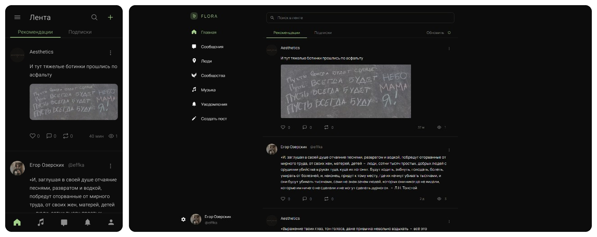

## Flora Ecosystem

**Flora**  –  открытая некоммерческая социальная экосистема: без рекламы и слежки, с настоящим сквозным шифрованием и рекомендательным алгоритмом, который можно прочитать и настроить под себя. Свои медиакодеки и бэкенд  –  на Rust.

* **Безопасность:** [`SECURITY.md`](SECURITY.md), известные допущения  –  [`Documents/known/security.md`](Documents/known/security.md)
* **Участие:** [`CONTRIBUTING.md`](CONTRIBUTING.md)

### Попробовать альфу

* **Веб:** https://social.flora-s.net
* **Android:** https://social.flora-s.net/download

После входа  –  лента, сообщества, сообщения со сквозным шифрованием, музыка и поиск.

<p align="center">
  
</p>

### Протоколы и спеки (реализованные)

Открытые спецификации с работающим кодом в альфе / репозитории:

* **[FSCP](Documents/fscp/FSCP.md)**  –  сквозное шифрование переписки (сервер хранит шифртекст); также [криптографические жалобы](Documents/fscp/franking.md), [обзор шифрования](Documents/fscp/e2e-security.md)
* **[FIRA](Documents/fira/FIRA.md)**  –  читаемый алгоритм рекомендаций: [F](Documents/fira/FIRA-F.md) лента · [M](Documents/fira/FIRA-M.md) музыка · [P](Documents/fira/FIRA-P.md) люди · [C](Documents/fira/FIRA-C.md) сообщества
* **[FSA](Documents/fsa/FSA.md)**  –  полнотекстовый поиск (ядро + поверхности F/A/M/P/C/N/D), реализация в [`Products/FSA`](Products/FSA)
* **[FRC-I](Documents/codecs/FRC-I.md)**  –  свой фото-кодек на Rust (формат заморожен; в проде пишется вместе с запасным WebP)
* **[CODECS](Documents/codecs/CODECS.md)**  –  политика медиа (фото / аудио / видео), в том числе для зашифрованных сообщений

Семейство FRC также включает **[FRC-A](Documents/codecs/FRC-A.md)** (аудио) и **[FRC-V](Documents/codecs/FRC-V.md)** (видео)  –  ядра в [`Products/FRC`](Products/FRC); в пользовательском контуре флагман  –  FRC-I.

Черновики следующих слоёв (спека + ядра, не выдаём за прод): [FGP](Documents/fgp/FGP.md) (управление общим), [FPP](Documents/fpp/FPP.md) (подтверждение личности), [FEP](Documents/fep/FEP.md) / [LIV](Documents/fep/LIV.md) (экономика).

### Лицензия

Код сообщества  –  **AGPL-3.0-only**: можно читать, проверять, улучшать вкладом и запускать свои копии; если вы отдаёте модифицированный сервис по сети, исходники обязаны оставаться открытыми. Поэтому открытую редакцию нельзя тихо закрыть или забрать в частные руки.

Коммерческая лицензия  –  на **тот же код Flora Ecosystem**, у того же правообладателя (закрытая встройка, OEM, SLA). Это не отмена AGPL для пользовательской сети и не «закрытие» соцсети для сообщества.

Подробности: [`LEGAL.md`](LEGAL.md), [`LICENSE`](LICENSE), [`LICENSE-COMMERCIAL.md`](LICENSE-COMMERCIAL.md), [`NOTICE.md`](NOTICE.md). Некодовые материалы  –  **CC BY-SA 4.0** или коммерческая лицензия на контент ([`LICENSE-CONTENT.md`](LICENSE-CONTENT.md)).

### Разработка

**Требования:** Docker Desktop, [Rust](https://rustup.rs/) (см. [`rust-toolchain.toml`](rust-toolchain.toml)), Node.js ≥ 20.19 (см. [`.nvmrc`](.nvmrc)).

HTTP API  –  пакет Rust `flora-api` на порту **:5290**.

```bash
# 1. Зависимости JS (workspaces: Web, Mobile, client-core)
npm install

# 2. PostgreSQL + миграции (Windows PowerShell)
./Scripts/setup-local-postgres.ps1

# 3. Локальный стек: DB → flora-api :5290 → Web :3000
./Scripts/zed-dev-api-web.ps1
# Web → http://localhost:3000 → proxy http://127.0.0.1:5290
```

**Android (USB):** VS Code / Cursor task **Flora Android: debug (USB)**  –  PostgreSQL, Rust `flora-api`, установка Flora Dev, Metro. CLI: `./Scripts/mobile-debug-android.ps1`.

На Windows удобнее задачи из [`.vscode/tasks.json`](.vscode/tasks.json): **Flora: API + Web dev localhost**, **Flora Android: debug (USB)**.

## Философия проекта

Ценности Flora закреплены не слоганами, а инструментами: у каждого тезиса есть открытая спека и код (см. блок протоколов выше и [`LEGAL.md`](LEGAL.md)).

### Некоммерческий фундамент

Реклама, платное продвижение и платная кастомизация «для статуса» исключены: они ломают доверие быстрее, чем любой баг. Брендовый контент помечается, идёт по тем же правилам, что и обычные посты, и отключается одной настройкой (в разработке). Коммерческая лицензия на код  –  для чужих закрытых интеграций, не для продажи внимания пользователей Flora.

Дальше по той же логике проектируется экономика **FEP / LIV**: деньги как средство обмена, а не рычаг власти (спека и ядра есть; в прод пользовательской сети пока не включаем). Это больше про глобальные задачи на будущее, чем про рабочий инструмент сейчас.

### Доказательность вместо «поверьте нам»

Приватность и «этичность» без проверяемых артефактов  –  маркетинг. У Flora код под AGPL, публичные спецификации и эталонные тестовые векторы там, где протокол это требует. Утверждение о продукте должно разворачиваться в ссылку на спеку или реализацию  –  иначе его не стоит публиковать. Участие: [`CONTRIBUTING.md`](CONTRIBUTING.md).

### Переписка, которую не читает даже сервер

**FSCP**  –  сквозное шифрование по умолчанию: на сервере остаётся шифртекст. Ключ привязан к учётным данным и переносится между устройствами без отдельной «магии». На жалобы о вреде в зашифрованной переписке рассчитан механизм [криптографических жалоб](Documents/fscp/franking.md): можно сообщить о нарушении, не открывая серверу чтение всего чата и не встраивая тайный доступ. Обзор: [`e2e-security.md`](Documents/fscp/e2e-security.md).

### Алгоритмы, которые можно прочитать и настроить

**FIRA**  –  рекомендации (лента, музыка, люди, сообщества) как публичная спецификация, а не чёрный ящик «для вовлечённости». **FSA**  –  тот же принцип для поиска: одно ядро, явные профили поверхностей, управляемая подстройка под пользователя. Пользователь должен понимать *почему* видит материал и иметь рычаги, а не только бесконечную ленту.

### Свои медиа, в том числе в шифрованных сообщениях

Медиа не должны быть вечной зависимостью от чужих кодеков и непрозрачных цепочек обработки. Политика **CODECS** разделяет открытый контур постов и зашифрованные вложения в сообщениях. Флагман **FRC-I**  –  свой фото-кодек на Rust (один исходник собирается и для сервера/приложений, и для браузера), уже в проде вместе с запасным форматом. **FRC-A** и **FRC-V** развиваются в том же семействе.

### Живые люди, а не фермы  –  без биометрии

Ответ на «мёртвый интернет» и массовые фейковые аккаунты не должен быть сдачей радужки. **FPP** проектирует подтверждение, что за аккаунтом живой человек  –  без биометрических баз и без проверки паспортов; **FGP**  –  управление общим (правила, приоритеты), где частное пространство пользователя выведено из-под захвата техническими инвариантами. Оба слоя пока в статусе черновика / ядра  –  направление зафиксировано в спеках.

### Дизайн

К дизайну относимся как к инженерии: решения опираются на эргономику, читаемость и предсказуемое поведение, а не на сезонные моды интерфейса. Кастомизация  –  про своё пространство, без платы за оформление и без тёмных приёмов удержания внимания.
