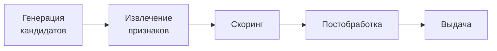

# FIRA — Flora Individual Recommendation Algorithm

**Status:** Draft  
**Version:** 0.2  
**Date:** 2026-06-09

---

## Overview

FIRA (Flora Individual Recommendation Algorithm) — алгоритмический фундамент системы персональных рекомендаций в экосистеме FLORA. Все компоненты FIRA-X (FIRA-F, FIRA-P, FIRA-C, FIRA-M и будущие расширения) строятся на общих абстракциях, определённых в этом документе: едином профиле интересов пользователя (UIP), универсальной формуле скоринга и типизированном контракте расширяемости.

Этот документ является нормативным: каждый компонент **обязан** соответствовать описанным здесь принципам и интерфейсам. Специфика каждого компонента — в его собственном spec-файле.

---

## Goals & Non-Goals

**Goals:**
- Сформулировать единый профиль интересов (UIP), применимый ко всем компонентам.
- Определить универсальную формулу скоринга и pipeline-архитектуру.
- Зафиксировать протокол cold start и политику разнообразия.
- Предоставить типизированный контракт расширяемости (`IFiraComponent`) для будущих компонентов.
- Установить явные границы приватности.

**Non-Goals:**
- Описание компонент-специфичных источников кандидатов или весов — это зона FIRA-X.
- Описание конкретных хранилищ данных или инфраструктурных деталей.
- Определение UI/UX экранов настроек (это зона Apps/Web).

---

## Architecture Position

FIRA — алгоритмический слой внутри **Modules**. Бизнес-логика скоринга принадлежит соответствующим модулям:

- Лента, сообщества → `Modules/Flora.Content`
- Люди → `Modules/Flora.Users`
- Музыка → `Modules/Flora.Music` (future)

Продукт `Products/Flora.Social` только **компонует** результаты модулей и выставляет их через HTTP. UIP как shared-абстракция определяется в `Flora.Shared.Contracts` (read-only DTO), но владеет данными и обновляет их только модуль-владелец.

```
Apps/Web
  └─→ Flora.API
        └─→ Flora.Social (composition only)
              ├─→ Flora.Content  (FIRA-F, FIRA-C)
              ├─→ Flora.Users    (FIRA-P)
              └─→ Flora.Music    (FIRA-M, future)
```

---

## 1. Philosophy & Goals

**Миссия:** Создать для каждого пользователя максимально интересный опыт, основанный на балансе его индивидуальных интересов и глобальной актуальности контента. Алгоритм не должен просто давать больше того, что пользователь уже видел (filter bubble), — он должен открывать новое, попадая в интересы.

**Принципы:**

1. **Баланс индивидуального и глобального.** Персонализация улучшает попадание, но не изолирует пользователя. Каждый компонент гарантирует квоту неперсонализированного контента для открытия нового.

2. **Privacy-first.** Сигналы строятся исключительно на публичном поведении и явных предпочтениях. E2E-переписка никогда не читается и не анализируется. Протокол чата: [`docs/fscp/FSCP.md`](../fscp/FSCP.md). Платформенная модель и границы приватности: [`docs/fscp/e2e-security.md`](../fscp/e2e-security.md), раздел «Поиск и рекомендации без plaintext чатов».

3. **Прозрачность.** Все параметры алгоритма — именованные настраиваемые константы, не магические числа. Каждый вес документирован и обоснован.

4. **Эволюционируемость.** Новые компоненты добавляются через единый контракт `IFiraComponent` без изменения core-логики.

---

## 2. User Interest Profile (UIP)

UIP — персистентный вектор интересов пользователя. Это центральная общая абстракция: все FIRA-X компоненты читают один и тот же UIP при скоринге.

### 2.1 Структура

UIP представляет собой нормированный вектор весов по осям топик-таксономии:

```
UIP = { topic_id → weight }   where Σ weight = 1
```

Каждая ось соответствует теме из системной таксономии (§2.6). Вес отражает накопленную силу интереса пользователя к теме с учётом затухания по времени.

### 2.2 Сигналы и их веса

Сигналы делятся на **неявные** (поведенческие) и **явные** (пользовательский выбор).

**Неявные сигналы (implicit):**

| Событие | Базовый вес |
|---------|-------------|
| `like` | +1.0 |
| `comment` | +2.0 |
| `repost` | +2.5 |
| `view_full` (прочитан до конца) | +0.5 |
| `view_partial` (прокручен мимо, >3 с) | +0.1 |
| `skip` (пролистан мгновенно) | −0.3 |
| `hide` (скрыть пост / «не интересно») | −1.0 |

**Явные сигналы (explicit):**
- Темы, выбранные пользователем в Settings → Interests.
- Применяются как фиксированный базовый вес `explicitTopicSeedWeight` на каждую выбранную тему.
- Не вытесняют накопленные неявные сигналы — суммируются с ними при нормировке.

### 2.3 Функция затухания

Вес каждого события убывает с течением времени по экспоненте:

```
w_decayed(event) = w_base(event) × exp(−λ × Δhours)
```

где `λ` — configurable параметр, специфичный для каждого FIRA-X компонента (`FiraComponentConfig.DecayLambda`).

### 2.4 Обновление UIP

- **Инкрементальное (per-event):** каждое engagement-событие помещается в очередь и обрабатывается near-realtime (задержка < 1 с); UIP обновляется асинхронно относительно HTTP-ответа, но до следующего запроса рекомендаций обновление уже применено.
- **Полный пересчёт (daily batch):** перенормировка всего вектора, применение функции затухания ко всем историческим событиям.
- **Приоритетная обработка негативных сигналов:** `hide` и `skip` дополнительно применяются **синхронно к кэшу текущей сессии** — автор и тема понижаются мгновенно, не дожидаясь ни очереди, ни batch. Это предотвращает повторный показ нежелательного контента в той же сессии.
- **Коррекция позиционного смещения (Position Bias Correction):** Engagement-события логируются вместе с `feedPosition` — позицией элемента в ленте в момент взаимодействия. При обновлении UIP вес события корректируется:

```
positionCorrectedWeight(event) = w_base(event) × positionBiasCorrection(feedPosition)
positionBiasCorrection(pos)    = avgCtr / expectedCtr(pos)
```

`expectedCtr(pos)` — скользящая агрегация наблюдаемого CTR по каждой позиции ленты (обновляется в daily batch). Без коррекции возникает самоусиливающийся цикл: контент, попавший на верхние позиции, получает завышенные веса в UIP и стабилизируется вверху навсегда.

> **Инфраструктурное требование:** `feedPosition` должен логироваться с первого дня развёртывания. До накопления достаточных данных: `positionBiasCorrection(pos) = 1.0` (нейтральный вес).

### 2.5 Нормировка с отрицательными весами

Накопленный сырой вес темы после суммирования всех событий с затуханием может быть отрицательным. Перед нормировкой применяется процедура:

```
rawWeight(topic) = Σ w_decayed(event_i)   для всех событий по этой теме

clampedWeight(topic) = max(0, rawWeight(topic))

// Guard against empty UIP (все темы отрицательны или нет истории):
total = Σ clampedWeight(t)   для всех t
UIP[topic] = clampedWeight(topic) / total   если total > 0
           = 1 / |Taxonomy|                 иначе (равномерное распределение)
```

Отрицательный накопленный вес обнуляется (`clamp to 0`) — тема не имеет отрицательного веса в итоговом векторе, она просто вытесняется темами с позитивными сигналами. Это обеспечивает корректность косинусного сходства в формулах скоринга.

**Edge case — пустой UIP:** Если пользователь не имеет никаких позитивных сигналов (нет истории или все веса ушли в минус), `total = 0`. В этом случае UIP инициализируется равномерным распределением по всем темам таксономии (`1 / |Taxonomy|`). Система корректно переходит в Phase 0 cold start — `IndividualAffinity` близок к константе, алгоритм опирается на `β` и `γ`.

Явные теги (`explicitTopicSeedWeight`) добавляются к `clampedWeight` до нормировки.

### 2.6 Явная таксономия интересов (Explicit Interest Taxonomy)

Системная таксономия — предустановленный список тем, из которых пользователь выбирает явные интересы. Примеры тем:

> Музыка · Компьютерные игры · Фильмы · Сериалы · Спорт · Технологии · Искусство · Наука · Мода · Кулинария · Книги · Путешествия · Фотография · Автомобили · Животные · Юмор · Бизнес · Здоровье · Аниме · Политика

**Правила:**

- Полный список тем является developer-configurable параметром: `TopicTaxonomy.MaxTopics`.
- Пользователь может выбрать **не более** `floor(MaxTopics / 3)` тем. Ограничение в треть от общего числа предотвращает размытие профиля и принуждает к осознанному выбору приоритетов.
- Настройка доступна в **Settings → Interests**; изменения применяются немедленно (синхронное обновление UIP, без ожидания batch).
- **Cold start:** если пользователь ещё не выбрал ни одной темы — перед первой загрузкой рекомендаций отображается onboarding-экран выбора. Он ускоряет переход к персонализации (Phase 0 → Phase 1, §6).

### 2.7 Session UIP (краткосрочный профиль сессии)

Постоянный UIP отражает долгосрочные интересы, но не реагирует немедленно на смену контекста внутри сессии. Если пользователь только что прочитал пять постов о программировании — следующие рекомендации должны учитывать этот краткосрочный контекст, не дожидаясь daily batch.

**Session UIP** — временный вектор, живущий только на время HTTP-запроса:

- Строится из последних `SessionWindowSize` engagement-событий текущей сессии (configurable, дефолт: `20`).
- Использует **те же базовые веса из §2.2** (`like` = +1.0, `hide` = −1.0 и т.д.), но **без функции временного затухания** (`w_session(event) = w_base(event)`). После суммирования применяется `clamp to 0` и нормировка — как в §2.5. Это обеспечивает корректный знак: `hide` понижает тему, а не усиливает её.
- Не персистируется и не влияет на постоянный UIP; передаётся через `FiraRequestMetadata.SessionUip` (может быть `null`, если событий ещё нет).

**Применение при скоринге:**

```
effectiveUip(u) = (1 − sessionMomentumWeight) × UIP(u)
               + sessionMomentumWeight × SessionUip(u)

// При SessionUip = null: effectiveUip(u) = UIP(u)
```

`sessionMomentumWeight ∈ [0, 0.4]` (`FiraComponentConfig.SessionMomentumWeight`, дефолт: `0.2`). Значение `0` — только долгосрочный UIP; `0.4` — сессия влияет существенно, но не доминирует.

`IndividualAffinity` во всех компонентах, поддерживающих Session UIP, вычисляется через `effectiveUip` вместо `UIP`. Компоненты: FIRA-F, FIRA-P, FIRA-C. FIRA-M управляет контекстом через `ListeningContext` и Session UIP не применяет.

**Построение Session UIP (архитектурная заметка):**

`SessionUip` строится в `Products/Flora.Social` на основе per-user сессионного кэша:

```
Flora.Social controller:
  1. Читает из ISessionUipCache.GetEventsAsync(userUuid)   → последние SessionWindowSize событий
  2. Строит SessionUip: суммирует w_base(event) по темам (без decay), применяет clamp+normalize (§2.5)
  3. Помещает результат в FiraRequestMetadata.SessionUip
```

Сессия идентифицируется по `userUuid` + скользящему окну `sessionInactivityTimeout` (дефолт: `30 мин` без запросов — сессия считается завершённой). `ISessionUipCache` — легковесный in-memory cache; не персистируется, не требует distributed storage.

**Контракт `FiraRequestMetadata`:**

```csharp
record FiraRequestMetadata(
    // ... existing fields
    UserInterestProfile? SessionUip   // null = нет engagement-событий в текущей сессии
);
```

---

## 3. Универсальная формула скоринга

Каждый FIRA-X компонент применяет одну и ту же трёхкомпонентную формулу:

```
Score(item) = α · IndividualAffinity(item, UIP)
            + β · GlobalRelevance(item)
            + γ · SocialProximity(item, graph)
            [+ additiveBonus(item)]              ← опционально, см. ниже
```

**Инварианты основной части:**
- `α + β + γ = 1` — соблюдается на каждой фазе cold start, в том числе при линейной интерполяции (все три веса интерполируются совместно).
- Все три веса определяются в `FiraComponentConfig` каждого компонента — не хардкод.
- При cold start (Phase 0) `α = 0`; в полном режиме (Phase 2) `α` принимает дефолтное значение компонента.

**Аддитивные расширения (`additiveBonus`):**  
Компонент может добавлять внешнее слагаемое за пределами нормированной тройки — например, `growthBonus` (FIRA-C) или `temporalBoost` (FIRA-M). Такие надбавки должны быть: явно указаны в `FiraComponentConfig` (поле `AdditiveBonusWeight`), масштабированы так, чтобы их максимальное значение не превышало `AdditiveBonusWeight`, и задокументированы как исключение из основного инварианта.

**Соглашение о логарифме:**  
Везде в FIRA-X, если не указано иное, `log(x)` означает натуральный логарифм (`ln`). Для баз 10 явно указывается `log10(x)`.

**Компоненты:**

| Компонент | Что измеряет |
|-----------|-------------|
| `IndividualAffinity` | Насколько item соответствует UIP пользователя (косинусное сходство тегов, author affinity). |
| `GlobalRelevance` | Насколько item актуален глобально (вирусность, рейтинги, свежесть). |
| `SocialProximity` | Насколько item близок по социальному графу (реакции подписок, репосты и т.д.). |

Конкретные формулы каждого компонента описаны в FIRA-X spec-файлах.

**Примечание о масштабах компонентов:**  
`IndividualAffinity` нормирован в `[0, 1]`. `GlobalRelevance` и `SocialProximity` используют логарифмические формулы без верхней границы — их абсолютные значения могут превышать 1 для популярного контента. Это стандартная практика для ранжирующих систем: веса α, β, γ управляют *относительной важностью* компонентов при типичных значениях входных сигналов, а не гарантируют математически равный диапазон. При тюнинге весов необходимо учитывать фактическое распределение значений `GlobalRelevance` и `SocialProximity` в production-данных.

---

## 4. Pipeline Architecture

Все FIRA-X компоненты проходят единый пятиступенчатый pipeline:



**Candidate Generation** — формирование пула кандидатов из нескольких источников с разными начальными весами. Цель: высокий recall (не пропустить релевантное).

**Feature Extraction** — извлечение сигналов из UIP, social graph snapshot и глобальной статистики для каждого кандидата.

**Scoring** — применение универсальной формулы (§3) с компонент-специфичными весами.

**Post-processing** — фильтры разнообразия, дедупликация, применение политики приватности, сортировка.

**Serving** — выдача из per-user кэша с TTL; инвалидация при engagement-событиях.

---

## 5. Политика разнообразия и защита от filter bubble

**Exploration quota:** Минимум `ε = 15%` позиций в каждом результирующем наборе должны занимать кандидаты из неперсонализированных источников (trending, global popular, new content). Это гарантирует, что пользователь всегда открывает что-то новое.

**Адаптивная квота исследования (Contextual Bandit):** Фиксированная квота `ε = 15%` заменяется динамическим значением, зависящим от зрелости UIP пользователя. При `FiraComponentConfig.UseAdaptiveBandit = true`:

```
uipConfidence   = Σ clampedWeight(t) / |Taxonomy|   ← средний накопленный сигнал (до нормировки UIP)
adaptiveEpsilon = ε_min + (ε_max − ε_min) × exp(−uipConfidence / banditConfidenceScale)
```

| Параметр | Описание | Дефолт |
|----------|----------|--------|
| `EpsilonMin` | Квота исследования при зрелом UIP | 0.10 |
| `EpsilonMax` | Квота исследования при холодном UIP | 0.30 |
| `BanditConfidenceScale` | Чувствительность перехода от `ε_max` к `ε_min` | 5.0 |

При `UseAdaptiveBandit = false` используется фиксированный `ExplorationQuota` (дефолт: `0.15`). Это обеспечивает обратную совместимость.

**Diversity constraint:** В рамках одного ответа не может быть более `maxConsecutiveSameAuthor` подряд идущих элементов от одного автора и не менее `minUniqueTopicsPerPage` разных тем на страницу. Конкретные значения задаются в `FiraComponentConfig`.

**MMR (Maximal Marginal Relevance):** Опциональная стратегия для post-processing. Вместо сортировки только по Score, MMR итеративно выбирает следующий элемент как баланс между максимальным Score и минимальным сходством с уже выбранными:

```
MMR(item) = λ_mmr · Score(item) − (1 − λ_mmr) · max_similarity(item, selected)
```

Включается флагом `FiraComponentConfig.UseMmr`.

---

## 6. Cold Start Protocol

Cold start применяется к новым пользователям без накопленных сигналов. Переход между фазами — линейный, основан на количестве engagement-событий.

| Фаза | Условие | Описание |
|------|---------|----------|
| **Phase 0** | 0 сигналов | `α = 0`; β и γ — per-component дефолты для Phase 0 (указаны в каждом FIRA-X spec) |
| **Phase 1** | 1–19 сигналов | Линейная интерполяция **всех трёх весов** (α, β, γ) от Phase 0 к Phase 2 значениям; `α+β+γ = 1` на каждом шаге |
| **Phase 2** | ≥ 20 сигналов | Полный режим FIRA; α, β, γ = per-component дефолты Phase 2 |

> Конкретные числа Phase 0 / Phase 2 для каждого компонента — в `FiraComponentConfig` и в таблице «Individual vs Global Balance» соответствующего FIRA-X документа.

**Ускоренный выход из Phase 0 (поведение по умолчанию):** Если пользователь выбрал темы в onboarding (§2.6), UIP немедленно сидируется явными весами, и система переходит в Phase 1 без ожидания неявных сигналов. Каждая выбранная тема засчитывается как `explicitSignalEquivalent` событий (configurable).

> **Override:** Компоненты могут переопределять это поведение, если семантика домена требует иного. Например, FIRA-M явно остаётся в Phase 0 после onboarding до первого реального прослушивания — в этом домене явный выбор жанров считается слабым сигналом. Каждый FIRA-X spec фиксирует своё поведение в секции «Cold Start Protocol».

---

## 7. Feedback Loop

```
Пользователь взаимодействует с контентом
  → Engagement-событие отправляется асинхронно (+ feedPosition для bias correction)
  → UIP инкрементально обновляется (near-realtime, с коррекцией позиционного смещения)
  → Session UIP обновляется синхронно в памяти запроса
  → Следующий запрос рекомендаций использует обновлённый UIP + effectiveUip
  → Daily batch: полный пересчёт, перенормировка, обновление positionBias-таблицы
```

**Негативные сигналы — приоритетная обработка:** `hide` и `skip` применяются немедленно к кэшу сессии, понижая автора и тему до следующего полного обновления. Это предотвращает повторное появление нежелательного контента в той же сессии.

**Паттерн негативных сигналов (Negative Streak):** Если пользователь подряд совершил `NegativeStreakThreshold` или более негативных взаимодействий (`hide` или `skip`) по одной теме без единого позитивного сигнала по этой теме — тема помечается флагом `topicTempBlocked`:

```
isStreakViolation(topic) = consecutiveNegatives(topic) ≥ NegativeStreakThreshold
                        AND positiveInStreak(topic) = 0
```

При `topicTempBlocked = true` все кандидаты, для которых данная тема является **доминирующей**, исключаются из выдачи на `TopicBlockDurationHours`:

```
topTopic(item) = argmax_t topicVector(item)[t]  // тема с наибольшим весом в теговом векторе item
blocked(item)  = topicTempBlocked[topTopic(item)]
```

По истечении срока тема разблокируется и снова участвует в ранжировании с накопленным сниженным весом (через UIP).

| Параметр | Описание | Дефолт |
|----------|----------|--------|
| `NegativeStreakThreshold` | Число подряд идущих негативных сигналов до блокировки темы | 3 |
| `TopicBlockDurationHours` | Длительность временной блокировки темы | 4 ч |

**Хранение:** Счётчик `consecutiveNegatives(topic)` и флаг `topicTempBlocked` хранятся в `ISessionUipCache` — так же, как Session UIP (§2.7). Оба сбрасываются при истечении `sessionInactivityTimeout`. Это намеренное упрощение для v1: пользователь может обойти стрик, покинув приложение на `sessionInactivityTimeout`. При необходимости счётчик можно вынести в персистентный кэш в будущей версии. Постоянный UIP обновляется штатно — тема лишь временно исключается из выдачи, а не удаляется из профиля.

---

## 8. IFiraComponent — Контракт расширяемости

Каждый компонент FIRA-X реализует следующий интерфейс:

```csharp
interface IFiraComponent<TCandidate, TResult>
{
    FiraComponentConfig Config { get; }

    IAsyncEnumerable<TCandidate> GenerateCandidatesAsync(FiraContext ctx, CancellationToken ct);
    Task<ScoredItem<TCandidate>[]> ScoreAsync(TCandidate[] candidates, FiraContext ctx, CancellationToken ct);
    TResult[] PostProcess(ScoredItem<TCandidate>[] scored, FiraContext ctx);
}

record FiraContext(
    UserInterestProfile Uip,
    SocialGraphSnapshot Graph,
    FiraRequestMetadata Metadata
);

record FiraComponentConfig(
    // --- Основные веса ---
    double AlphaDefault,             // вес IndividualAffinity в Phase 2
    double BetaDefault,              // вес GlobalRelevance
    double GammaDefault,             // вес SocialProximity; AlphaDefault+BetaDefault+GammaDefault = 1
    double DecayLambda,              // параметр затухания UIP и freshness в GlobalRelevance
    TimeSpan CacheTtl,

    // --- Разнообразие ---
    int MaxConsecutiveSameAuthor,
    int MinUniqueTopicsPerPage,
    double ExplorationQuota,         // фиксированная квота исследования; игнорируется при UseAdaptiveBandit = true
    bool UseMmr,

    // --- Адаптивный bandit (§5) ---
    bool UseAdaptiveBandit,          // заменяет фиксированный ExplorationQuota динамическим значением
    double EpsilonMin,               // минимальная квота при зрелом UIP; дефолт: 0.10
    double EpsilonMax,               // максимальная квота при холодном UIP; дефолт: 0.30
    double BanditConfidenceScale,    // чувствительность перехода; дефолт: 5.0

    // --- Аддитивный бонус ---
    double AdditiveBonusWeight,      // макс. значение аддитивного бонуса; 0 = не используется

    // --- Affinity ---
    double AffinityScale,            // знаменатель tanh для author/artistAffinityScore
                                     //   FIRA-F: authorAffinityScale = 5.0
                                     //   FIRA-M: artistAffinityScale = 8.0
                                     //   остальные компоненты: 0 (не используется)
    double FollowedArtistBoost,      // буст в SocialProximity за follow-артиста (FIRA-M); 0 = не используется у остальных
                                     // намеренное упрощение: единый flat config для всех компонентов

    // --- Session UIP (§2.7) ---
    double SessionMomentumWeight,    // [0, 0.4]; 0 = отключить session UIP; дефолт: 0.2
    int SessionWindowSize,           // кол-во событий в окне Session UIP; дефолт: 20

    // --- Negative Streak (§7) ---
    int NegativeStreakThreshold,     // стрик негативных сигналов до временной блокировки темы; дефолт: 3
    int TopicBlockDurationHours,     // длительность блокировки темы в часах; дефолт: 4

    // --- Collaborative Filtering (§10) ---
    double CfCandidateWeight,        // вес CF-источника в пуле кандидатов; 0 = отключить CF; дефолт: 0.2
    double CfMinUipConfidence        // мин. uipConfidence для включения CF; дефолт: 0.05
);
```

**Добавление нового компонента** требует только: реализации `IFiraComponent<TCandidate, TResult>`, определения `FiraComponentConfig` и регистрации в DI соответствующего модуля. Core-логика FIRA не меняется.

### 8.1 Построение FiraContext

`FiraContext` строится в `Products/Flora.Social` (composition layer) перед вызовом модуля:

```
HTTP Request
  → Flora.Social controller
      1. вызывает Flora.Users: GetSocialGraphSnapshotAsync(userUuid)     → SocialGraphSnapshot
      2. вызывает Flora.Users: GetUserInterestProfileAsync(userUuid)     → UserInterestProfile
      3. [для FIRA-P] вызывает Flora.Content:
            GetCandidateTopicVectorsAsync(candidateUuids)               → CandidateTopicVectors
         включает результат в FiraRequestMetadata
      4. собирает FiraContext(uip, graph, metadata)
      5. передаёт FiraContext в вызов соответствующего модуля
```

Это единственное место, где данные из разных модулей объединяются. Бизнес-логики в этой сборке нет — только агрегация DTO. `Flora.Social` не знает о внутренней структуре UIP или графа; он оперирует только публичными контрактами (`Flora.Users.Contracts`, `Flora.Content.Contracts`).

---

## 9. Классификация жизненного цикла контента (Content Lifecycle)

Разный контент стареет по-разному. Мем теряет актуальность за несколько часов; туториал остаётся ценным годами. Единый `DecayLambda` для всего контента неоптимален.

**Content Lifecycle** — классификация поста/трека/объекта по скорости устаревания:

```csharp
enum ContentLifecycle { Ephemeral, Standard, Evergreen }
```

| Тип | Описание | Множитель decay |
|-----|----------|----------------|
| `Ephemeral` | Новость, мем, событие | `× 2.0` (быстрое устаревание) |
| `Standard` | Обычный пост, фото | `× 1.0` (базовое значение) |
| `Evergreen` | Туториал, guide, аналитика | `× 0.2` (медленное устаревание) |

> **Множители `2.0` и `0.2` — намеренные константы.** Выбраны как "одна октава" вверх и вниз от базового `× 1.0`: контент крайних типов стареет в 5× раз быстрее/медленнее стандартного. Калибруются при первом A/B-тесте в production. Сделаны ненастраиваемыми через `FiraComponentConfig` намеренно — чтобы не пролиферировать конфиг до появления реальных данных для тюнинга.

**Применение:**

```
lifecycleDecayLambda(item) = DecayLambda × lifecycleMultiplier(item.ContentLifecycle)
```

`lifecycleDecayLambda` подставляется в `exp(−λ × ageHours)` формулы `GlobalRelevance` вместо константного `DecayLambda`.

**Классификация контента:**

Тип `ContentLifecycle` присваивается при публикации: автором явно через UI, или автоматически NLP-классификатором (future). Хранится как атрибут поста в `Flora.Content`. Пока автоматическая классификация не реализована — все посты по умолчанию `Standard`.

**Область применения:** FIRA-F (посты), FIRA-M (треки: `Ephemeral` = топ-чарты текущей недели, `Evergreen` = классика). FIRA-C не использует lifecycle (сообщества стареют не по контенту, а по `communityAge` в `growthBonus`).

---

## 10. Коллаборативная фильтрация (CF) как источник кандидатов

CF — дополнительный источник кандидатов, расширяющий пул для FIRA-F и FIRA-C. Идея: если пользователи A и B похожи по UIP-вектору, контент, понравившийся B, но ещё неизвестный A, скорее всего, будет интересен A.

**CF не заменяет формулу скоринга.** Она лишь добавляет новый источник в Шаг 1 pipeline — далее кандидаты проходят стандартный scoring наравне с остальными.

### Алгоритм

```
cfNeighbors(u)   = top-K пользователей с наибольшим cosine(UIP(u), UIP(v)), v ≠ u
cfCandidates(u)  = ⋃_{v ∈ cfNeighbors} { items, понравившиеся v, невиденные u }
                   взвешенные по similarity(u, v)
```

CF-кандидаты добавляются в пул Шага 1 с весом `CfCandidateWeight` (дефолт: `0.2`). CF отключается, если `uipConfidence < CfMinUipConfidence` (configurable, дефолт: `0.05`) — при таком профиле ANN-соседи нерепрезентативны и CF только добавляет шум. `uipConfidence` — та же метрика, что в §5 (адаптивный bandit).

### Инфраструктурные требования

| Требование | Описание |
|-----------|----------|
| **UIP ANN-индекс** | Approximate Nearest Neighbors индекс по UIP-векторам пользователей (e.g. HNSW) |
| **Частота обновления** | Ежедневный rebuild; инкрементальное обновление при значительных изменениях UIP |
| **Приватность** | Индекс оперирует только UIP-векторами. Mapping `UIP-vector → user_uuid` хранится за boundary модуля `Flora.Users`; CF-результаты возвращаются как списки `item_uuid`, не `user_uuid` |
| **Cold start** | При `CfCandidateWeight = 0` или `uipConfidence < CfMinUipConfidence` — CF-источник отключён |

### Область применения

| Компонент | Применимость |
|-----------|-------------|
| FIRA-F | Кандидаты-посты: вес пула `CfCandidateWeight` |
| FIRA-C | Кандидаты-сообщества: вес пула `CfCandidateWeight` |
| FIRA-P | Не применяется: FIRA-P и так рекомендует пользователей — CF создал бы circular dependency |
| FIRA-M | Рассматривается; зависит от готовности `Flora.Music` поддерживать собственный UIP |

---

## 11. Кросс-компонентная сигнализация (Hot Zones)

**Проблема:** Компоненты FIRA работают изолированно. Если пользователь прямо сейчас активно слушает рок-музыку в FIRA-M — FIRA-F ничего об этом не знает и не усиливает посты о роке в ленте.

**Решение — Hot Zones:** лёгкий сигнал, временно усиливающий связанные темы в других компонентах. Изоляция модулей соблюдена: сигнал передаётся через публичный контракт `IHotZoneEventBus` (Contracts), без прямого доступа к внутренним структурам.

### Контракт

```csharp
record HotZoneSignal(
    Guid UserUuid,
    string TopicId,              // topic из общей таксономии (§2.6)
    double AmplificationFactor,  // множитель [1.0, 2.0]
    DateTimeOffset ExpiresAt     // TTL сигнала
);

interface IHotZoneEventBus
{
    void Publish(HotZoneSignal signal);
    IEnumerable<HotZoneSignal> GetActive(Guid userUuid);
}
```

### Применение при скоринге

Hot Zones применяются **поверх** Session UIP mixing (§2.7). Порядок операций:

```
// Шаг 1: Session UIP mixing (§2.7)
effectiveUip[topic] = (1 − sessionMomentumWeight) × UIP[topic]
                    + sessionMomentumWeight × SessionUip[topic]
                    // SessionUip = null → effectiveUip = UIP

// Шаг 2: Hot Zones amplification поверх effectiveUip
hotZoneFactor(topic, u)       = max(activeSignals(topic, u).AmplificationFactor)   если есть активные сигналы
                              = 1.0                                                  иначе

effectiveUip_hotzone[topic]   = effectiveUip[topic] × hotZoneFactor(topic, u)
```

`effectiveUip_hotzone` — итоговый вектор, который используется в `IndividualAffinity` всех компонентов, поддерживающих оба механизма.

### Примеры сигналов

| Событие-источник | Публикуемый сигнал | Эффект в других компонентах |
|-----------------|-------------------|----------------------------|
| FIRA-M: 3+ трека подряд genre=Rock | `HotZone(Rock, ×1.5, TTL=20 мин)` | FIRA-F: посты о роке выше в ленте |
| FIRA-C: вступление в Photography-сообщество | `HotZone(Photography, ×1.3, TTL=60 мин)` | FIRA-F: посты о фотографии получают буст |

### Ограничения

- TTL сигнала: от 15 минут до 2 часов (настраивается при публикации).
- `AmplificationFactor ≤ 2.0` — жёсткий предел на усиление.
- Сигналы хранятся в `IMemoryCache` — не персистируются, не влияют на постоянный UIP.
- Компонент, публикующий сигнал, не знает, кто его читает — только пишет в шину.

---

## 12. Границы приватности

| Статус | Источник сигнала |
|--------|-----------------|
| **Разрешено** | Публичные engagement-события (лайки, репосты, просмотры публичных постов) |
| **Разрешено** | Граф подписок (кто на кого подписан) |
| **Разрешено** | Явные предпочтения (Settings → Interests) |
| **Разрешено** | Публичные данные профиля |
| **Разрешено** | История прослушиваний (музыка) — хранится локально в модуле |
| **Разрешено** | `feedPosition` для position bias correction — агрегируется в статистику, не хранится per-event |
| **Запрещено** | Содержимое E2E-сообщений |
| **Запрещено** | Метаданные E2E-сообщений (кому, когда, как часто) |
| **Запрещено** | Контент приватных сообществ без подтверждённого членства |
| **Запрещено** | Любые данные из `Flora.Messaging` |
| **Запрещено** | Прямая передача `user_uuid` между CF-соседями (только item-результаты) |

Подробная модель угроз и криптографические гарантии: [`docs/fscp/e2e-security.md`](../fscp/e2e-security.md).

---

## 13. Page Refresh Policy

Единая политика обновления страниц рекомендаций для всех компонентов FIRA-X. Определяет, когда кэш инвалидируется, какие метаданные возвращает API и как ведёт себя пагинация при обновлении.

### 13.1 Общие принципы

| Принцип | Описание |
|---------|----------|
| **Ленивое обновление** | Кэш инвалидируется немедленно при триггере, но пересчёт происходит только при следующем запросе — нет синхронного пересчёта в обработчике события. |
| **Естественный дебаунс** | Несколько engagement-событий подряд не приводят к N пересчётам: первый запрос после инвалидации пересчитывает кэш, последующие запросы до истечения TTL обслуживаются из нового кэша. |
| **Pull-to-refresh (явный)** | Клиент сбрасывает курсор на позицию 0; следующий запрос возвращает свежий набор, начиная с начала. |
| **Фоновое обновление (мягкое)** | Курсор не сбрасывается; пользователь продолжает скролл с той же позиции, но следующий запрос получит пересчитанный кэш. |
| **Cursor-safety при обновлении** | Курсор основан на offset, а не на конкретных UUID. Смена набора в кэше не ломает существующий курсор — пользователь просто сдвинется в новом наборе. |

### 13.2 Матрица триггеров инвалидации

Каждое событие инвалидирует кэш текущего пользователя в указанных компонентах:

| Событие | FIRA-F | FIRA-P | FIRA-C | FIRA-M |
|---------|:------:|:------:|:------:|:------:|
| Лайк / анлайк поста | ✓ | — | — | — |
| Репост / анрепост поста | ✓ | — | — | — |
| Комментарий к посту | ✓ | — | — | — |
| Публикация нового поста | ✓ | — | — | — |
| Подписка / отписка на пользователя | ✓ | ✓ | — | — |
| Вступление / выход из сообщества | ✓ | — | ✓ | — |
| Изменение явных интересов (Settings) | ✓ | ✓ | ✓ | ✓ |
| Новый `ListeningEvent` (прослушивание трека) | — | — | — | ✓ |
| `hide` / скрыть пост | ✓ | — | — | — |

> Инвалидация затрагивает **только кэш выполняющего действие пользователя**. Изменение данных другими пользователями подхватывается при следующем пересчёте (при истечении TTL или следующей инвалидации).

### 13.3 Метаданные ответа (`FeedPage`)

Все рекомендательные ответы включают поля управления обновлением:

| Поле | Тип | Описание |
|------|-----|----------|
| `generatedAt` | `DateTime (UTC)` | Момент вычисления / кэширования набора. Клиент передаёт это значение в endpoint `has-new` для поллинга. |
| `expiresAt` | `DateTime (UTC)` | `generatedAt + TTL` компонента. Клиент может автоматически рефрешнуть при `now > expiresAt`. |

### 13.4 Индикатор новых рекомендаций

Каждый компонент, поддерживающий pagination, предоставляет лёгкий endpoint для проверки наличия нового контента:

```
GET /api/auth/{resource}/has-new?since=<generatedAt>
→ 200 { hasNew: bool, checkedAt: DateTime }
```

Клиент поллит этот endpoint с интервалом `pollIntervalSeconds` (компонент-специфично; см. §Cache & Performance в каждом FIRA-X документе). При `hasNew = true` отображается баннер/кнопка «Обновить» без автоматического сброса скролла.

**Реализация:**

- FIRA-F: проверяет, появились ли посты от пользователей из follow-графа новее `since`.
- FIRA-P: не поддерживается (список людей меняется редко; TTL 300 с достаточен).
- FIRA-C: не поддерживается (список сообществ меняется редко; TTL 600 с достаточен).
- FIRA-M: не поддерживается (music batch model; TTL 180 с достаточен).

### 13.5 Семантика pull-to-refresh

```
Пользователь инициирует pull-to-refresh
  1. Клиент сбрасывает курсор на offset = 0
  2. Клиент делает запрос GET /feed (без cursor)
  3. Сервер обнаруживает инвалидированный или истёкший кэш
  4. Пересчёт ComputeFiraFeedAsync(...)
  5. Новый кэш сохраняется с новым generatedAt
  6. Ответ возвращает свежий набор с generatedAt и expiresAt
```

Сервер не различает pull-to-refresh от обычного первого запроса — семантика pull-to-refresh реализуется клиентом через сброс курсора.

### 13.6 Session continuation (сохранение позиции)

| Сценарий | Поведение |
|----------|-----------|
| Скролл внутри сессии | Курсор сохраняется; пагинация продолжается по текущему кэшу |
| Pull-to-refresh | Клиент сбрасывает курсор на 0; кэш будет пересчитан при следующем запросе (если инвалидирован или TTL истёк) |
| TTL истёк — следующий запрос | Пересчёт прозрачен; курсор не сбрасывается — пользователь продолжает с той же позиции в новом наборе |
| Фоновый возврат < 5 мин | Курсор сохраняется; кэш не трогается (клиентское решение) |
| Фоновый возврат ≥ 5 мин | Клиент инициирует pull-to-refresh; кэш пересчитывается при следующем запросе |

### 13.7 Текущие ограничения (v1)

- `has-new` реализован только для FIRA-F.
- FIRA-P и FIRA-C кэшируются, но без `has-new` поллинга — обновление по TTL.
- FIRA-M — forward spec; политика обновления описана, реализация при создании `Flora.Music`.
- Explicit Settings → Interests изменения инвалидируют кэш только при следующем запросе (batch re-seed UIP — асинхронно); для синхронного эффекта требуется future work.
- **`hide` / «Не интересно»:** endpoint скрытия поста в v1 не реализован; инвалидация по триггеру `hide` в матрице §13.2 выполняется при его появлении. До тех пор — обновление по истечении TTL.

---

## Open Questions / Future Work

- **UIP persistence:** хранение в отдельной таблице per-module или в shared read model?
- **Cross-component UIP:** как правильно передавать UIP между модулями (gRPC DTO vs shared contract)?
- **A/B testing:** механизм подмены `FiraComponentConfig` для экспериментов без деплоя.
- **Объяснимость:** API для получения объяснения, почему конкретный item попал в рекомендации («вы лайкали похожее», «это репостнул ваш подписчик»).
- **ContentLifecycle NLP:** автоматическая классификация контента через NLP без ручной разметки автором.
- **Hot Zones порог:** при каком `streakLength` триггерить HotZone сигнал — нужно A/B-тестирование.
- **CF масштабирование:** при > 10M пользователей ANN-индекс по полным UIP-векторам может быть дорогим — изучить PCA или quantization.
- **Федеративное обучение:** долгосрочная альтернатива centralized UIP для максимальной приватности.
