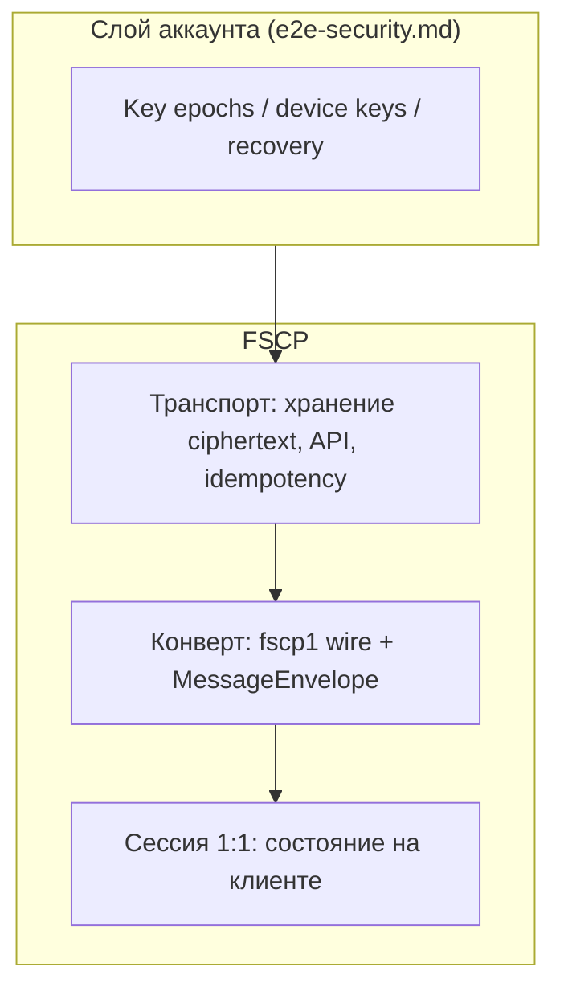

# FSCP — Flora Secure Chat Protocol

**Status:** Released  
**Version:** 1.0  
**Date:** 2026-05-10 (spec freeze)

---

## Overview

FSCP (Flora Secure Chat Protocol) — протокол защищённого **личного чата** в экосистеме FLORA. Он задаёт криптографические цели, wire-format, состояние сессии 1:1, согласование ключей сообщения и правила серверной валидации **без расшифровки** payload.

Платформенный контур (key epochs, backup/recovery, FSM аккаунта, API messaging, freeze, rate limits) описан в [`e2e-security.md`](./e2e-security.md). FSCP **опирается** на него, но **владеет** каналом «сообщение ↔ доставка ↔ клиенты».

Этот документ нормативен: реализация wire и клиентской криптографии сообщений **обязана** соответствовать описанным здесь правилам.

---

## Goals & Non-Goals

**Goals:**

- Конфиденциальность и целостность plaintext сообщений при модели «сервер хранит ciphertext, не имея ключа к истории».
- Явные версии, AAD и проверяемость (test vectors, server-side validation).
- Привязка к `keyEpochId`, device keys и подписи epoch identity.
- Честное разделение MVP v1 и target (pre-keys, Double Ratchet, key transparency).

**Non-Goals:**

- Модель аккаунта, password/recovery backup, trusted devices, freeze — зона [`e2e-security.md`](./e2e-security.md).
- Групповой чат (MLS и т.д.) — вне FSCP v1.
- Полная эквивалентность Signal Double Ratchet в v1 — **target**, см. §Forward secrecy.
- Публикация FSCP как внешний открытый стандарт.

---

## Architecture Position

FSCP — криптографический слой **сообщений** внутри продукта. Бизнес-логика доставки — модуль `Flora.Messaging`; HTTP-композиция — `Products/Flora.Social`.

```
Apps/Web, Apps/Mobile
  └─→ Flora.API
        └─→ Flora.Social (composition)
              └─→ Flora.Messaging (messages, E2E state)
                    ↑ контекст key epochs / devices из e2e-security
```

**Слои FSCP:**



| Слой | Ответственность |
| --- | --- |
| Транспорт | REST, `deviceSetRevision`, отзыв устройств — без plaintext |
| Конверт | `fscp1:` + JSON `MessageEnvelope`, per-device RKE |
| Сессия | `FscpV1ConversationSession`, safety number, re-handshake |

---

## Principles

1. **E2E по смыслу продукта.** Plaintext только на клиентах; сервер не согласует `messageKey`.
2. **Явные версии.** Изменение wire или крипто-логики → новый `messageEnvelopeVersion` / major bump.
3. **AEAD и AAD.** Подмена метаданных ломает расшифровку.
4. **Минимизация доверия к серверу.** Сервер маршрутизирует ciphertext, не читает историю.
5. **Проверяемость.** Норма сопоставима с golden-векторами и server-side validation.
6. **Честные ограничения v1.** `preKeyId = null`, без Double Ratchet — допустимый MVP.
7. **Восстановление и чат ортогональны.** После recovery участники снова устанавливают канал с актуальными device keys.
8. **Метаданные вне ciphertext.** Частота, размеры, id бесед — residual risk; минимизируется продуктовой политикой.

---

## Cryptographic primitives

Production stack для **сообщений** FSCP v1:

| Назначение | Примитив |
| --- | --- |
| Device agreement | X25519 |
| KDF (RKE unwrap) | HKDF RFC 5869, SHA-256 |
| AEAD (тело и RKE) | XChaCha20-Poly1305 **IETF** (libsodium), nonce 24 байта |
| Подпись envelope | Ed25519 (sender device signing key) |
| Fingerprint | SHA-256 |
| Random | CSPRNG (WebCrypto / libsodium) |

Для v1 **запрещён** fallback на AES-GCM. Password/recovery KDF (Argon2id) — в [`e2e-security.md`](./e2e-security.md).

**Версии payload (v1):**

- `fscpProtocolVersion = 1`
- `messageEnvelopeVersion = 1` (поле `version` в JSON)
- `e2eProtocolVersion = 1`

---

## Wire format

HTTP/API передаёт сообщение как строку с префиксом **`fscp1:`**, за которым следует **base64url без padding** внутреннего JSON envelope.

```
fscp1:<base64url(UTF-8 JSON MessageEnvelope)>
```

**Инварианты v1 (1:1):**

- Внутри JSON: `version = 1`, `keyEpochId` = bootstrap epoch (см. ниже), `recipients` — ровно **2** элемента (оба участника DM).
- Для одного сообщения на wire **оба** поля legacy API (`encryptedForReceiver`, `encryptedForSender`) должны содержать **одинаковую** строку `fscp1:…`.
- `senderUserUuid` в wire совпадает с аутентифицированным отправителем.
- `conversationUuid` = детерминированный UUID DM из пары участников (UUIDv5).

**Bootstrap constants (текущая реализация v1):**

| Константа | Значение |
| --- | --- |
| `FSCP_BOOTSTRAP_KEY_EPOCH_ID` | `00000000-0000-4000-8000-000000000001` |
| `FSCP_BOOTSTRAP_DEVICE_UUID` | `00000000-0000-4000-8000-000000000002` (sentinel, пока нет per-device UUID на сервере) |

---

## MessageEnvelope

Внутренний JSON (до кодирования в `fscp1:`):

```json
{
  "version": 1,
  "messageUuid": "uuid",
  "conversationUuid": "uuid",
  "keyEpochId": "uuid",
  "senderUserUuid": "uuid",
  "senderDeviceUuid": "uuid",
  "messageKeyId": "uuid-or-counter",
  "createdAt": "utc-iso8601",
  "ciphertextBase64Url": "...",
  "aead": {
    "name": "xchacha20-poly1305",
    "nonceBase64Url": "..."
  },
  "recipients": [
    {
      "userUuid": "uuid",
      "deviceUuid": "uuid",
      "recipientKeyEnvelope": {
        "version": 1,
        "algorithm": "x25519-hkdf-xchacha20poly1305",
        "ephemeralPublicKeyBase64Url": "...",
        "recipientAgreementPublicKeyId": "uuid",
        "preKeyId": null,
        "saltBase64Url": "...",
        "aead": { "name": "xchacha20-poly1305", "nonceBase64Url": "..." },
        "ciphertextBase64Url": "..."
      }
    }
  ],
  "senderSigningPublicKeyBase64Url": "...",
  "senderSignatureBase64Url": "..."
}
```

**Plaintext тела сообщения** (до AEAD):

```json
{
  "type": "text",
  "body": "message text",
  "attachments": [],
  "clientCreatedAt": "utc"
}
```

**AAD тела сообщения:**

```text
flora.messaging.message.v1 | conversationUuid | keyEpochId | messageUuid | messageKeyId | senderUserUuid | senderDeviceUuid | createdAt
```

UUID в AAD — **нижний регистр**. Разделитель полей — ` | ` (U+007C).

**AAD recipient key envelope:**

```text
flora.messaging.recipient-key-envelope.v1 | conversationUuid | keyEpochId | messageUuid | messageKeyId | senderUserUuid | senderDeviceUuid | recipientUserUuid | recipientDeviceUuid | recipientAgreementPublicKeyId
```

Тело шифруется случайным 32-байтовым `messageKey` (CSPRNG). `recipientKeyEnvelope.ciphertextBase64Url` содержит тот же `messageKey`, зашифрованный per-device.

`preKeyId` в v1 **обязан** быть `null`; непустое значение сервер отклоняет.

Сервер **не принимает** plaintext `content` для новых сообщений v1.

---

## Key agreement v1 (recipientKeyEnvelope)

Алгоритм `x25519-hkdf-xchacha20poly1305` выполняется **независимо для каждой** строки `recipients[]`.

1. **Ephemeral:** новая пара X25519 на каждый RKE; `ephemeralPublicKeyBase64Url` — 32 байта. **Запрещено** повторное использование ephemeral для другого `messageUuid` или другой строки `recipients[]`.
2. **Shared secret:** `ss = X25519(ephemeral_private, recipient_agreement_public)` (отправитель); получатель — `X25519(recipient_private, ephemeral_public)`.
3. **HKDF:** `PRK = HKDF-Extract(SHA-256, salt=decode(saltBase64Url), IKM=ss)`; `wrapKey = HKDF-Expand(PRK, info=UTF8(AAD_recipient_line), L=32)`. Соль — 32 случайных байта, уникальная для envelope.
4. **AEAD:** XChaCha20-Poly1305 IETF, ключ `wrapKey`, nonce 24 байта, AAD = та же строка `AAD_recipient_line`. Plaintext AEAD — **ровно 32 байта** `messageKey`.

**Инвариант:** нет «одного ephemeral на всю беседу». Общность — один `messageKey` в ciphertext тела и согласованные поля AAD.

`recipientAgreementPublicKeyId` — uuid опубликованного agreement public key получателя (`UserDeviceKey` в scope `keyEpochId`).

**Подпись envelope:**

```text
flora.messaging.envelope-signature.v1 | canonicalEnvelopeWithoutSignature
```

Подпись Ed25519 покрывает весь `recipients` array. Сервер не может незаметно удалить получателя или подменить RKE без нарушения подписи (клиент проверяет; сервер в v1 проверяет **форму**, см. §Known limitations).

Golden: [`test-vectors/fscp-rke-wrap-key-v1.json`](../test-vectors/fscp-rke-wrap-key-v1.json).

---

## Session state (1:1)

Для пары `(conversationUuid, keyEpochId)` клиент ведёт **`FscpV1ConversationSession`** (память / локальное хранилище — вне нормы wire).

| `sessionState` | Условие | Поведение |
| --- | --- | --- |
| `uninitialized` | Нет успешно обработанного envelope для пары | Отправитель может отправить первое сообщение; получатель после decrypt → `ready` |
| `ready` | Хотя бы одно сообщение успешно обработано | Обычный обмен |
| `compromised_local` | Revoke устройства, смена epoch identity, reset в UI, невозможность decrypt | Исходящие приостановлены до re-handshake |

| Поле | Назначение |
| --- | --- |
| `conversationUuid`, `keyEpochId`, `peerUserUuid` | Идентификаторы |
| `fscpProtocolVersion` | `1` |
| `lastProcessedInboundMessageUuid` | Опционально, anti-duplicate UX |
| `lastAcceptedOutboundMessageUuid` | Опционально |

**Wire vs состояние:** на каждое сообщение — новый ephemeral и новый `messageKey` per RKE. `ready` означает доверие к каналу, а не долгоживущий shared secret на wire.

---

## Safety number (fingerprint)

**Цель:** два клиента при одинаковых входах вычисляют одинаковый `fingerprintSha256Hex` для OOB-сверки.

**Входы:** `keyEpochId`, `conversationUuid`, два Ed25519 epoch account identity public key (32 байта) участников.

**Упорядочивание:** `pk_low`, `pk_high` — сортировка 32-байтовых ключей по memcmp.

**Preimage (UTF-8, без BOM):**

```text
flora.fscp.v1.safety-number|<keyEpochId>|<conversationUuid>|<pkLowB64u>|<pkHighB64u>
```

**Выход:** `fingerprintSha256Hex` = lowercase hex SHA-256(preimage), 64 символа.

Golden: [`test-vectors/fingerprint-v1.json`](../test-vectors/fingerprint-v1.json).

**Phase 1 (до key transparency):**

- Safety number обязателен в UI 1:1 после перехода в `ready`.
- `verified contact` — локальный флаг на клиенте, не на сервере.
- Смена epoch identity сбрасывает verified state.

---

## Canonical encoding

Для подписей и AAD:

- canonical JSON с лексикографической сортировкой ключей;
- UTF-8 без BOM;
- base64url **без padding**;
- даты ISO-8601 UTC;
- массив `recipients` сортируется по `(userUuid, deviceUuid)`;
- неизвестные поля в strict mode → ошибка.

**Nonce rules:**

- XChaCha20-Poly1305: nonce 192-bit, CSPRNG;
- один nonce не повторяется с тем же ключом;
- для RKE уникальность через пару `(ephemeral, nonce)` и полный AAD context.

---

## Server-side validation

Сервер **не расшифровывает** E2E payload, но обязан валидировать форму (реализация: `FscpWireEnvelopeValidator`).

**Обязательные проверки wire v1:**

- префикс `fscp1:`;
- `version = 1`;
- `senderUserUuid` = текущий пользователь;
- `conversationUuid` соответствует участникам DM;
- `keyEpochId` = bootstrap epoch v1;
- `recipients` — массив из **2** элементов, оба участника присутствуют;
- у каждого recipient: `deviceUuid`, `recipientKeyEnvelope` с `algorithm = x25519-hkdf-xchacha20poly1305`, `preKeyId = null`;
- размеры ephemeral (32 B), salt (32 B), nonce RKE (24 B), ciphertext RKE (≥16 B), body ciphertext (≥16 B);
- `senderSigningPublicKeyBase64Url` (32 B), `senderSignatureBase64Url` (64 B) — **форма**; криптопроверка Ed25519 на сервере в v1 **не выполняется** (defense-in-depth — на клиенте).

**Размерные лимиты:**

| Объект | Лимит |
| --- | --- |
| Текст до шифрования | 20 KiB |
| Encrypted message body | 64 KiB |
| Один recipient envelope | 8 KiB |
| FSCP wire string | 200 000 символов |
| Inner JSON UTF-8 | 120 000 байт |

Сервер не логирует ciphertext целиком.

---

## Forward secrecy: MVP vs target

| Уровень | Поведение |
| --- | --- |
| **MVP v1** | Новый `messageKey` и ephemeral **на каждое** сообщение; сессия сбрасывается по `compromised_local`, смене epoch, reset UI |
| **Target** | Double Ratchet (или эквивалент) для PCS между сообщениями; отдельная major-версия |

**Критерий включения ratchet:** security review + transcript test vectors + обратная совместимость чтения v1.

---

## Pre-keys roadmap

| Фаза | Содержание |
| --- | --- |
| **v1** | `preKeyId = null`; только long-term device agreement keys |
| **v1.1** | One-time pre-keys; `preKeyId` в envelope |
| **v2** | X3DH-подобный handshake + ratchet; отдельная спецификация |

---

## Device revocation

После `POST .../devices/{id}/revoke`:

- новые envelope **не** содержат entry для отозванного устройства;
- сессии с отозванным устройством требуют re-handshake;
- негативный сценарий: test vector `message_session_revoked_device_v1_failure` (TODO: golden transcript).

---

## Test vectors

Минимальный набор для FSCP v1:

| Vector id | Файл | Проверяет |
| --- | --- | --- |
| `fscp_rke_wrap_key_v1_success` | [fscp-rke-wrap-key-v1.json](../test-vectors/fscp-rke-wrap-key-v1.json) | X25519 + HKDF + AEAD → 32-байтовый `messageKey` |
| `fingerprint_v1_success` | [fingerprint-v1.json](../test-vectors/fingerprint-v1.json) | Safety number preimage + SHA-256 |

Регенерация RKE golden: `python docs/test-vectors/_gen_fscp_rke_v1.py` (нужны `cryptography`, `PyNaCl`).

Правила новых векторов: `protocolVersion` в JSON, base64url без padding, AAD **байт-в-байт** как в этом документе; негативы — отдельные файлы с `expectedError`.

Полный каталог платформенных векторов (backup, unlock, device): [`e2e-security.md`](./e2e-security.md) §Test vectors.

---

## Privacy boundaries

| Разрешено серверу | Запрещено |
| --- | --- |
| Хранить ciphertext, публичные ключи, метаданные доставки | Plaintext сообщений |
| Валидировать форму wire | Расшифровка истории |
| Rate limits, freeze policy | Fallback-ключ «для поддержки» |

E2E-переписка **не** используется для рекомендаций (FIRA). Подробнее: [`FIRA.md`](../fira/FIRA.md) §Privacy.

Метаданные (кто кому, когда, размеры) — частичный residual risk; см. [`SECURITY.md`](../../SECURITY.md).

---

## Known MVP limitations (implementation)

Зафиксировано для текущего релиза; не ошибки спецификации, а отложенная реализация:

- **Сервер не верифицирует Ed25519 подпись envelope** — только форма; проверка на клиенте получателя.
- **Bootstrap key epoch и sentinel device UUID** — нет полноценного per-device ratchet.
- **E2E-ключи на вебе в `localStorage`** — риск при XSS; target: non-extractable WebCrypto keys.
- **Legacy dual-ciphertext API** (`encryptedForReceiver` / `encryptedForSender`) — мост к целевому единому `fscp1:` wire.
- **Нет golden transcript** для полного flow после device revoke.

---

## Versioning

| Версия | Содержание |
| --- | --- |
| **FSCP v1.0** | Текущая норма (этот документ); spec freeze 2026-05-10 |
| **FSCP v1.1** | Pre-keys, `preKeyId != null` |
| **FSCP v2** | X3DH + ratchet |

Изменения, **несовместимые с wire**, — только через bump major (`messageEnvelopeVersion`). Текстовые errata без смены байтов — в этом файле с пометкой `docs(fscp): errata` в commit message.

**Compliance checklist (v1.0):**

1. Golden `fscp_rke_wrap_key_v1_success` и `fingerprint_v1_success` в CI.
2. Server-side validation без отклонений от §Server-side validation.
3. Клиент: AAD и HKDF-info **байт-в-байт** как в §MessageEnvelope / §Key agreement.

---

## Open Questions / Future Work

- Серверная криптопроверка Ed25519 подписи envelope (defense-in-depth).
- Golden transcript `message_session_revoked_device_v1_failure`.
- Переход с bootstrap epoch на реальные per-device UUID и key epochs.
- Key transparency phase 2.
- Групповой чат (отдельная спецификация, возможно MLS).
- Хранение E2E material: WebCrypto `extractable: false`, IndexedDB.

---

*Платформа E2E (аккаунт, recovery, API): [`e2e-security.md`](./e2e-security.md). Test vectors: [`docs/test-vectors/README.md`](../test-vectors/README.md).*
