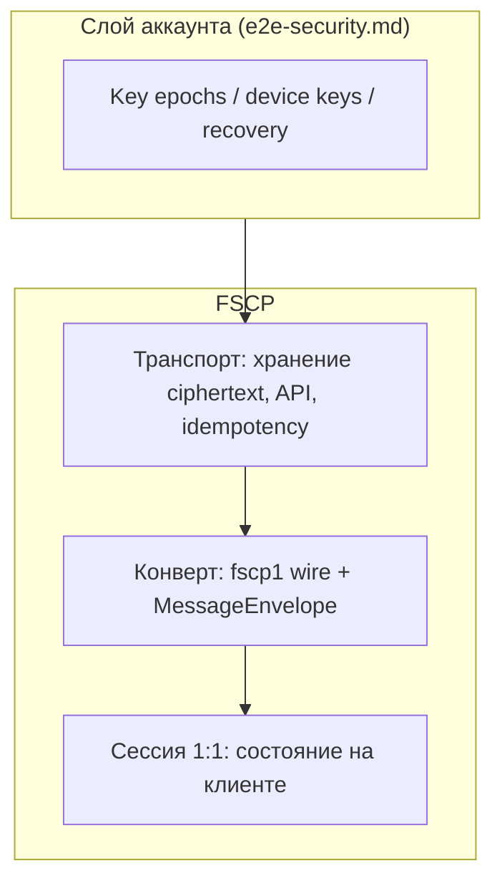

# FSCP — Flora Secure Communication Protocol

**Status:** Released  
**Version:** 1.0  
**Date:** 2026-05-10 (spec freeze)

---

## Overview

FSCP (Flora Secure Communication Protocol) — протокол защищённого **личного чата** в экосистеме FLORA. Он задаёт криптографические цели, wire-format, состояние сессии 1:1, согласование ключей сообщения и правила серверной валидации **без расшифровки** payload.

Платформенный контур (key epochs, backup/recovery, FSM аккаунта, API messaging, freeze, rate limits) описан в [`e2e-security.md`](./e2e-security.md). FSCP **опирается** на него, но **владеет** каналом «сообщение ↔ доставка ↔ клиенты».

Этот документ нормативен: реализация wire и клиентской криптографии сообщений **обязана** соответствовать описанным здесь правилам.

**Смежные нормативные документы:**

- [`e2e-security.md`](./e2e-security.md) — платформенный контур (epochs, backup/recovery, FSM, devices, freeze).
- [`franking.md`](./franking.md) — FSCP-FRANK, RFC-draft message franking (модерация E2E по добровольной жалобе; активация v1.1+).
- [`../fgp/FGP.md`](../fgp/FGP.md) — governance. FSCP реализует конституционные инварианты FGP §1.1–§1.2: «тайна переписки» (сервер хранит только ciphertext) и запрет обязательного клиентского сканирования (§1.2 п. 7). Модерация E2E-пространства проходит **только** по добровольной жалобе через message franking (FGP §6.5, см. §Целевой алгоритм → Message franking).
- [`../../next-architecture.md`](../../next-architecture.md) §1.2, §4.4 — на время миграции бэкенда на Rust wire FSCP v1 и bootstrap-epoch **заморожены**; сервер лишь воспроизводит структурную валидацию бит-в-бит.
- [`../FSCP-REVIEW.md`](../FSCP-REVIEW.md) — ревью спецификации и реализации (2026-07-14): вердикт, actionable-находки, расхождения docs↔факт, порядок remediation.

**Ревизии:**

| Ревизия | Дата | Содержание |
| --- | --- | --- |
| v1.0 | 2026-05-10 | Первичная норма (spec freeze). |
| v1.0-errata-1 | 2026-07-13 | Byte-neutral errata (без смены wire): явные алгоритмы v1 (§Algorithms), точная модель подписи (§Signature authenticity), синхронизация plaintext-схемы с реализацией, фиксация порядка сортировки canonical, документирование серверной проверки `recipientAgreementPublicKeyId`, честный conformance-статус. Добавлен §Целевой алгоритм (v1.1/v2 + franking) как roadmap. Кросс-ссылки на FGP и next-architecture. Wire-байты **не изменены**. |
| v1.0-errata-2 | 2026-07-13 | Byte-neutral: полный golden-транскрипт `fscp_message_transcript_v1` (потребители TS/Rust/C#, покрыты все байт-критичные пути Algorithm A/B, включая canonical JSON и подпись); franking вынесен в полноценный RFC-draft [`franking.md`](./franking.md) (gate FGP §8.3 выполнен). Wire-байты **не изменены**. |
| v1.0-errata-3 | 2026-07-14 | Byte-neutral: franking стал исполняемым (эталон `franking.ts` + вектор `fscp_franking_v1`, потребители TS/Rust, франкуется сообщение транскрипта); референсная FSM `FscpV1ConversationSession` реализована в client-core; добавлен нормативный §Post-quantum (гибрид X25519+ML-KEM-768, PQXDH-направление, gate v2). Wire-байты **не изменены**. |
| v1.0-errata-4 | 2026-07-14 | Byte-neutral: §Post-quantum получил конкретную инстанциацию гибридного комбинера (v2-draft) и golden-вектор `fscp_hybrid_kem_v2draft_v1` — три независимые реализации ML-KEM-768 (kyber-py / @noble/post-quantum / RustCrypto), потребители TS + Rust, негативы на implicit rejection FIPS 203. Продакшн-код и wire v1 **не изменены**. |

---

## Goals & Non-Goals

**Goals:**

- Конфиденциальность и целостность plaintext сообщений при модели «сервер хранит ciphertext, не имея ключа к истории».
- Явные версии, AAD и проверяемость (test vectors, server-side validation).
- Привязка к `keyEpochId`, device keys и подписи epoch identity.
- Честное разделение MVP v1 и target (pre-keys, Double Ratchet, key transparency).

**Non-Goals:**

- Модель аккаунта, password/recovery backup, trusted devices, freeze — зона [`e2e-security.md`](./e2e-security.md).
- Групповой чат (MLS и т.д.) — вне FSCP v1.
- Полная эквивалентность Signal Double Ratchet в v1 — **target**, см. §Forward secrecy.
- Публикация FSCP как внешний открытый стандарт.

---

## Architecture Position

FSCP — криптографический слой **сообщений** внутри продукта. Бизнес-логика доставки — модуль `Flora.Messaging`; HTTP-композиция — `Products/Flora.Social`.

```
Apps/Web, Apps/Mobile
  └─→ Flora.API
        └─→ Flora.Social (composition)
              └─→ Flora.Messaging (messages, E2E state)
                    ↑ контекст key epochs / devices из e2e-security
```

**Слои FSCP:**


```mermaid
flowchart TB
  subgraph account["Слой аккаунта (e2e-security.md)"]
    A[Key epochs / device keys / recovery]
  end
  subgraph fscp["FSCP"]
    T[Транспорт: хранение ciphertext, API, idempotency]
    E[Конверт: fscp1 wire + MessageEnvelope]
    S[Сессия 1:1: состояние на клиенте]
  end
  account --> T
  T --> E
  E --> S
```

| Слой | Ответственность |
| --- | --- |
| Транспорт | REST, `deviceSetRevision`, отзыв устройств — без plaintext |
| Конверт | `fscp1:` + JSON `MessageEnvelope`, per-device RKE |
| Сессия | `FscpV1ConversationSession`, safety number, re-handshake |

---

## Principles

1. **E2E по смыслу продукта.** Plaintext только на клиентах; сервер не согласует `messageKey`.
2. **Явные версии.** Изменение wire или крипто-логики → новый `messageEnvelopeVersion` / major bump.
3. **AEAD и AAD.** Подмена метаданных ломает расшифровку.
4. **Минимизация доверия к серверу.** Сервер маршрутизирует ciphertext, не читает историю.
5. **Проверяемость.** Норма сопоставима с golden-векторами и server-side validation.
6. **Честные ограничения v1.** `preKeyId = null`, без Double Ratchet — допустимый MVP.
7. **Восстановление и чат ортогональны.** После recovery участники снова устанавливают канал с актуальными device keys.
8. **Метаданные вне ciphertext.** Частота, размеры, id бесед — residual risk; минимизируется продуктовой политикой.

---

## Cryptographic primitives

Production stack для **сообщений** FSCP v1:

| Назначение | Примитив |
| --- | --- |
| Device agreement | X25519 |
| KDF (RKE unwrap) | HKDF RFC 5869, SHA-256 |
| AEAD (тело и RKE) | XChaCha20-Poly1305 **IETF** (libsodium), nonce 24 байта |
| Подпись envelope | Ed25519 (sender device signing key) |
| Fingerprint | SHA-256 |
| Random | CSPRNG (WebCrypto / libsodium) |

Для v1 **запрещён** fallback на AES-GCM. Password/recovery KDF (Argon2id) — в [`e2e-security.md`](./e2e-security.md).

**Версии payload (v1):**

- `fscpProtocolVersion = 1`
- `messageEnvelopeVersion = 1` (поле `version` в JSON)
- `e2eProtocolVersion = 1`

---

## Wire format

HTTP/API передаёт сообщение как строку с префиксом **`fscp1:`**, за которым следует **base64url без padding** внутреннего JSON envelope.

```
fscp1:<base64url(UTF-8 JSON MessageEnvelope)>
```

**Инварианты v1 (1:1):**

- Внутри JSON: `version = 1`, `keyEpochId` = bootstrap epoch (см. ниже), `recipients` — ровно **2** элемента (оба участника DM).
- Для одного сообщения на wire **оба** поля legacy API (`encryptedForReceiver`, `encryptedForSender`) должны содержать **одинаковую** строку `fscp1:…`.
- `senderUserUuid` в wire совпадает с аутентифицированным отправителем.
- `conversationUuid` = детерминированный UUID DM из пары участников (UUIDv5).

**Bootstrap constants (текущая реализация v1):**

| Константа | Значение |
| --- | --- |
| `FSCP_BOOTSTRAP_KEY_EPOCH_ID` | `00000000-0000-4000-8000-000000000001` |
| `FSCP_BOOTSTRAP_DEVICE_UUID` | `00000000-0000-4000-8000-000000000002` (sentinel, пока нет per-device UUID на сервере) |

---

## MessageEnvelope

Внутренний JSON (до кодирования в `fscp1:`):

```json
{
  "version": 1,
  "messageUuid": "uuid",
  "conversationUuid": "uuid",
  "keyEpochId": "uuid",
  "senderUserUuid": "uuid",
  "senderDeviceUuid": "uuid",
  "messageKeyId": "uuid-or-counter",
  "createdAt": "utc-iso8601",
  "ciphertextBase64Url": "...",
  "aead": {
    "name": "xchacha20-poly1305",
    "nonceBase64Url": "..."
  },
  "recipients": [
    {
      "userUuid": "uuid",
      "deviceUuid": "uuid",
      "recipientKeyEnvelope": {
        "version": 1,
        "algorithm": "x25519-hkdf-xchacha20poly1305",
        "ephemeralPublicKeyBase64Url": "...",
        "recipientAgreementPublicKeyId": "uuid",
        "preKeyId": null,
        "saltBase64Url": "...",
        "aead": { "name": "xchacha20-poly1305", "nonceBase64Url": "..." },
        "ciphertextBase64Url": "..."
      }
    }
  ],
  "senderSigningPublicKeyBase64Url": "...",
  "senderSignatureBase64Url": "..."
}
```

**Plaintext тела сообщения** (до AEAD) — блочная схема (соответствует реализации `Packages/flora-client-core/src/fscp/envelope.ts`):

```json
{
  "type": "blocks",
  "version": 1,
  "blocks": [
    { "kind": "text", "body": "message text" }
  ],
  "clientCreatedAt": "utc-iso8601",
  "replyTo": {
    "messageUuid": "uuid",
    "authorDisplayName": "string",
    "preview": "string"
  }
}
```

- `blocks[]` — упорядоченный список; `kind ∈ { text, voice, image, video }`.
- Медиа-блоки (`voice`/`image`/`video`) **не** несут байты в plaintext: они содержат `assetUuid` и `encryption { algorithm: "aes-gcm", keyBase64Url, nonceBase64Url }`; сам ассет шифруется отдельным file key и грузится как encrypted object (см. [`e2e-security.md`](./e2e-security.md) §Размерные лимиты — attachment descriptor). `messageKey` беседы **не** переиспользуется как file key.
- `replyTo` опционален (денормализованный превью реплая).
- **Read-compat:** получатель обязан принимать legacy-форму `{ "type": "text", "body": "…", "clientCreatedAt": "…" }` и нормализовать её в единственный `text`-блок. Отправитель v1.0-errata-1 пишет только блочную форму.

Plaintext тела — **внутри** AEAD, сервер его не видит; поэтому эволюция схемы блоков не является wire-breaking, пока не меняются поля AAD ниже.

**AAD тела сообщения:**

```text
flora.messaging.message.v1 | conversationUuid | keyEpochId | messageUuid | messageKeyId | senderUserUuid | senderDeviceUuid | createdAt
```

UUID в AAD — **нижний регистр**. Разделитель полей — ` | ` (U+007C).

**AAD recipient key envelope:**

```text
flora.messaging.recipient-key-envelope.v1 | conversationUuid | keyEpochId | messageUuid | messageKeyId | senderUserUuid | senderDeviceUuid | recipientUserUuid | recipientDeviceUuid | recipientAgreementPublicKeyId
```

Тело шифруется случайным 32-байтовым `messageKey` (CSPRNG). `recipientKeyEnvelope.ciphertextBase64Url` содержит тот же `messageKey`, зашифрованный per-device.

`preKeyId` в v1 **обязан** быть `null`; непустое значение сервер отклоняет.

Сервер **не принимает** plaintext `content` для новых сообщений v1.

---

## Key agreement v1 (recipientKeyEnvelope)

Алгоритм `x25519-hkdf-xchacha20poly1305` выполняется **независимо для каждой** строки `recipients[]`.

1. **Ephemeral:** новая пара X25519 на каждый RKE; `ephemeralPublicKeyBase64Url` — 32 байта. **Запрещено** повторное использование ephemeral для другого `messageUuid` или другой строки `recipients[]`.
2. **Shared secret:** `ss = X25519(ephemeral_private, recipient_agreement_public)` (отправитель); получатель — `X25519(recipient_private, ephemeral_public)`.
3. **HKDF:** `PRK = HKDF-Extract(SHA-256, salt=decode(saltBase64Url), IKM=ss)`; `wrapKey = HKDF-Expand(PRK, info=UTF8(AAD_recipient_line), L=32)`. Соль — 32 случайных байта, уникальная для envelope.
4. **AEAD:** XChaCha20-Poly1305 IETF, ключ `wrapKey`, nonce 24 байта, AAD = та же строка `AAD_recipient_line`. Plaintext AEAD — **ровно 32 байта** `messageKey`.

**Инвариант:** нет «одного ephemeral на всю беседу». Общность — один `messageKey` в ciphertext тела и согласованные поля AAD.

`recipientAgreementPublicKeyId` — uuid опубликованного agreement public key получателя (`UserDeviceKey` в scope `keyEpochId`).

**Подпись envelope:**

```text
flora.messaging.envelope-signature.v1 | canonicalEnvelopeWithoutSignature
```

Подпись Ed25519 покрывает весь `recipients` array. Сервер не может незаметно удалить получателя или подменить RKE без нарушения подписи (клиент проверяет; сервер в v1 проверяет **форму**, см. §Known limitations). `canonicalEnvelopeWithoutSignature` — canonical JSON конверта (§Canonical encoding) со всеми полями **кроме** `senderSignatureBase64Url`; поле `senderSigningPublicKeyBase64Url` **входит** в подписываемый объект.

Golden: [`test-vectors/fscp-rke-wrap-key-v1.json`](../test-vectors/fscp-rke-wrap-key-v1.json).

---

## Algorithms (v1) — нормативные шаги

Псевдокод ниже — обязательная последовательность; байты (§MessageEnvelope, §Key agreement, §Canonical encoding) не переопределяются, только фиксируется порядок для паритета имплементаций. `b64u` — base64url без padding.

### A. Отправитель — сборка wire (`buildFscpWireEnvelope`)

```text
Вход: senderUserUuid, receiverUserUuid,
      senderAgreementPrivKey (X25519), senderSigningPrivKey (Ed25519 seed/keypair),
      receiverAgreementPubKey (X25519), plaintext (блочная схема)

 1. messageUuid   ← UUIDv7 (CSPRNG)
    messageKeyId  ← UUIDv7 (CSPRNG)          # в v1 — uuid, не счётчик
    createdAt     ← now() в ISO-8601 UTC
    keyEpochId    ← FSCP_BOOTSTRAP_KEY_EPOCH_ID
    conversationUuid ← UUIDv5(ns, "{min}|{max}|fscp-dm-v1")   # см. §4.2 next-architecture
    senderDeviceUuid = receiverDeviceUuid = FSCP_BOOTSTRAP_DEVICE_UUID
 2. messageKey    ← 32 случайных байта (CSPRNG)
 3. bodyAad       ← messageBodyAadLine(...)  # UTF-8, UUID в нижнем регистре
    bodyNonce     ← 24 случайных байта
    bodyCipher    ← XChaCha20Poly1305-IETF.enc(messageKey, nonce=bodyNonce, aad=UTF8(bodyAad), pt=UTF8(JSON(plaintext)))
 4. Для каждого получателя R ∈ { receiver, sender } (self-copy обязателен для чтения своей истории):
      rkeAad      ← recipientKeyEnvelopeAadLine(..., recipientAgreementPublicKeyId=UUIDv5(R.user, keyEpoch))
      ephSecret   ← 32 случайных байта;  ephPub ← X25519.base(ephSecret)   # НОВЫЙ ephemeral на каждый R
      salt        ← 32 случайных байта
      ss          ← X25519(ephSecret, R.agreementPub)
      prk         ← HKDF-Extract(SHA-256, salt, ss)
      wrapKey     ← HKDF-Expand(prk, info=UTF8(rkeAad), L=32)
      rkeNonce    ← 24 случайных байта
      rkeCipher   ← XChaCha20Poly1305-IETF.enc(wrapKey, nonce=rkeNonce, aad=UTF8(rkeAad), pt=messageKey)
      → recipient entry { userUuid, deviceUuid, recipientKeyEnvelope{ version:1, algorithm, ephPub, recipientAgreementPublicKeyId, preKeyId:null, salt, aead{nonce}, rkeCipher } }
 5. recipients ← sort(entries) по (userUuid, deviceUuid) в нижнем регистре
 6. envelopeNoSig ← { version:1, messageUuid, conversationUuid, keyEpochId, senderUserUuid,
                      senderDeviceUuid, messageKeyId, createdAt, ciphertextBase64Url=b64u(bodyCipher),
                      aead{name, nonce=b64u(bodyNonce)}, recipients, senderSigningPublicKeyBase64Url=b64u(signPub) }
 7. sig ← Ed25519.sign(senderSigningPrivKey, UTF8("flora.messaging.envelope-signature.v1 | " + canonicalJson(envelopeNoSig)))
 8. full ← envelopeNoSig ∪ { senderSignatureBase64Url = b64u(sig) }
 9. wire ← "fscp1:" + b64u(UTF8(JSON(full)))
```

**Инварианты отправителя:** новый `messageKey`, новый ephemeral и новый nonce на **каждое сообщение** и **каждую строку** `recipients` (запрет reuse). Никогда не отправлять plaintext `content` для v1.

### B. Получатель — открытие wire (`decryptFscpWireEnvelope`)

```text
Вход: wire, viewerUserUuid, viewerAgreementPrivKey

 1. Проверить префикс "fscp1:"; env ← JSON(b64u_decode(остаток))
 2. Проверить подпись (§Signature authenticity): при наличии senderSigningPublicKeyBase64Url —
    Ed25519.verify(pk, sig, UTF8("flora.messaging.envelope-signature.v1 | " + canonicalJson(env без senderSignatureBase64Url)));
    при провале — ОТКЛОНИТЬ. (v1.0-errata-1: см. §Signature authenticity — MUST verify; «пропуск при отсутствии pk» помечен deprecated.)
 3. row ← recipients.find(userUuid == viewerUserUuid);  нет → ошибка «нет RKE»
 4. rkeAad ← recipientKeyEnvelopeAadLine(env-поля, row.userUuid, row.deviceUuid, row.recipientAgreementPublicKeyId)
    ss   ← X25519(viewerAgreementPrivKey, row.ephPub)
    prk  ← HKDF-Extract(SHA-256, row.salt, ss);  wrapKey ← HKDF-Expand(prk, info=UTF8(rkeAad), L=32)
    messageKey ← XChaCha20Poly1305-IETF.dec(wrapKey, row.nonce, aad=UTF8(rkeAad), ct=row.rkeCipher)   # 32 байта
 5. bodyAad ← messageBodyAadLine(env-поля)
    pt ← XChaCha20Poly1305-IETF.dec(messageKey, env.aead.nonce, aad=UTF8(bodyAad), ct=env.ciphertext)
 6. Нормализовать plaintext (принять legacy text-форму), вернуть блоки.
```

Любое несовпадение AAD (подмена `conversationUuid`/`messageUuid`/`messageKeyId`/`senderDeviceUuid`/…) ломает AEAD-tag → decrypt падает. Это и есть защита целостности метаданных.

### C. Сервер — структурная валидация (`FscpWireEnvelopeValidator`, без расшифровки)

Нормативный порядок (реализация — [`Products/Flora.Social/FscpWireEnvelopeValidator.cs`](../../Products/Flora.Social/FscpWireEnvelopeValidator.cs)):

```text
 1. dual-wire: encryptedForReceiver == encryptedForSender (Ordinal)     # legacy-мост, см. §Known limitations
 2. непусто; длина ≤ 200 000 символов; префикс "fscp1:"
 3. base64url → inner JSON ≤ 120 000 байт; корень — объект
 4. version == 1
 5. senderUserUuid == аутентифицированный отправитель
 6. conversationUuid == UUIDv5(sender, receiver)     # DM deterministic
 7. keyEpochId == bootstrap epoch v1
 8. recipients: массив ровно из 2 объектов; множество userUuid == { sender, receiver }
 9. для каждого recipient: валидный deviceUuid; recipientKeyEnvelope.version==1;
    algorithm=="x25519-hkdf-xchacha20poly1305"; preKeyId==null;
    recipientAgreementPublicKeyId == UUIDv5(recipient.user, keyEpoch)   # ← проверяется сервером (errata: было недокументировано)
    |ephemeral|==32 B, |salt|==32 B, |rkeNonce|==24 B, |rkeCipher|≥16 B
10. |bodyCipher|≥16 B и ≤ 64 KiB; body aead.name=="xchacha20-poly1305"; |bodyNonce|==24 B
11. senderSigningPublicKeyBase64Url присутствует, |pk|==32 B; senderSignatureBase64Url присутствует, |sig|==64 B
    # v1: сервер проверяет ФОРМУ подписи, но НЕ верифицирует Ed25519 (см. §Signature authenticity)
```

Сервер **не** проверяет: порядок сортировки `recipients`, значение `createdAt`, содержимое ciphertext, криптоподпись. Всё это — на клиенте получателя.

### Signature authenticity (v1) — точная модель и ограничение

Подпись Ed25519 в v1 обеспечивает **целостность** конверта, но **не** аутентичность против активного сервера, потому что получатель проверяет её ключом `senderSigningPublicKeyBase64Url`, **встроенным в тот же конверт**, а не доверенным epoch account identity / device signing key. Следствия, нормативно:

- **Получатель ОБЯЗАН** верифицировать подпись, если `senderSigningPublicKeyBase64Url` присутствует; несовпадение → отклонить сообщение. Текущая реализация **молча пропускает** проверку при отсутствии ключа (`verifyDetachedEnvelopeSignature` early-return) — это поведение помечается **deprecated**: после включения device-key binding (§Целевой алгоритм) отсутствие подписи для v1-epoch должно трактоваться как ошибка, а не как «старое сообщение».
- **Гарантия v1:** «тот, кто собрал конверт, им же и подписал» + защита метаданных через AAD. Это защищает от пассивной утечки БД и модификации в хранилище.
- **Чего v1 НЕ даёт:** злонамеренный или скомпрометированный сервер может подменить пару (pk, подпись) и RKE. Закрывается только связкой device key ← подписан epoch account identity (см. [`e2e-security.md`](./e2e-security.md) §Подлинность ключей п.1) + safety number OOB-сверкой (§Safety number) + key transparency (phase 2). До этого — E2E полезен, но не полон против активной атаки сервера (честно зафиксировано в [`e2e-security.md`](./e2e-security.md) §Частично защищаемся от).
- **Defense-in-depth (target):** серверная Ed25519-проверка формы→криптопроверки (§Open Questions).

---

## Session state (1:1)

Для пары `(conversationUuid, keyEpochId)` клиент ведёт **`FscpV1ConversationSession`** (память / локальное хранилище — вне нормы wire).

| `sessionState` | Условие | Поведение |
| --- | --- | --- |
| `uninitialized` | Нет успешно обработанного envelope для пары | Отправитель может отправить первое сообщение; получатель после decrypt → `ready` |
| `ready` | Хотя бы одно сообщение успешно обработано | Обычный обмен |
| `compromised_local` | Revoke устройства, смена epoch identity, reset в UI, невозможность decrypt | Исходящие приостановлены до re-handshake |

| Поле | Назначение |
| --- | --- |
| `conversationUuid`, `keyEpochId`, `peerUserUuid` | Идентификаторы |
| `fscpProtocolVersion` | `1` |
| `lastProcessedInboundMessageUuid` | Опционально, anti-duplicate UX |
| `lastAcceptedOutboundMessageUuid` | Опционально |

**Wire vs состояние:** на каждое сообщение — новый ephemeral и новый `messageKey` per RKE. `ready` означает доверие к каналу, а не долгоживущий shared secret на wire.

Референсная реализация — [`conversationSession.ts`](../../Packages/flora-client-core/src/fscp/conversationSession.ts) (`@flora/client-core/fscp`): чистая FSM без I/O (переносима Web/Mobile/Rust), переходы и триггеры `compromised_local` покрыты unit-тестами; интеграция в UI-поток сообщений — при подключении safety number surface.

---

## Safety number (fingerprint)

**Цель:** два клиента при одинаковых входах вычисляют одинаковый `fingerprintSha256Hex` для OOB-сверки.

**Входы:** `keyEpochId`, `conversationUuid`, два Ed25519 epoch account identity public key (32 байта) участников.

**Упорядочивание:** `pk_low`, `pk_high` — сортировка 32-байтовых ключей по memcmp.

**Preimage (UTF-8, без BOM):**

```text
flora.fscp.v1.safety-number|<keyEpochId>|<conversationUuid>|<pkLowB64u>|<pkHighB64u>
```

**Выход:** `fingerprintSha256Hex` = lowercase hex SHA-256(preimage), 64 символа.

Golden: [`test-vectors/fingerprint-v1.json`](../test-vectors/fingerprint-v1.json).

**Phase 1 (до key transparency):**

- Safety number обязателен в UI 1:1 после перехода в `ready`.
- `verified contact` — локальный флаг на клиенте, не на сервере.
- Смена epoch identity сбрасывает verified state.

---

## Canonical encoding

Для подписей и AAD:

- canonical JSON с сортировкой ключей объекта;
- **порядок сортировки ключей — по значению UTF-16 code unit (эквивалент побайтового для ASCII-имён полей v1)**. Реализация использует `Array.prototype.sort` без коллатора (`localeCompare` для не-ASCII ключей не эквивалентен и запрещён к использованию в новых имплементациях, включая Rust — сортировать по кодовым единицам/байтам). В v1 все имена полей ASCII, поэтому code-unit и байтовый порядок совпадают; правило зафиксировано для будущего паритета кросс-язык;
- вложенные массивы сериализуются рекурсивно **в исходном порядке элементов** (canonical не переупорядочивает массивы);
- UTF-8 без BOM;
- base64url **без padding**;
- даты ISO-8601 UTC;
- массив `recipients` сортируется отправителем по `(userUuid, deviceUuid)` в нижнем регистре **до** подписи; сервер проверяет **состав** получателей, но **не** переупорядочивание (порядок закрепляется подписью клиента);
- неизвестные поля в strict mode → ошибка.

Golden-паритет canonical/AAD между `Apps/Web/lib/fscp` и `Packages/flora-client-core/src/fscp` — обязателен (см. §Test vectors, требование о consumer-тесте).

**Nonce rules:**

- XChaCha20-Poly1305: nonce 192-bit, CSPRNG;
- один nonce не повторяется с тем же ключом;
- для RKE уникальность через пару `(ephemeral, nonce)` и полный AAD context.

---

## Server-side validation

Сервер **не расшифровывает** E2E payload, но обязан валидировать форму (реализация: `FscpWireEnvelopeValidator`).

**Обязательные проверки wire v1:**

- при dual-wire API — `encryptedForReceiver` и `encryptedForSender` **побайтово равны** (Ordinal);
- префикс `fscp1:`;
- `version = 1`;
- `senderUserUuid` = текущий пользователь;
- `conversationUuid` соответствует участникам DM (`UUIDv5(sender, receiver)`);
- `keyEpochId` = bootstrap epoch v1;
- `recipients` — массив из **2** элементов, оба участника присутствуют;
- у каждого recipient: `deviceUuid`, `recipientKeyEnvelope` с `algorithm = x25519-hkdf-xchacha20poly1305`, `preKeyId = null`;
- `recipientAgreementPublicKeyId = UUIDv5(recipient.userUuid, keyEpochId)` — сервер **проверяет** соответствие id пользователю и эпохе (реализовано в `FscpWireEnvelopeValidator`);
- размеры ephemeral (32 B), salt (32 B), nonce RKE (24 B), ciphertext RKE (≥16 B), body ciphertext (≥16 B);
- `senderSigningPublicKeyBase64Url` (32 B), `senderSignatureBase64Url` (64 B) — **форма**; криптопроверка Ed25519 на сервере в v1 **не выполняется** (defense-in-depth — на клиенте).

Полная нормативная последовательность — §Algorithms (v1) → C. Сервер.

**Размерные лимиты:**

| Объект | Лимит |
| --- | --- |
| Текст до шифрования | 20 KiB |
| Encrypted message body | 64 KiB |
| Один recipient envelope | 8 KiB |
| FSCP wire string | 200 000 символов |
| Inner JSON UTF-8 | 120 000 байт |

Сервер не логирует ciphertext целиком.

---

## Forward secrecy: MVP vs target

| Уровень | Поведение | FS | PCS |
| --- | --- | --- | --- |
| **MVP v1** | Новый `messageKey` и ephemeral **на каждое** сообщение; сессия сбрасывается по `compromised_local`, смене epoch, reset UI | частично¹ | нет |
| **v1.1** | + one-time pre-keys (сильнее защита первого сообщения) | частично¹ | нет |
| **v2 (target)** | X3DH + Double Ratchet: симметричный+DH ratchet, per-message keys | да | да |

¹ v1 даёт **эфемерность на уровне RKE-обёртки** (компрометация приватного agreement-ключа получателя раскрывает все `messageKey`, зашифрованные на него, т.к. long-term agreement key переиспользуется). Настоящая forward secrecy между сообщениями появляется только с ratchet (v2). Это честное ограничение MVP.

**Критерий включения ratchet (v2):** security review + transcript test vectors + обратная совместимость **чтения** v1 (старая история остаётся читаемой) + отдельная major-версия `messageEnvelopeVersion = 2`.

---

## Целевой алгоритм (roadmap, не входит в замороженный v1 wire)

Раздел нормативен как **план**; активируется только явным bump версии. До завершения миграции бэкенда wire v1 заморожен ([`next-architecture.md`](../../next-architecture.md) §1.2), поэтому всё ниже реализуется **после** миграции и не меняет байты v1.

### v1.1 — one-time pre-keys (минимальная дельта к v1)

Цель: убрать переиспользование long-term agreement key как единственного секрета RKE, не вводя полный ratchet.

- Устройство публикует на сервере пул **one-time pre-keys** (X25519), каждый — с `preKeyId` (uuid) и подписью epoch account identity key. Сервер раздаёт по одному и **удаляет выданный** (at-most-once); при исчерпании — fallback на signed pre-key.
- Отправитель в RKE использует `ss = X25519(ephemeral, oneTimePreKey_recipient)` вместо long-term agreement key; `preKeyId != null` указывает, какой pre-key был использован.
- Wire-дельта: единственное поле — `preKeyId` перестаёт быть `null`. Сервер v1.1 снимает проверку «`preKeyId == null`» для epoch v1.1 и добавляет проверку «pre-key существует/не израсходован».
- Совместимость: bump `messageEnvelopeVersion` **не** обязателен (аддитивно), но требуется `fscpProtocolVersion = 1.1` и новые golden-векторы; клиент v1 читать v1.1-конверты не обязан (разные epoch).

### v2 — X3DH + Double Ratchet (полный target)

**Установление сессии (X3DH-подобно):** между устройствами A и B по опубликованным `(identityKey, signedPreKey, oneTimePreKey)`:

```text
DH1 = X25519(IK_A, SPK_B)
DH2 = X25519(EK_A, IK_B)
DH3 = X25519(EK_A, SPK_B)
DH4 = X25519(EK_A, OPK_B)          # если one-time pre-key доступен
SK  = HKDF(DH1 ‖ DH2 ‖ DH3 ‖ DH4)  # root key начальной сессии
```

**Обмен сообщениями (Double Ratchet):**

- **Symmetric-key ratchet:** из chain key выводится per-message `messageKey` (`KDF_CK`), chain key продвигается — каждый ключ используется один раз (FS).
- **DH ratchet:** при смене направления стороны обмениваются новыми ephemeral DH public (в заголовке сообщения), root key продвигается (`KDF_RK`) — даёт post-compromise security.
- **Заголовок сообщения:** `dhPublic`, `previousChainLength (PN)`, `messageNumber (N)` для доставки out-of-order и skipped-message keys (буфер с лимитом).

**Отображение на wire v2 (эскиз, отдельная спецификация):** `MessageEnvelope.version = 2`; `recipientKeyEnvelope` заменяется на `ratchetHeader { dhPublicBase64Url, pn, n }` + `messageKeyId`, ассоциированный с ratchet-шагом; AAD-строки получают суффикс `.v2` и включают `dhPublic`, `pn`, `n`. Тело по-прежнему XChaCha20-Poly1305 IETF под per-message key.

**Инварианты миграции v1→v2:**

- старая история v1 остаётся читаемой (клиент выбирает путь по `keyEpochId`/`version`);
- нельзя понижать версию беседы (см. [`e2e-security.md`](./e2e-security.md) §Rollback policy);
- новые golden transcript-векторы (`docs/test-vectors/`, регенерация из эталонной реализации — руками не править, [`AGENTS.md`](../../AGENTS.md)).

### Post-quantum (v2+, нормативное направление)

Актуальная угроза уже для v1 — **harvest-now-decrypt-later**: адверсарий записывает ciphertext сегодня и расшифровывает после появления криптографически значимого квантового компьютера. Для долгоживущей личной переписки это главный PQ-риск; подпись/аутентификация, напротив, требует атаки в реальном времени и мигрирует позже.

Нормативные решения:

1. **Гибрид, не замена.** Key agreement переводится на **X25519 + ML-KEM-768** (FIPS 203): `ss = KDF(ss_x25519 ‖ ss_mlkem ‖ transcript)`. Чистый PQ-KEM без классической компоненты запрещён — молодые схемы не имеют сопоставимой истории криптоанализа; взлом любой из двух компонент не раскрывает сессию.
2. **Точки внедрения.** v1.1 pre-key bundle расширяется до пары (X25519 pre-key, ML-KEM encapsulation key), обе подписаны epoch identity; X3DH v2 выполняется по PQXDH-схеме (референс: Signal PQXDH — ML-KEM закрывает initial handshake). PQ-укрепление самого ratchet (направление Signal SPQR / triple ratchet) — отдельное решение после стабилизации, DH-шаги ratchet до тех пор классические.
3. **Подписи.** Ed25519 остаётся для аутентификации; миграция на ML-DSA (FIPS 204) — отдельный milestone после вызревания экосистемы (размер подписи ≥ 2420 B против 64 B — цена, не оправданная моделью угроз аутентификации сегодня).
4. **Размеры и wire.** ML-KEM-768: encapsulation key 1184 B, ciphertext 1088 B — RKE-лимит 8 KiB выдерживает гибрид с запасом; растёт только RKE, тело сообщения не меняется (XChaCha20-Poly1305 — symmetric, PQ-стойкость при 256-битном ключе достаточна).
5. **Gate.** Активация — вместе с major bump v2: KAT-векторы FIPS 203 + собственные гибридные транскрипт-векторы (та же дисциплина потребления, §Test vectors) + внешний криптоаудит гибридного KDF.

**Прототип комбинера (выполнено, v2-draft).** Конкретная инстанциация формулы п. 1, закреплённая golden-вектором `fscp_hybrid_kem_v2draft_v1` (§Test vectors) с тремя независимыми реализациями ML-KEM (kyber-py ↔ @noble/post-quantum ↔ RustCrypto `ml-kem`); в продакшн-код не входит до v2 design review:

```
ss_x25519            = X25519(eph_priv, recipient_agreement_pub)
(ss_mlkem, ct_mlkem) = ML-KEM-768.Encaps(recipient_ek)
transcriptHash       = SHA-256(utf8("flora.fscp.v2draft.hybrid-transcript")
                               ‖ eph_pub(32) ‖ recipient_agreement_pub(32)
                               ‖ recipient_ek(1184) ‖ ct_mlkem(1088))
aadLine              = "flora.messaging.recipient-key-envelope.v2draft | <10 uuid-полей v1
                        + recipientMlKemEncapsulationKeyId> | pq:" + base64url(transcriptHash)
wrapKey              = HKDF-SHA-256(salt = salt32,
                                    IKM  = ss_x25519 ‖ ss_mlkem,   // классическая компонента первая
                                    info = utf8(aadLine), L = 32)
RKE ciphertext       = XChaCha20-Poly1305(wrapKey, nonce24, messageKey32, aad = utf8(aadLine))
```

Свойства: `transcript` из формулы п. 1 реализован как SHA-256-хэш всех публичных значений обмена **внутри** HKDF-info (через AAD) — подмена любого из `eph_pub`/`ek`/`ct` меняет ключ и AAD одновременно; IND-CCA обеспечивается уже тем, что обе компоненты входят в IKM, а FIPS 203 implicit rejection (`K̄ = J(z‖c)`) при подменённом `ct_mlkem` детерминированно уводит получателя на другой `wrapKey` — AEAD не открывается (закреплено негативами вектора). Порядок IKM фиксирован: классика первая, PQ вторая.

### Group messaging (за пределами v2)

MLS или sender keys — отдельная спецификация. Не смешивать с 1:1 сессией.

### Message franking (модерация E2E без раскрытия истории)

Единственный санкционированный FGP канал модерации приватной переписки ([`../fgp/FGP.md`](../fgp/FGP.md) §6.5; обязательное клиентское сканирование запрещено конституционно, FGP §1.2 п. 7). Схема (target, активация в v1.1+):

1. **Commit при отправке:** отправитель включает franking-тег `frankTag = HMAC-SHA-256(frankingKey, commitInput)`, где `frankingKey` — случайный per-message ключ, передаётся получателю **внутри** зашифрованного тела (сервер его не видит), а `commitInput` детерминированно собирается из контекста сообщения и `SHA-256(plaintext)`.
2. **Слепая квитанция:** сервер подписывает `receiptPayload(frankTag, messageUuid, участники, ts)` **не видя** plaintext (видит только `frankTag`), и прикладывает к доставке.
3. **Добровольная жалоба:** получатель раскрывает жюри `plaintext`, `frankingKey`, `frankTag`, `serverFrankReceipt`. Жюри проверяет HMAC и подпись сервера → доказательство «это сообщение реально отправлено этим отправителем через этот сервер», **без** доступа к остальной переписке.
4. **Приватность:** подделка жалобы криптографически исключена (HMAC binding + committing-конструкция поверх не-committing AEAD); сервер не может сам инициировать раскрытие; непожалованные сообщения не раскрываются.

Статус: **RFC-draft принят и исполняем** — полная спецификация (байтовые форматы `commitInput`/`receiptPayload`, wire/AAD-дельта v1.1, процедура жюри, свойства безопасности) вынесена в [`franking.md`](./franking.md) (FSCP-FRANK v0.1); эталонная реализация примитивов — [`franking.ts`](../../Packages/flora-client-core/src/fscp/franking.ts) (`@flora/client-core/fscp`), поведение закреплено golden-вектором `fscp_franking_v1` с потребителями TS + Rust (§Test vectors). Gate FGP v2 «franking-RFC в FSCP принят хотя бы как draft» (FGP §8.3) — выполнен. Активация wire-дельты — только с bump `fscpProtocolVersion` после снятия заморозки.

---

## Device revocation

После `POST .../devices/{id}/revoke`:

- новые envelope **не** содержат entry для отозванного устройства;
- сессии с отозванным устройством требуют re-handshake;
- негативный сценарий: test vector `message_session_revoked_device_v1_failure` (TODO: golden transcript).

---

## Test vectors

Минимальный набор для FSCP v1:

| Vector id | Файл | Проверяет |
| --- | --- | --- |
| `fscp_rke_wrap_key_v1_success` | [fscp-rke-wrap-key-v1.json](../test-vectors/fscp-rke-wrap-key-v1.json) | X25519 + HKDF + AEAD → 32-байтовый `messageKey` |
| `fingerprint_v1_success` | [fingerprint-v1.json](../test-vectors/fingerprint-v1.json) | Safety number preimage + SHA-256 |
| `fscp_wire_validator_v1` | [fscp-wire-validator-v1.json](../test-vectors/fscp-wire-validator-v1.json) | Серверная структурная валидация wire: позитив + 22 негатива, точные строки ошибок (форма заморожена, [`next-architecture.md`](../../next-architecture.md) §4.4 — Rust воспроизводит байт-в-байт) |
| `fscp_message_transcript_v1` | [fscp-message-transcript-v1.json](../test-vectors/fscp-message-transcript-v1.json) | **Полный транскрипт** Algorithm A/B: plaintext (unicode) → body AEAD → RKE обоих получателей → canonical JSON → Ed25519 → `fscp1:`-wire, со всеми промежуточными значениями; варианты `signature_tampered` (клиент отклоняет, форма проходит) и `legacy_unsigned` (клиент читает deprecated-путь, сервер отклоняет) |
| `fscp_franking_v1` | [franking-v1.json](../test-vectors/franking-v1.json) | Message franking ([`franking.md`](./franking.md)): commit → HMAC-тег → квитанция сервера → полная верификация жюри + негативы с причинами отказа; франкуется **сообщение транскрипт-вектора** (жалоба доказуема для реального wire) |
| `fscp_hybrid_kem_v2draft_v1` | [fscp-hybrid-kem-v2draft-v1.json](../test-vectors/fscp-hybrid-kem-v2draft-v1.json) | **v2-draft, вне нормы v1**: гибридный KEM X25519+ML-KEM-768 (§Целевой алгоритм → Post-quantum) — детерминированные keygen/encaps/decaps FIPS 203, transcript-hash, гибридный HKDF, AEAD; негативы: implicit rejection при подмене `ct_mlkem`, расхождение AAD-метаданных |

Регенерация: RKE — `python docs/test-vectors/_gen_fscp_rke_v1.py`, транскрипт — `python docs/test-vectors/_gen_fscp_message_transcript_v1.py`, franking — `python docs/test-vectors/_gen_fscp_franking_v1.py` (после транскрипта; нужны `cryptography`, `PyNaCl`), гибридный KEM — `python docs/test-vectors/_gen_fscp_hybrid_kem_v2draft_v1.py` (дополнительно нужен `kyber-py`); wire-validator — `Scripts/generate-golden-vectors.ps1` (из C#-эталона). Файлы `docs/test-vectors/**` — **regenerate-only**, руками не редактировать ([`AGENTS.md`](../../AGENTS.md)).

Правила новых векторов: `protocolVersion` / `fscpProtocolVersion` в JSON, base64url без padding, AAD **байт-в-байт** как в этом документе; негативы — отдельные файлы или блок `cases` с `expectedError`.

**Требование потребления (v1.0-errata-1, устраняет разрыв «вектор есть, но не проверяется»):** golden-векторы обязаны иметь **consumer-тесты**, иначе compliance-пункт считается невыполненным. Текущие потребители (все в CI через `npm run test` / `dotnet test`):

- клиентский тест [`goldenVectors.test.ts`](../../Packages/flora-client-core/src/fscp/goldenVectors.test.ts): RKE unwrap даёт `messageKeyBase64Url` бит-в-бит (плюс покомпонентно: AAD-строка, X25519 shared secret, HKDF wrap key, детерминированный AEAD-шифротекст); `fingerprint-v1.json` — реализация safety number даёт `fingerprintSha256Hex`; `backend-parity/uuid-v1.json` — клиентские `deriveIds` сходятся с C#-эталоном;
- **cross-impl parity:** [`webParity.test.ts`](../../Packages/flora-client-core/src/fscp/webParity.test.ts) утверждает, что `Apps/Web/lib/fscp/{constants,aad,canonicalJson,deriveIds}` дают **идентичный** результат с `Packages/flora-client-core/src/fscp/*` на общих входах (защита от дрейфа двух клиентских реализаций до их консолидации, [`next-architecture.md`](../../next-architecture.md) §9);
- серверный тест (C#) [`FscpWireValidatorVectors.cs`](../../tests/Flora.GoldenVectors/FscpWireValidatorVectors.cs) прогоняет позитив и негативы `FscpWireEnvelopeValidator` из `fscp-wire-validator-v1.json`, сверяя accept/reject и **точную строку ошибки**;
- серверный тест (Rust) [`fscp_wire_vectors.rs`](../../Backend/tests/parity/tests/fscp_wire_vectors.rs) прогоняет тот же вектор через порт [`flora-messaging/src/fscp.rs`](../../Backend/crates/modules/flora-messaging/src/fscp.rs) — кросс-языковой паритет валидации до Фазы 4;
- клиентская криптография на RustCrypto: [`fscp_client_crypto_vectors.rs`](../../Backend/tests/parity/tests/fscp_client_crypto_vectors.rs) воспроизводит RKE-вектор (X25519, HKDF, XChaCha20-Poly1305) и fingerprint-вектор — тройная верификация (python-генератор ↔ TS ↔ Rust) и задел Rust client-core;
- **полный транскрипт** `fscp_message_transcript_v1` потребляют все три стека: TS [`transcriptVector.test.ts`](../../Packages/flora-client-core/src/fscp/transcriptVector.test.ts) расшифровывает wire через публичное API `decryptFscpWireEnvelope` (получатель + self-копия отправителя) и воспроизводит canonical signing payload; Rust [`fscp_transcript_vectors.rs`](../../Backend/tests/parity/tests/fscp_transcript_vectors.rs) проходит весь путь на RustCrypto + ed25519-dalek + порт canonical JSON [`canonical_json.rs`](../../Backend/tests/parity/src/canonical_json.rs); C# `Message_transcript_vector_agrees_with_reference_validator` прогоняет тот же wire через боевой валидатор. Это замыкает треугольник «клиентская криптография ⇄ серверная форма ⇄ Rust-порт» на **одном** сообщении;
- **franking** `fscp_franking_v1`: TS [`frankingVector.test.ts`](../../Packages/flora-client-core/src/fscp/frankingVector.test.ts) — эталонная реализация `franking.ts` (commit, тег, квитанция, полный verify жюри); Rust [`fscp_franking_vectors.rs`](../../Backend/tests/parity/tests/fscp_franking_vectors.rs) дополнительно доказывает, что Rust как будущий серверный подписант детерминированно воспроизводит квитанцию из seed. C#-consumer появится вместе с серверной реализацией при активации v1.1;
- **гибридный PQ-KEM (v2-draft)** `fscp_hybrid_kem_v2draft_v1`: TS [`hybridKemVector.test.ts`](../../Packages/flora-client-core/src/fscp/hybridKemVector.test.ts) (@noble/post-quantum, devDependency — продакшн-поверхности нет) и Rust [`fscp_hybrid_kem_vectors.rs`](../../Backend/tests/parity/tests/fscp_hybrid_kem_vectors.rs) (RustCrypto `ml-kem`, dev-dependency) воспроизводят все шаги комбинера из §Post-quantum, включая FIPS 203 implicit rejection; вместе с генератором на kyber-py это **три независимые реализации ML-KEM-768**, согласные байт-в-байт.

Полный каталог платформенных векторов (backup, unlock, device): [`e2e-security.md`](./e2e-security.md) §Test vectors.

---

## Privacy boundaries

| Разрешено серверу | Запрещено |
| --- | --- |
| Хранить ciphertext, публичные ключи, метаданные доставки | Plaintext сообщений |
| Валидировать форму wire | Расшифровка истории |
| Rate limits, freeze policy | Fallback-ключ «для поддержки» |

E2E-переписка **не** используется для рекомендаций (FIRA). Подробнее: [`FIRA.md`](../fira/FIRA.md) §Privacy.

Метаданные (кто кому, когда, размеры) — частичный residual risk; см. [`SECURITY.md`](../../SECURITY.md).

**Governance-инварианты (FGP):** приватная переписка выведена из-под юрисдикции governance техническими инвариантами ([`../fgp/FGP.md`](../fgp/FGP.md) §1.1–§1.2): никакое решение FGP не может читать/выдавать содержимое E2E, вводить обязательное клиентское сканирование (§1.2 п. 7) или серверный escrow. Модерация E2E — только добровольная жалоба через franking (§Целевой алгоритм → Message franking; FGP §6.5). RFC, нарушающий эти пункты, — конституционный конфликт (FGP R3).

---

## Known MVP limitations (implementation)

Зафиксировано для текущего релиза; не ошибки спецификации, а отложенная реализация. Столбец «статус» отражает **фактическое** состояние кода на дату errata-1 (честный conformance):

| Ограничение | Статус | Деталь |
| --- | --- | --- |
| Сервер не верифицирует Ed25519 подпись envelope | by design (v1) | только форма; криптопроверка — на клиенте получателя. Подпись v1 не привязана к доверенному identity key (см. §Signature authenticity) |
| Клиентская подпись проверяется ключом из самого конверта | by design (v1) | целостность, не аутентичность против активного сервера |
| Bootstrap key epoch + sentinel device UUID | by design (v1) | нет per-device ratchet; single epoch |
| E2E-ключи на вебе в `localStorage` | **известный риск** | `Apps/Web/lib/fscp/storage.ts`; target — non-extractable WebCrypto / IndexedDB |
| Legacy dual-ciphertext API | мост | `encryptedForReceiver`/`encryptedForSender` идентичны; путь к единому `fscp1:` |
| Safety number / fingerprint в UI | **частично** | расчёт реализован: `safetyNumber.ts` в `@flora/client-core/fscp` (golden-тест зелёный); UI-поверхность после `ready` отсутствует → выполнить до release gate |
| `FscpV1ConversationSession` / session state | **реализовано (библиотека)** | чистая FSM `conversationSession.ts` в `@flora/client-core/fscp` (переходы + re-handshake, unit-тесты); интеграция в UI-поток — вместе с safety number surface |
| Golden-векторы в CI | ✅ подключены | consumer-тесты: `goldenVectors.test.ts` + `transcriptVector.test.ts` (клиент), `FscpWireValidatorVectors.cs` (сервер C#), `fscp_*_vectors.rs` (Rust); полный транскрипт покрывает все байт-критичные пути — см. §Test vectors |
| Две параллельные клиентские реализации FSCP | **дрейф-риск, огорожен** | `Apps/Web/lib/fscp` vs `Packages/flora-client-core/src/fscp`; байт-критичные модули покрыты parity-тестом `webParity.test.ts`; консолидация остаётся — [`next-architecture.md`](../../next-architecture.md) §9 |
| Golden transcript после device revoke | **не реализовано** | `message_session_revoked_device_v1_failure` — TODO; approve/recover-key HTTP-эндпоинты не выставлены |

---

## Versioning

| Версия | Содержание |
| --- | --- |
| **FSCP v1.0** | Текущая норма (этот документ); spec freeze 2026-05-10 |
| **FSCP v1.1** | Pre-keys (`preKeyId != null`) + активация franking wire-дельты ([`franking.md`](./franking.md)) |
| **FSCP v2** | X3DH + ratchet; гибридный PQ-KEM X25519+ML-KEM-768 (§Целевой алгоритм → Post-quantum) |

Изменения, **несовместимые с wire**, — только через bump major (`messageEnvelopeVersion`). Текстовые errata без смены байтов — в этом файле с пометкой `docs(fscp): errata` в commit message.

**Compliance checklist (v1.0)** — статус на errata-1 (обновлено после подключения векторов):

1. ✅ Golden `fscp_rke_wrap_key_v1_success` и `fingerprint_v1_success` в CI — consumer-тесты `Packages/flora-client-core/src/fscp/goldenVectors.test.ts` (`npm run test`).
2. ✅ Server-side validation без отклонений от §Server-side validation (реализовано, включая проверку `recipientAgreementPublicKeyId`); поведение закреплено golden-вектором `fscp_wire_validator_v1` + consumer `tests/Flora.GoldenVectors/FscpWireValidatorVectors.cs`.
3. ✅ Клиент: AAD и HKDF-info **байт-в-байт** как в §MessageEnvelope / §Key agreement (подтверждено consumer-тестами RKE-вектора).
4. ✅ Cross-impl parity-тест `Apps/Web/lib/fscp` ↔ `Packages/flora-client-core` — `webParity.test.ts` (constants, AAD, canonical JSON, deriveIds).
5. ✅ Полный транскрипт `fscp_message_transcript_v1`: каждая байт-критичная операция v1 (canonical JSON → подпись → RKE → тело) закреплена golden-вектором и потребляется TS + Rust + C# (§Test vectors). Полное покрытие путей Algorithm A/B достигнуто.
6. ⛔ Safety number в UI 1:1 после `ready` — **не выполнено**: расчёт реализован (`safetyNumber.ts`, golden-тест зелёный), UI-поверхность отсутствует (см. §Known limitations).

---

## Open Questions / Future Work

- Серверная криптопроверка Ed25519 подписи envelope (defense-in-depth).
- Golden transcript `message_session_revoked_device_v1_failure`; выставить HTTP `approve`/`recover-key`.
- Safety number: UI-поверхность 1:1 (расчёт — `computeSafetyNumberV1`, session FSM — `conversationSession.ts`; оба уже в `@flora/client-core/fscp`, осталось подключить в UI сообщений).
- Консолидация двух клиентских реализаций на `@flora/client-core` ([`next-architecture.md`](../../next-architecture.md) §9); parity-тест уже защищает от дрейфа байт-критичных модулей.
- Переход с bootstrap epoch на реальные per-device UUID и key epochs.
- Message franking: RFC + эталонная реализация + вектор готовы; осталась wire-дельта и серверный подписант при активации v1.1 ([`franking.md`](./franking.md)).
- Post-quantum: ✅ прототип комбинера X25519+ML-KEM-768 закреплён вектором `fscp_hybrid_kem_v2draft_v1` (три реализации ML-KEM, потребители TS + Rust). До v2 design review остаются: перенос комбинера в pre-key bundle/PQXDH-поток и внешний криптоаудит гибридного KDF.
- Key transparency phase 2.
- Групповой чат (отдельная спецификация, возможно MLS).
- Хранение E2E material: WebCrypto `extractable: false`, IndexedDB.

---

*Платформа E2E (аккаунт, recovery, API): [`e2e-security.md`](./e2e-security.md). Test vectors: [`docs/test-vectors/README.md`](../test-vectors/README.md).*
