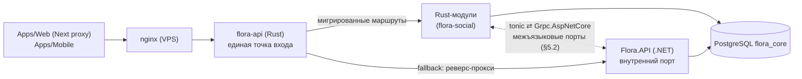

# next-architecture — целевая архитектура Flora.Ecosystem (Rust + TS) и план миграции

> **Статус: draft v1 (2026-07-13).** Нормативный план перевода бэкенда с **C# / .NET 10** на **Rust** при неизменных TypeScript-клиентах. Текущее состояние системы описано в [`ARCHITECTURE.md`](ARCHITECTURE.md) — этот документ описывает **конечное состояние** и **безопасный путь** к нему. По завершении миграции документ станет основой нового `ARCHITECTURE.md`.

---

## 0. TL;DR

- Конечный стек: **Rust** (tokio + axum + sqlx + tonic) на бэкенде, **TypeScript** (Next.js, Expo, `@flora/client-core`) на клиентах, **PostgreSQL** — схема `flora_core` без изменений.
- Паттерн миграции: **strangler fig** — Rust-хост становится единой точкой входа с первого дня и постепенно забирает группы маршрутов у .NET-хоста, проксируя остальное.
- Единица миграции — **модуль** (границы уже подготовлены: Contracts-порты, свои таблицы, свой DbContext). Двойная запись в таблицы модуля из двух языков **запрещена**.
- Порядок: `Фундамент → Music → Verification → Users+Auth → Content → Messaging+Notifications → вывод .NET`.
- Публичный HTTP-контракт **заморожен**: клиенты не меняются; паритет доказывается contract fixtures, golden-векторами и differential-тестами, cutover — канареечный, откат — мгновенный (флип маршрута).

---

## 1. Цели и рамки

### 1.1. Цели

1. Полностью заменить .NET-бэкенд на Rust без остановки сервиса и без изменений в клиентах.
2. Сохранить модульный монолит и правила границ из [`AGENTS.md`](AGENTS.md): Clean Architecture внутри модуля, общение только через контракты, однонаправленные зависимости `Apps → API → Products → Modules → Infrastructure`.
3. По пути погасить главный долг: декомпозировать god-контроллер [`ImportedSocialController.cs`](Products/Flora.Social/ImportedSocialController.cs) (~3.5k строк, ~87 эндпоинтов) на модульные роутеры.
4. Сохранить возможность выноса любого модуля в отдельный сервис (после миграции — без изменения доменного кода, сменой композиции).

### 1.2. Не-цели (жёсткие ограничения на время миграции)

- **Не** менять схему БД и форматы данных (включая медиа в `bytea`) — редизайн хранения возможен только после миграции.
- **Не** менять протокол FSCP (остаётся v1, bootstrap-epoch) и любые криптоформаты.
- **Не** менять публичный HTTP-контракт (пути, формы JSON, статус-коды, заголовки). Единственное согласованное исключение — вывод legacy-маршрутов `/api/auth/messages*` и др. после консолидации веба на `client-core` (см. §9).
- **Не** добавлять функциональность в модуль в окно его cutover (freeze на модуль).
- **Не** переписывать клиентов: TS-слой уже является конечным стеком.

### 1.3. Мотивация Rust (кратко)

Отсутствие GC-пауз и предсказуемая память (важно для SSE-подключений и отдачи медиа из `bytea`), один статический бинарь на VPS, компилируемая проверка границ (crate-граф вместо PowerShell-валидатора), долгосрочная стоимость владения для некоммерческого проекта. Клиентская криптография уже вне бэкенда (FSCP — на клиентах), поэтому серверный перенос не трогает крипто-ядро продукта.

---

## 2. Конечное состояние: продукты + Rust workspace

### 2.0. Продуктовая топология (App vs Functional)

Пиры под [`Products/`](Products/). Классы и правила — [`ARCHITECTURE.md`](ARCHITECTURE.md) §1.1. Кратко:

- **App:** Flora.Social (доменные модули Auth/Users/… — внутренности Social, не пиры). Зарезервированы без пустых папок: Browser, Email, OS.
- **Functional (headless/embeddable):** FIRA, FSA, FSCP, FRC, FGP, FEP, FPP — kernel/contracts (+ опц. runtime); не зависят от Social.
- **UIP** — DTO в `fira-contracts`; Users владеет персистенцией и маппит в `InterestProfile`.
- **FSA** — kernel+contracts в `Products/FSA` (поиск: анализ/индекс/BM25F/персонализация); мост FIRA→FSA — данные (`AffinitySnapshot`), не код. Спека — [`Documents/fsa/FSA.md`](Documents/fsa/FSA.md).
- **FPP** — kernel+contracts в `Products/FPP`; таблицы `personhood_*` пишет только Verification (Social).
- **FSCP product scope:** wire + crypto + server validator + client session FSM. Epochs/backup/devices — Messaging / [`Documents/fscp/e2e-security.md`](Documents/fscp/e2e-security.md).
- **TS SoT** functional-клиента — в `Products/<Name>/` (напр. `@flora/fscp`); `Packages/flora-client-core` реэкспортирует.
- **Один Cargo workspace** (корень [`Cargo.toml`](Cargo.toml)). Members включают **все** Products crates, в т.ч. FRC.
- Functional → Social = **запрещено** (валидатор).

### 2.1. Расположение и структура

Единый Cargo workspace — **корень репозитория** [`Cargo.toml`](Cargo.toml) (= будущий Platform; каталог `Backend/` хранит host-crates и конфиг).

```
Cargo.toml                      # workspace members → Backend/crates + Products/*/crates
Products/
  Flora.Social/                 # PRODUCT_CLASS: app (C# as-is + Rust crates/)
  FIRA/ FSA/ FSCP/ FRC/ FEP/ FGP/ FPP/
Backend/
  crates/ flora-api, flora-shared, flora-migrate, infrastructure/
  Tests/parity/
  appsettings.json
Apps/  Packages/  Documents/
```

C#-каталоги (`Flora.API`, `Modules/`, …) удаляются на **Фазе 5**; до cutover C# `Products/Flora.Social` не ломать.

### 2.2. Гранулярность crate'ов

- **App Social:** два crate на доменный модуль (`flora-<module>` + `*-contracts`); слоистость внутри crate (`domain/application/infrastructure/http` + `compose()`).
- **Functional:** `*-contracts` + `*-core`/`*-crypto` (portable, wasm32 где нужно) + опц. `*-runtime` (Flora-host). FRC: `frc-a-core`, `frc-i`, `frc-v`, CLI tools — members того же workspace.
- Модуль/runtime экспортирует: `compose` / `router` / `spawn_workers` по мере готовности HTTP.

### 2.3. Правила зависимостей (порт Validate-Architecture)

| Crate | Может зависеть от |
| --- | --- |
| `flora-api` | `flora-social`, `flora-shared` |
| `flora-social` | корни модулей Social, functional `*-runtime`/`*-core` по необходимости, `flora-shared` |
| `flora-<module>` (Social) | свой/чужие `*-contracts`, functional contracts/core, свой crypto, `flora-shared` |
| `*-contracts` | `flora-shared` (Social) или только внешние (functional, предпочтительно) |
| functional `*-crypto` / FRC cores / `fscp-core` / `fira-core` / `fsa-core` | только внешние crates (+ другие crates того же functional-продукта) |
| functional `*-runtime` | свой crypto/contracts, `flora-shared`, другие **functional**-contracts |
| `flora-shared` | только внешние crates |
| Любой Functional | **не** `flora-social` и не `modules/flora-*` Social |

Проверка — `Tools/validate-architecture-rust.ps1` + CI (`fmt`, `clippy -D warnings`, `cargo deny`).

### 2.4. Композиция вместо DI-контейнера

`flora-social` собирает модули Social и подключает functional engines (FIRA, FSCP validator, FEP/FGP runtime, FRC через infrastructure). Порядок: `Users → Verification → Auth → Notifications → Content → Messaging → Music` (+ Economy по флагу).

---

## 3. Соответствие технологий

| Сейчас (.NET) | Станет (Rust) | Примечание |
| --- | --- | --- |
| ASP.NET Core (Kestrel, MVC-контроллеры) | **axum** + tower + hyper, tokio | SSE и multipart поддержаны нативно |
| DI-контейнер | Явная композиция + `Arc<AppState>` | §2.4 |
| EF Core + Npgsql (7 DbContext) | **sqlx** (Postgres, compile-time проверка запросов) | Пул на модуль не требуется — общий `PgPool`, владение таблицами по модулям |
| EF-миграции (`Flora.Migrations`, история на модуль) | `flora-migrate`: sqlx migrate / refinery | **Требование:** отдельная таблица истории на модуль (как сейчас); инструмент фиксируется в Фазе 0 |
| System.Text.Json (camelCase) | **serde / serde_json** (`rename_all = "camelCase"`) | Инварианты сериализации — §4.3 |
| JwtBearer middleware | **jsonwebtoken** + tower-слой | HS256, общий секрет — §4.1 |
| Konscious Argon2id | **argon2** (RustCrypto) | Формат хранения бит-в-бит — §4.1 |
| Otp.NET (TOTP) | **totp-rs** (или RFC 6238 на `hmac`/`sha1`) | issuer `FLORA`, окно ±1 шаг |
| `RandomNumberGenerator` | `rand` / `getrandom` (OsRng) | refresh 64 B, CSRF 32 B, HMAC-key 64 B |
| ASP.NET RateLimiter (fixed window) | Собственный tower-слой fixed window | Семантика и партиции — §4.5; готовые GCRA-крейты (governor) не подходят по семантике |
| SSE (`SignalsController` + in-memory hub) | axum `Sse` + tokio broadcast per user | Формат кадров и ping — §4.6 |
| FirebaseAdmin SDK (FCM) | FCM HTTP v1: reqwest + gcp_auth | Тот же service-account JSON из конфига |
| SMTP-клиент (Verification) | **lettre** | Секция `Smtp` без изменений |
| ffmpeg через `Process` | ffmpeg через `tokio::process` | Те же `Media:FfmpegPath` / `Media:FfprobePath`, temp-файлы |
| `IHostedService` / `BackgroundService` (4 шт.) | tokio-задачи + graceful shutdown | Список — §6, фазы 1/3/4 |
| Grpc.AspNetCore (`Flora.gRPC`, спящий) | **tonic / prost** | Каркас оживает как межъязыковой мост — §5.2 |
| `ILogger` | **tracing** + tracing-subscriber | JSON-логи; OpenTelemetry — опционально |
| `Flora.Shared` (`FloraUuid`, `UuidV5`, `LatinIdentifiers`) | `flora-shared` (`uuid` crate v5/v7) | Байтовый паритет — §4.2 |
| `TimestampAuditInterceptor` (EF) | Явное проставление `created_at`/`updated_at` в репозиториях | Интерцепторов нет — поле задаётся кодом, проверяется тестами |

---

## 4. Нормативные инварианты совместимости

Rust-реализация обязана воспроизводить следующее **бит-в-бит** (проверяется тестами паритета до cutover соответствующей фазы). Источники истины — файлы текущей реализации.

### 4.1. Аутентификация

| Инвариант | Значение | Источник |
| --- | --- | --- |
| JWT | HS256, issuer `Flora.Auth`, audience `Flora.Ecosystem`, access 15 мин, clock skew **1 мин**, секрет ≥32 символов (`Jwt__Secret`) | [`JwtTokenService.cs`](Modules/Flora.Auth/Flora.Auth.Infrastructure/Services/JwtTokenService.cs), [`FloraJwtExtensions.cs`](Products/Flora.Social/FloraJwtExtensions.cs) |
| Клеймы токена | `sub`, `email`, `jti` (+ дубли через .NET outbound mapping — фактический wire-набор зафиксировать фикстурой **до Фазы 2b**) | там же |
| Refresh | 64 случайных байта → Base64; ротация: новый `jti`, новый refresh, `RotationId++`, продление на 7 дней; статус-модель `UserSession` | `AuthCredentialOperations.cs` |
| Пароли | Argon2id: salt 16 B, hash 32 B, **t=4, m=65536 KiB, p=2**, хранение `Base64(salt‖hash)` (не PHC-строка!) | [`Argon2PasswordHasher.cs`](Modules/Flora.Auth/Flora.Auth.Infrastructure/Services/Argon2PasswordHasher.cs) |
| Lockout | 5 неудачных логинов → блок 15 мин | `AuthCredentialOperations.cs` |
| TOTP | secret 20 B (Base32), issuer `FLORA`, шаг 30 с, окно ±1 | `AuthAccountSecurityService.cs` |

Существующие хеши паролей и сессии **остаются валидными** — таблицы не мигрируют, меняется только исполнитель. Кросс-языковой тест обязателен: токен, выпущенный C#, валиден в Rust, и наоборот (пока живы оба хоста).

### 4.2. Идентификаторы

- UUID **v7** для новых сущностей (`FloraUuid` → `uuid::Uuid::now_v7()`).
- UUID **v5**: namespace DNS `6ba7b810-9dad-11d1-80b4-00c04fd430c8`; деривации `DmConversationUuid` (`"{min}|{max}|fscp-dm-v1"`, ordinal-сортировка строковых UUID) и `AgreementPublicKeyId` (`"{user}|{epoch}|agreement-v1"`) — байтовый паритет с [`UuidV5.cs`](Flora.Shared/UuidV5.cs) **и** с TS-реализацией в client-core. Golden-вектора генерируются из C# до Фазы 0.
- GUID в JSON — lowercase, с дефисами.

### 4.3. JSON-сериализация

- camelCase; **null-поля сериализуются явно** (поведение System.Text.Json по умолчанию) — в serde не использовать `skip_serializing_if` на nullable-полях контрактов.
- Даты — ISO 8601 UTC. Формат долей секунды у .NET и chrono различается — differential-harness сравнивает **семантически** (парсит даты), а не побайтово; TS-парсеры client-core должны оставаться зелёными на обоих бэкендах.
- Курсоры пагинации (`nextCursor`) — **opaque-контракт**: формат воспроизводится как есть (зафиксировать фикстурами по эндпоинтам до переноса соответствующего модуля).
- Формы ошибок (тела 4xx/5xx) — часть контракта, фиксируются фикстурами.

### 4.4. FSCP (серверная валидация формы конверта)

Сервер не расшифровывает — только структурная валидация `fscp1:base64url(JSON)`. Паритет с [`FscpWireEnvelopeValidator.cs`](Products/Flora.Social/FscpWireEnvelopeValidator.cs): версия=1, лимиты (конверт ≤200k символов, внутренний JSON ≤120k байт, тело ≤64 KB), bootstrap-epoch `00000000-0000-4000-8000-000000000001`, ровно 2 получателя (1:1 DM), `conversationUuid`/`agreementPublicKeyId` через UUID v5 (§4.2), RKE `x25519-hkdf-xchacha20poly1305` (ephemeral 32 B, salt 32 B, nonce 24 B), Ed25519 (pub 32 B, подпись 64 B), совпадение `encryptedForReceiver == encryptedForSender`. Проверяется на golden-векторах [`Documents/test-vectors/`](Documents/test-vectors/README.md) + негативных кейсах, извлечённых из C#-тестов. Нормативные спецификации: [`Documents/fscp/FSCP.md`](Documents/fscp/FSCP.md), [`Documents/fscp/e2e-security.md`](Documents/fscp/e2e-security.md).

**Статус:** порт выполнен заранее (чистая функция без БД/HTTP, форма заморожена): [`flora-messaging/src/fscp.rs`](Backend/crates/modules/flora-messaging/src/fscp.rs). Паритет закреплён вектором `fscp-wire-validator-v1.json` (позитив + 22 негатива, **точные строки ошибок**) и consumer-тестами с обеих сторон — C# [`FscpWireValidatorVectors.cs`](Tests/Flora.GoldenVectors/FscpWireValidatorVectors.cs), Rust [`fscp_wire_vectors.rs`](Backend/Tests/parity/tests/fscp_wire_vectors.rs); клиентская криптография RKE/fingerprint дополнительно сверена на RustCrypto ([`fscp_client_crypto_vectors.rs`](Backend/Tests/parity/tests/fscp_client_crypto_vectors.rs)). Сверх того, полный golden-транскрипт `fscp-message-transcript-v1.json` проходит на Rust весь клиентский путь — canonical JSON ([`canonical_json.rs`](Backend/Tests/parity/src/canonical_json.rs), байт-паритет с TS), Ed25519-подпись, RKE unwrap, расшифровка тела ([`fscp_transcript_vectors.rs`](Backend/Tests/parity/tests/fscp_transcript_vectors.rs)) — готовый фундамент будущего Rust client-core. Пост-квантовое направление FSCP v2 (гибрид X25519+ML-KEM-768) также закреплено на Rust заранее: [`fscp_hybrid_kem_vectors.rs`](Backend/Tests/parity/tests/fscp_hybrid_kem_vectors.rs) потребляет вектор `fscp-hybrid-kem-v2draft-v1.json` через RustCrypto `ml-kem` (dev-dependency паритет-харнесса, в продакшн-крейты не входит). Владение модулем **не меняется** (§6.0): до cutover Фазы 4 Rust-код трафик не обслуживает. Осознанные отличия на патологических входах задокументированы в шапке `fscp.rs` (дубликаты JSON-ключей, не-объектный корень в `TryExtractReceiver`, X-форма GUID).

### 4.5. Rate limiting (fixed window, 429)

| Политика | Партиция | Лимит / окно |
| --- | --- | --- |
| `social-login` | IP | 10 / 5 мин |
| `social-register` | IP | 8 / 15 мин |
| `social-verify` | IP | 12 / 15 мин |
| `social-refresh` | IP | 60 / 5 мин |
| `social-account-sensitive` | JWT sub → IP | 10 / 15 мин |
| `social-write` | JWT sub → IP | 60 / 5 мин |
| `social-upload` | JWT sub → IP | 30 / 10 мин |
| `e2e-key-backup-write` | user | 5 / сутки |
| `e2e-recovery-read` | user | 5 / сутки |
| `e2e-challenge` | user | 20 / сутки |

Источники: `SocialRateLimitPolicies.cs`, `MessagingModuleComposition.cs`. IP-партиция читает первый hop `X-Forwarded-For` — шлюз обязан корректно передавать XFF (§5.1).

### 4.6. Realtime (SSE)

`GET /api/auth/signals/stream`: `text/event-stream`, кадр `event: {name}\ndata: {json}\n\n`, heartbeat `: ping\n\n` каждые **25 с**, события `connected` (connectionId), `message`, `notification`, `presence`, `typing`, `read` (conversation marked read by peer — metadata only, no FCM). Хаб in-memory (per-user / per-connection каналы) — без брокера; presence watch scoped to SSE connection.

### 4.7. Заголовки и middleware

- `X-Flora-Client: {platform}/{version}` → при `version < FloraMobile:MinClientVersion` ответ **426** с `{ error, minClientVersion }` ([`FloraClientVersionMiddleware.cs`](Flora.API/FloraClientVersionMiddleware.cs)); также используется Notifications для фильтра платформ.
- Порядок конвейера: `CORS → проверка версии клиента → JWT-аутентификация → авторизация → rate limiter` (как в [`Flora.API/Program.cs`](Flora.API/Program.cs)).
- CORS: `FloraWeb:CorsOrigins`, credentials.

### 4.8. Конфигурация

Rust-хост читает **те же ключи** и источники: JSON-файл (аналог `appsettings.json` + локальные override) + переменные окружения в ASP.NET-конвенции с `__` (`Jwt__Secret`, `ConnectionStrings__FloraDatabase`, `Smtp__Host`, `Media__FfmpegPath`, `Flora__AdminBroadcastToken`, `Push__Firebase__*`, `FloraMobile__MinClientVersion`…), чтобы деплой-скрипты VPS и окружения не менялись. Dev-режим сохраняет поведение эфемерного JWT-секрета.

---

## 5. Переходная топология (strangler fig)

### 5.1. Rust-хост как единая точка входа



**Решение:** маршрутизацию ведёт Rust-хост (вариант «nginx решает по спискам regex-путей» отвергнут: эндпоинты разных модулей перемешаны под общим префиксом `/api/auth/*` — feed, профили, логин, уведомления, legacy-сообщения, — и ~150 правил в nginx неревьюируемы). В Rust таблица маршрутов живёт в коде, покрыта тестами, а шлюз — не одноразовая работа, это будущий постоянный хост.

Требования к прокси-fallback (критерии Фазы 0): потоковая передача тел (multipart-загрузки, медиа из `bytea`), прозрачный SSE (без буферизации, без таймаута простоя), корректное дописывание `X-Forwarded-For`, передача статус-кодов/заголовков как есть. Откат всей конструкции — один флип nginx обратно на .NET.

До Фазы 5 сквозные middleware для **проксируемых** маршрутов остаются на стороне .NET (прокси прозрачен); для **нативных** маршрутов их выполняет Rust. Это исключает двойной rate limiting.

### 5.2. Межъязыковые порты (переходные)

Когда модуль уезжает в Rust, а его потребители ещё на C# (или наоборот), in-process порт заменяется на **внутренний gRPC** — это штатная «лестница коммуникаций» из AGENTS.md (шаг 3) и осознанное оживление спящего каркаса [`Infrastructure/Flora.gRPC`](Infrastructure/Flora.gRPC). Protos лежат в `Infrastructure/Flora.gRPC/Protos/` (единый источник для `prost` и `Grpc.Tools`), транспорт — localhost, наружу не публикуется. C#-адаптеры портов живут в `*.Infrastructure` модулей (ссылка на `Flora.gRPC` там разрешена валидатором).

| Порт (Contracts) | Направление в переходный период | Живёт с фазы | Умирает в фазе |
| --- | --- | --- | --- |
| `IVerificationChallengeService` | C# Auth → Rust Verification | 2a | 2b (Auth сам в Rust) |
| `IUserProfileReadQueries`, `IFollowGraphReader` | C# Content/Notifications → Rust Users | 2b | 3 (Content) / 4 (Notifications) |
| `IAccountReadQueries` | C# Notifications → Rust Auth | 2b | 4 |
| `IPublicCommunityFollowingStats` | Rust Users → C# Content (обратное направление) | 2b | 3 |
| `IUserProfileProvisioner` | не пересекает границу (Auth и Users мигрируют вместе) | — | — |
| `IMessageSentNotifier` | не пересекает границу (Messaging и Notifications мигрируют вместе) | — | — |

Все пересекающие границу порты — **read-only запросы** (кроме Verification challenge), что минимизирует риск. Порты с интенсивным трафиком (`IUserProfileReadQueries` для push display-name) допускают короткий TTL-кэш на вызывающей стороне.

### 5.3. Данные и владение

- Одна БД, одна схема, **нулевая миграция данных**: cutover модуля — это только флип маршрутов + переключение исполнителя фоновых задач.
- В окно cutover модуля его схема **заморожена** (ни EF-, ни Rust-миграций). После стабилизации новые миграции модуля пишутся только на Rust-инструменте, история — в отдельной таблице модуля (продолжение текущего паттерна `Flora.Migrations`).
- Откат внутри окна безопасен: схема не менялась, C#-код модуля ещё в репозитории — возвращаем маршруты, Rust-воркеры останавливаем. Правило «один писатель на таблицу в каждый момент времени» соблюдается флипом маршрутов целиком по модулю (не по эндпоинту записи).
- Фоновые задачи модуля переезжают одновременно с его HTTP-поверхностью (иначе два писателя).

---

## 6. Фазы миграции

| Фаза | Скоуп | Эндпоинты | ~LOC C# | Межъязыковые мосты |
| --- | --- | --- | --- | --- |
| 0 | Фундамент: workspace, шлюз, parity-харнесс, CI | 3 (`/`, `/health`, `/version`) | — | нет |
| 1 | **Music** | 22 | 3.5k | нет |
| 2a | **Verification** | 0 (только порт) | 0.3k | Verification-сервер (Rust) |
| 2b | **Users + Auth** | 35 | 2.6k + доля god-контроллера | users-read, auth-read (Rust-серверы); content-stats (C#-сервер) |
| 3 | **Content** (FIRA-F/C) | 39 | 2.5k + доля god-контроллера | все мосты Users/Content умирают |
| 4 | **Messaging + Notifications** (FSCP, SSE, FCM) | 51 (13 legacy + 27 + 11) | 3.8k + `MessagingController` | все мосты умирают |
| 5 | Вывод .NET, смена тулинга | — | −22k | — |

Каждая фаза **может** завершаться соаком на 100% трафика перед стартом следующей — полезно при живых пользователях. **Пока прод-аудитории нет**, обязательный соак/freeze между фазами **не требуется**: можно сразу идти в следующий срез (сейчас — Music). Прогресс-порядок по связанности без изменений (см. граф в ARCHITECTURE.md §2.6): Music → identity → Content → Messaging.

### 6.0. Статус миграции (единственный источник истины о владении)

> Обновляется **в том же PR**, что и событие: старт фазы, freeze, cutover, откат, вывод. Агенты и люди обязаны сверяться с этой таблицей до правок кода модуля (см. AGENTS.md, skill `/rust-migration`).

| Единица | Владелец сейчас | Статус | Freeze-окно |
| --- | --- | --- | --- |
| Хост / шлюз (`/`, `/health`, `/version`) | **Rust** `flora-api` (:5290) | **Фаза 5:** C# удалён из репо; `Gateway:DotnetUpstream` пуст | — |
| Music | **Rust** | cutover HTTP + workers | — |
| Verification | **Rust** (gRPC) | tonic `verification.proto` | — |
| Users | **Rust** | cutover HTTP + FIRA-P | — |
| Auth | **Rust** | cutover HTTP (login/register/sessions/…) | — |
| Content | **Rust** | cutover HTTP + media/video worker | — |
| Messaging | **Rust** | cutover HTTP + E2E FSM | — |
| Notifications | **Rust** | cutover inbox + SSE + FCM | — |
| Economy (FEP) | **Rust** (родной) | вне strangler; `Economy:Enabled` | — |

Статусы (исторические): `не начат → в переносе → freeze → cutover → Rust`. **Фаза 5 завершена (2026-07-15):** проекты `Flora.API`, `Modules/*`, `Flora.Shared`, `Flora.Migrations`, C#-часть `Products/Flora.Social` удалены; CI без `dotnet`; protos оставлены в `Infrastructure/Flora.gRPC/Protos/`.

> Примечание: при пустом `Gateway:DotnetUpstream` незаматченные маршруты отвечают 404 (нет .NET fallback).

### Фаза 0 — Фундамент и шлюз

**Делаем:** workspace `Backend/` (§2.1); `flora-api` с конфигом (§4.8), tracing, `/`, `/health`, `/version` (читает `flora-versions.json` — паритет с [`FloraVersions.cs`](Flora.API/FloraVersions.cs)); прозрачный реверс-прокси на .NET (§5.1); `flora-shared` с golden-тестами UUID v5/v7 против C#-векторов; parity-харнесс (`Tests/parity`): прогон существующих contract fixtures + differential-инструмент `flora-diff` (replay GET-трафика на оба апстрима, семантический дифф JSON); расширение генератора фикстур (`Tests/Flora.ContractFixtures`, `UPDATE_CONTRACT_FIXTURES=1`) на Music/Content/E2E-поверхности; CI: fmt, clippy, test, `validate-architecture-rust`, `cargo deny`; обновление AGENTS.md (команды cargo, правила `Backend/`).

**Выход:** шлюз в проде отвечает на `/`/`/health`/`/version`, proxy на .NET прозрачен (SSE/multipart/медиа); кросс-языковой JWT-тест зелёный. Обязательный соак ≥1 недели **не требуется**, пока нет прод-аудитории. **Откат:** nginx → .NET напрямую.

### Фаза 1 — Music (пилот модуля)

Идеальный пилот: ни входящих, ни исходящих межмодульных зависимостей, свой контроллер уже в модуле. Скоуп: 22 эндпоинта `/api/music/*`, аудио-транскод ffmpeg, обложки/аудио из `bytea`, FIRA-M (`/flow`), таксономия жанров, воркеры `MusicArtistBackfillHostedService` (однократный) и `MusicArtistOrphanCleanupHostedService` (5 мин). Нативные JWT-валидация для `/api/music/*` при флаге **`Music:ServeNative=true`** (дефолт `false` до cutover; rate-limit на Music нет — §11.2).

FIRA-M: формулы as-built ([`FIRA-M.md`](Documents/fira/FIRA-M.md) §Implementation Status) переносятся 1:1. **Статус:** golden-вектор [`fira-m-scorer-v1.json`](Documents/test-vectors/fira/fira-m-scorer-v1.json) снят, чистый скорер портирован заранее ([`flora-music/src/application/recommendations.rs`](Backend/crates/modules/flora-music/src/application/recommendations.rs), consumer-тест [`fira_vectors.rs`](Backend/Tests/parity/tests/fira_vectors.rs)) — формулы заморожены, остаток фазы — HTTP/БД/воркеры. Конфиг-секция `FiraMusic` в `appsettings.json` **отсутствует** — production работает на дефолтах кода (`WeightBeta = 0.75`, `WeightGamma = 0.25`, `RecencyBoostDays = 14`, `MaxCandidates = 500` и др.), дефолты продублированы в Rust (`Default` в `MusicRecommendationOptions`) и сверяются паритет-тестом. Exploration-хвост волны стохастический — исключается из diff-сравнения (`flora-diff` сравнивает детерминированный префикс).

**Выход:** фикстуры и диффы зелёные; канарейка (например, `GET`-маршруты → 10% → 100%, затем записи) без регрессий; p95 и память не хуже .NET. **Откат:** флип маршрутов на прокси + остановка Rust-воркеров.

### Фаза 2a — Verification (пилот межъязыкового порта)

Минимальный модуль (0.3k LOC, без HTTP) для обкатки gRPC-моста с минимальным радиусом поражения. Rust: challenge-хранилище (`verification_challenges`), SMTP (lettre), TTL 15 мин; tonic-сервер `verification.proto` (Begin/Validate/Cancel). C#: адаптер `IVerificationChallengeService` → gRPC-клиент за конфиг-флагом.

**Выход:** регистрация/смена email в проде идут через мост. **Откат:** конфиг-флаг возвращает in-process C#-реализацию (схема общая, расхождений нет).

### Фаза 2b — Users + Auth (identity-ядро)

Мигрируют вместе (Auth → `IUserProfileProvisioner`/`IUserProfileReadQueries` остаются in-process). Скоуп: 35 эндпоинтов (login/refresh/logout/2FA/sessions/email-change; профили/аватары/подписки/блокировки/поиск/FIRA-P), таблицы `user_accounts`, `user_sessions`, `pending_registrations`, `user_security_logs`, `user_profiles`, `user_avatars`, `user_followers` и др. Все инварианты §4.1 доказываются до флипа; сессии продолжают жить в той же таблице — активные пользователи ничего не замечают. Поднимаются мосты: Rust-серверы users-read/auth-read для C# Content/Notifications; Rust-клиент к C# content-stats.

FIRA-P: формулы as-built ([`FIRA-P.md`](Documents/fira/FIRA-P.md) §Implementation Status) и конфиг-секция `UserRecommendation` переносятся 1:1. **Статус:** v1.1-гигиена (двунаправленный блоклист в кандидатном пуле — критичное приватностное отклонение) закрыта на C#-стороне, **после** неё снят golden-вектор [`fira-p-scorer-v1.json`](Documents/test-vectors/fira/fira-p-scorer-v1.json) — дефект не заморожен; чистый скорер портирован заранее ([`flora-users/src/application/people.rs`](Backend/crates/modules/flora-users/src/application/people.rs), consumer-тест `fira_vectors.rs`).

**Выход:** логин, refresh-ротация, 2FA, регистрация с email-кодом — в проде на Rust; кросс-языковая валидность JWT подтверждена в бою. **Откат:** флип маршрутов (сессии совместимы, C#-код на месте).

### Фаза 3 — Content

Самая большая HTTP-поверхность (39): лента + FIRA-F, посты/черновики/комментарии/лайки/репосты/просмотры, изображения/видео (`PostVideoTranscodeWorker`), сообщества + FIRA-C. Мосты Users↔Content умирают (порты снова in-process). Особое внимание — **числовой паритет FIRA**: формулы те же (f64), сравнение ранжирования differential-тестами top-K с допуском; конфиг-секции `FiraFeed`/`FeedRecommendation`/`CommunityRecommendation` читаются без изменений (refresh-ключи `FiraFeed` в `appsettings.json` отсутствуют — дефолты кода продублированы в Rust `Default`). **Статус:** golden-вектора скореров и постобработки сняты ([`fira-f-scorer-v1.json`](Documents/test-vectors/fira/fira-f-scorer-v1.json), [`fira-f-postprocessing-v1.json`](Documents/test-vectors/fira/fira-f-postprocessing-v1.json), [`fira-c-scorer-v1.json`](Documents/test-vectors/fira/fira-c-scorer-v1.json)); чистые скореры и постобработка портированы заранее ([`flora-content/src/application/`](Backend/crates/modules/flora-content/src/application/), consumer-тест `fira_vectors.rs`) — формулы заморожены. Нормативные as-built формулы и стохастические точки (exploration `ORDER BY random()`, refresh-shuffle — исключаются из диффа): [`FIRA-F.md`](Documents/fira/FIRA-F.md), [`FIRA-C.md`](Documents/fira/FIRA-C.md) §Implementation Status; дифф ленты — при `refresh=false` ([`FIRA.md`](Documents/fira/FIRA.md) §15).

**Выход:** дифф ленты в допуске, транскод стабилен, канарейка → 100%. **Откат:** флип маршрутов + остановка воркера транскода.

### Фаза 4 — Messaging + Notifications

Мигрируют вместе (порт `IMessageSentNotifier`, цепочка push display-name). Скоуп: FSCP-валидатор (§4.4) с golden-векторами; E2E-инфраструктура (epochs, device keys, key/recovery backups, unlock-challenge, идемпотентность + `IdempotencyCleanupService` 6 ч); ассеты voice/image/video (`bytea`); SSE-хаб (§4.6); FCM HTTP v1; admin broadcast (`Flora__AdminBroadcastToken`); e2e rate-limit политики. Судьба 13 legacy-маршрутов `/api/auth/*` (messages, conversations, e2e-public-key) решается **до** фазы: если веб к этому моменту консолидирован на client-core (§9) — выводим, иначе переносим и выводим позже.

**Выход:** обмен E2E-сообщениями, бэкапы/восстановление ключей, SSE (включая reconnect-шторм) и пуши — в проде на Rust. **Откат:** флип маршрутов; SSE-клиенты переподключаются автоматически.

### Фаза 5 — Вывод .NET

**Статус: выполнено (2026-07-15).** Удалены C#-проекты (`Flora.API`, `Modules/*`, `Flora.Shared`, `Flora.Migrations`, C# `Products/Flora.Social`); CI без `dotnet`; `Validate-Architecture.ps1` снят (остался `validate-architecture-rust.ps1`); `Gateway:DotnetUpstream` пуст; protos сохранены в `Infrastructure/Flora.gRPC/Protos/`. Миграции схемы — `flora-migrate`; contract fixtures / golden vectors уже закоммичены в `artifacts/` и `Documents/test-vectors/` (ручная правка запрещена).

---

## 7. Стратегия верификации

1. **Golden-вектора (unit):** UUID v5/v7, Argon2 (verify хешей, созданных C#), TOTP, JWT (кросс-языковая валидация), FSCP-конверты, FIRA-скореры всех четырёх компонентов «кандидат → Score» + позиционные фикстуры постобработки FIRA-F ([`Documents/test-vectors/`](Documents/test-vectors/README.md) + негативные кейсы; детерминизм и tie-break'и — [`FIRA.md`](Documents/fira/FIRA.md) §15). Вектора генерируются из C# **до** переноса соответствующего кода. FIRA-вектора сняты: [`Documents/test-vectors/fira/`](Documents/test-vectors/fira/), consumer-тесты — C# `GoldenVectorTests.cs` (freeze-контроль) и Rust [`fira_vectors.rs`](Backend/Tests/parity/tests/fira_vectors.rs) (скореры портированы заранее; паритетные примитивы `flora_shared::dotnet_time` / `flora_shared::ordinal`).
2. **Contract fixtures (контракт):** существующий механизм [`Tests/Flora.ContractFixtures`](Tests/Flora.ContractFixtures) → `Artifacts/contract-fixtures/` → TS-тесты client-core. Расширяется на все мигрируемые поверхности; Rust-интеграционные тесты обязаны выдавать те же формы. Один и тот же набор фикстур проверяет **оба** бэкенда, пока они живы.
3. **Differential/shadow (система):** `flora-diff` — replay реального GET-трафика на оба апстрима с семантическим диффом (нормализация дат, tolerance для FIRA-скоринга); на staging — постоянно, в проде — зеркалирование читающих маршрутов перед канарейкой фазы.
4. **Смоки клиентов (e2e):** `npm run ci` (contract-парсеры client-core) на фикстурах обоих бэкендов + ручной прогон критических сценариев Web/Mobile на staging перед каждым cutover (логин, лента, отправка E2E-сообщения, пуш).
5. **Нагрузочные:** k6/vegeta на горячие маршруты (feed, messages, отдача медиа) и удержание массовых SSE-подключений; критерий — p95 и RSS не хуже .NET-базлайна, снятого в Фазе 0.

---

## 8. Эксплуатация

- **Деплой:** тот же VPS; `flora-api` — systemd-юнит (или контейнер) на внутреннем порту рядом с .NET; nginx смотрит на Rust-шлюз с Фазы 0. Канарейка — на уровне таблицы маршрутов шлюза (процент/пользовательская когорта), откат — конфиг-флип без redeploy.
- **Наблюдаемость:** tracing (JSON) с полями, совместимыми с текущим анализом логов; метрики шлюза: доля проксируемого трафика, диффы shadow-тестов, латентность per-route по апстримам — это главный дашборд миграции.
- **Секреты:** без изменений (`Jwt__Secret`, `Smtp__*`, `Push__Firebase__*`, `Flora__AdminBroadcastToken` — те же env), см. `Local/SECRETS-ROTATION.local.md` (gitignored).
- **CI:** к текущим `npm run ci` / `dotnet build+test` добавляется cargo-конвейер (§2.3) и джоб паритета фикстур; после Фазы 5 dotnet-джобы удаляются.

---

## 9. Долг, который гасим по пути

| Долг (ARCHITECTURE.md §4) | Как закрывается |
| --- | --- |
| God-контроллер `ImportedSocialController` (~3.5k строк) | Не переносится как файл: его эндпоинты уезжают в HTTP-слои Rust-модулей по фазам 2b–4 |
| `MessagingController` с прямым EF в продукте | Поглощается `flora-messaging` в Фазе 4 |
| Интерфейсы в Application вместо Contracts (`IConversationService` и др.) | В Rust публичные порты изначально только в `*-contracts` |
| Параллельный FSCP/REST-слой в Apps/Web | Отдельный TS-трек: консолидация веба на client-core **до Фазы 4** — предусловие вывода legacy-маршрутов |
| gRPC-каркас без потребителей | Оживает как межъязыковой мост (§5.2), решение о его судьбе — Фаза 5 |
| No-op `Map*ModuleEndpoints`, `Class1.cs`-имена | Исчезают вместе с C#-кодом |

---

## 10. Риски и меры

| Риск | Мера |
| --- | --- |
| Диффы JSON-сериализации (даты, null, регистр) | Инварианты §4.3, семантический differ, TS-парсеры как арбитр |
| Wire-набор JWT-клеймов (.NET outbound mapping: `nameid` и др.) | Зафиксировать фактический токен фикстурой до Фазы 2b; кросс-валидация в CI с Фазы 0 |
| Семантика fixed-window rate limiting (границы окон) | Собственный tower-слой + юнит-тесты семантики; для проксируемых маршрутов лимиты остаются на .NET (§5.1) |
| Прокси ломает SSE/multipart в Фазе 0 | Явные критерии выхода фазы; соак на staging; мгновенный откат nginx |
| Числовой паритет FIRA (f64, порядок операций) | Differential top-K с допуском; формулы переносятся 1:1 без «улучшений» |
| Два писателя в таблицы модуля при частичном откате | Cutover и откат — только целым модулем; воркеры переезжают вместе с HTTP; schema freeze в окно |
| Argon2-производительность под нагрузкой логинов | Бенчмарк verify (те же t/m/p) в Фазе 0; при необходимости — отдельный blocking-пул tokio |
| Крупные `bytea`-ответы и память | Стриминг ответов, лимиты размера как в .NET, мониторинг RSS в канарейке |
| Экспертиза команды в Rust | Пилоты (Music, Verification) до критичных фаз; строгий CI (clippy, deny); ревью-чеклист границ |

---

## 11. Открытые вопросы (закрыть до соответствующей фазы)

1. **До Фазы 0 — закрыто:**
   - Миграции — **sqlx migrate**: история на модуль через `Migrator::dangerous_set_table_name("__flora_migrations_<module>")` (продолжение паттерна `__EFMigrationsHistory_*`; реестр — `Backend/crates/flora-migrate/src/registry.rs`). refinery отвергнут: sqlx уже в стеке, второй инструмент не нужен.
   - Пиновка версий — toolchain в `Backend/rust-toolchain.toml` (обновление осознанным коммитом); версии crates объявляются только в `workspace.dependencies`, фактическая пиновка — закоммиченный `Cargo.lock` (CI собирает с `--locked`); `cargo deny` следит за лицензиями (AGPL-совместимость), дублями и advisories.
   - Конфиг Rust-хоста — те же слои и семантика, что у ASP.NET (§4.8): `Backend/appsettings.json` → `appsettings.{Environment}.json` → (Development) `appsettings.Local.json` → env-переменные с `__`; ключи регистронезависимы; каталог переопределяется `FLORA_CONFIG_DIR`; реализация — `flora_shared::config`.
2. **До Фазы 1 — закрыто:**
   - Rate-limit на `/api/music/*`: на [`MusicController`](Modules/Flora.Music/MusicController.cs) нет `[EnableRateLimiting]` — политик нет; в Rust **не** добавлять лимитер «на всякий случай».
   - Обложки/аудио: серверного resize нет — байты и `Content-Type` хранятся as-uploaded / после ffmpeg-транскода аудио (`content_type` + `bytea`). FRC dual-read (FRC-A/I) — отдельной задачей после cutover Music, **без** смены схемы таблиц (opaque payload + MIME уже в колонках).
3. **До Фазы 2b:** фикстура фактического JWT (полный wire-набор клеймов); инвентаризация форматов `nextCursor` по всем эндпоинтам identity; серверный пайплайн аватаров (resize?).
4. **До Фазы 4:** решение по 13 legacy-маршрутам messaging (вывод vs перенос) — зависит от консолидации веба на client-core; стратегия дренажа SSE-подключений при cutover (мягкое закрытие → reconnect на Rust).
5. **Фаза 5:** судьба protos (`Infrastructure/Flora.gRPC`) — контракты будущих микросервисов или архив.

---

## Связанные документы

| Тема | Документ |
| --- | --- |
| Текущая архитектура (as-is) | [`ARCHITECTURE.md`](ARCHITECTURE.md) |
| Правила границ и процессов | [`AGENTS.md`](AGENTS.md) |
| E2E-протокол | [`Documents/fscp/FSCP.md`](Documents/fscp/FSCP.md), [`Documents/fscp/e2e-security.md`](Documents/fscp/e2e-security.md) |
| Рекомендации | [`Documents/fira/FIRA.md`](Documents/fira/FIRA.md) |
| Поиск | [`Documents/fsa/FSA.md`](Documents/fsa/FSA.md) |
| Golden-вектора | [`Documents/test-vectors/README.md`](Documents/test-vectors/README.md) |
| Кросс-языковые фикстуры | [`Tests/Flora.ContractFixtures`](Tests/Flora.ContractFixtures) |
